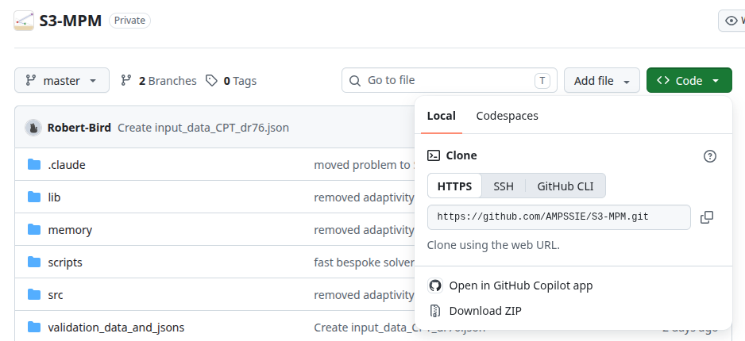

---

## Requirements

S3-MPM is a Julia package and runs anywhere Julia is supported.

**Operating system:** Linux, macOS, and Windows are all supported. Most development and testing has been done on Linux.

**Julia version:** 1.12 or newer. Earlier releases may work but are not actively tested.

**Hardware:** A typical desktop or laptop is sufficient for the tutorial problems. For larger 3D problems with refined meshes it is recommended to use an HPC with at least 10 cores, at least 60 GB of RAM and 10 GB of free disk for outputs. If you are using a GPU it is also recommended that the GPU has 60 GB of GPU memory (data-centre GPUs such as the NVIDIA A100 or H100 have 40-80 GB).

**Software requirements:**

- [Julia](https://julialang.org/downloads/) - at least version 1.12.
- A text editor with JSON support for editing `input_data.json` files - [VS Code](https://code.visualstudio.com/) with the [Julia extension](https://www.julia-vscode.org/) is a sensible default.
- [ParaView](https://www.paraview.org/) or [VisIt](https://visit-dav.github.io/visit-website/) for visualising the VTU/VTK output. Support and tutorial detail are only provided for ParaView.

**Optional:**

- [Git](https://git-scm.com/) for cloning the source repository.
- A container runtime ([Docker](https://www.docker.com/), or [Apptainer](https://apptainer.org/)/[Singularity](https://sylabs.io/singularity/) on HPC) to run Julia and S3-MPM without installation - see [deploying with containers](../UsingTheSoftware/DeployingTheSoftware.md).

## Julia runtime
The simplest deployment is to install Julia and run S3-MPM from source:

??? plain "Julia installation"

    Use the official installer from [julialang.org/downloads](https://julialang.org/downloads/), or on Linux/macOS use the [`juliaup`](https://github.com/JuliaLang/juliaup) toolchain manager:

    ```bash
    curl -fsSL https://install.julialang.org | sh
    ```

    Verify the install with `julia --version`.

??? plain "Downloading S3-MPM from GitHub"

    The source lives at [github.com/AMPSSIE/S3-MPM](https://github.com/AMPSSIE/S3-MPM).

    Use `git clone` to pull the code from GitHub into your current directory; updating later is then a single `git pull` from inside the folder:

    ```bash
    git clone https://github.com/AMPSSIE/S3-MPM.git
    cd S3-MPM
    ```

    If you prefer to download the ZIP containing the code, go to [github.com/AMPSSIE/S3-MPM](https://github.com/AMPSSIE/S3-MPM).


    { #fig-github-zip width="90%" }

    Then use the green *Code* button, choose *Download ZIP* and unzip it wherever you want to keep it.

    Both methods produce an `S3-MPM` folder containing the Julia code.

??? plain "S3-MPM installation"

    **1. Download the code** from GitHub, as described above.

    **2. Start Julia and install the S3-MPM package.** Open a PowerShell (Windows) or terminal (Linux/macOS) window and start Julia with:

    ```bash
    julia -t 4
    ```
    `-t 4` sets the number of CPU threads. Four threads is sufficient when the analysis is on a GPU; for a CPU run, set the number of threads to the number of physical cores minus 2. Julia runs on one thread if `-t` is omitted.

    In the Julia REPL, change directory to `S3-MPM` and install the S3MPM package. This installs the exact dependencies recorded in `Manifest.toml`:

    ```julia-repl
    julia> cd("path/to/S3-MPM")
    julia> using Pkg;
    julia> Pkg.activate(".")
    julia> Pkg.instantiate()
    julia> using S3MPM
    ```

    If everything succeeds the REPL prints the package versions being resolved.

    **3. Run a problem.** Copy a tutorial `input_data.json` (for example from [Tutorial 1](../TutorialProblems/Tutorial_1_input_data.md) or [Tutorial 2](../TutorialProblems/Tutorial_2_input_data.md)) into the folder you want to work in, and run it from that folder:

    === "CPU"

        ```julia-repl
        julia> cd("path/to/run_folder")
        julia> S3MPM.non_linear_solve("input_data_sim.json");
        ```

        - `cd` moves the REPL to the folder holding your input file, since step 2 left it in `S3-MPM`.
        - `input_data_sim.json` contains the simulation data; `S3MPM.non_linear_solve()` with no argument reads `input_data.json`.
        - The semicolon stops the REPL printing the material-point data that is returned.
        - The input file must have `"GPU": "off"`.

    === "GPU"

        ```julia-repl
        julia> cd("path/to/run_folder")
        julia> S3MPM.non_linear_solve("input_data_sim.json");
        ```

        - `cd` moves the REPL to the folder holding your input file, since step 2 left it in `S3-MPM`.
        - `input_data_sim.json` contains the simulation data; `S3MPM.non_linear_solve()` with no argument reads `input_data.json`.
        - The semicolon stops the REPL printing the material-point data that is returned.
        - The input file must have `"GPU": "on"`, and the machine needs an NVIDIA GPU with CUDA.

    This steps through the load increments configured in the JSON and writes `.vtu`, `.vtk` and `.csv` output files into the folder you ran from. Open the VTU/VTK files in [ParaView](https://www.paraview.org/) (or [VisIt](https://visit-dav.github.io/visit-website/)) to inspect the deformed mesh and the stress / displacement fields.

## Container runtime
A container image bundles Julia, S3-MPM and its dependencies, so nothing needs installing on the host machine. This is the usual route on HPC.

Images are built by a GitHub Actions workflow in the S3-MPM repository and published to the GitHub container registry. The latest build of the default branch is:

```text
ghcr.io/ampssie/s3-mpm:latest
```

For work you need to reproduce later, pull a fixed version tag such as `ghcr.io/ampssie/s3-mpm:v1.0.0` rather than `latest`, so that the image cannot change underneath you.

!!! note "Placeholder"
    This image is not published yet, so the address above will not resolve. Until it is, install S3-MPM through the [Julia runtime](#julia-runtime) route above.

Install whichever runtime suits your machine, then pull the image:


??? plain "Docker"

    **1. Install Docker** using the official guide for your system: [Windows](https://docs.docker.com/desktop/setup/install/windows-install/), [macOS](https://docs.docker.com/desktop/setup/install/mac-install/) or [Linux](https://docs.docker.com/desktop/setup/install/linux/).

    **2. Pull the image and start a container** from the folder holding your `input_data.json`:

    === "Windows (CPU)"

        ```powershell
        docker pull ghcr.io/ampssie/s3-mpm:latest
        docker run --rm -it -v ${PWD}:/work -w /work ghcr.io/ampssie/s3-mpm:latest input_data_sim.json -t 4
        ```

        - `input_data_sim.json` contains the simulation data; if it is not given it defaults to `input_data.json`.
        - `-t 4` is the number of CPU threads; if it is not given it defaults to 4. For the fastest performance on a CPU use the number of physical cores minus 2; if the analysis is on a GPU, 4 threads is sufficient.
        - The input file must have `"GPU": "off"`.

    === "Windows (GPU)"

        Requirements: Docker Desktop's WSL 2 engine, which is the default. The NVIDIA driver you already have on Windows is all that is needed.

        ```powershell
        docker pull ghcr.io/ampssie/s3-mpm:latest
        docker run --rm -it --gpus all -v ${PWD}:/work -w /work ghcr.io/ampssie/s3-mpm:latest input_data_sim.json -t 4
        ```

        - `input_data_sim.json` contains the simulation data; if it is not given it defaults to `input_data.json`.
        - `-t 4` is the number of CPU threads; 4 threads is sufficient when the analysis is on a GPU, and if it is not given it defaults to 4.
        - `--gpus all` only makes the GPU visible to the container; the input file must also have `"GPU": "on"`.

    === "Linux (CPU)"

        ```bash
        sudo docker pull ghcr.io/ampssie/s3-mpm:latest
        sudo docker run --rm -it -v "$PWD":/work -w /work ghcr.io/ampssie/s3-mpm:latest input_data_sim.json -t 4
        ```

        - `input_data_sim.json` contains the simulation data; if it is not given it defaults to `input_data.json`.
        - `-t 4` is the number of CPU threads; if it is not given it defaults to 4. For the fastest performance on a CPU use the number of physical cores minus 2.
        - The input file must have `"GPU": "off"`.

    === "Linux (GPU)"

        Requirements: the [NVIDIA Container Toolkit](https://docs.nvidia.com/datacenter/cloud-native/container-toolkit/latest/install-guide.html).

        ```bash
        sudo docker pull ghcr.io/ampssie/s3-mpm:latest
        sudo docker run --rm -it --gpus all -v "$PWD":/work -w /work ghcr.io/ampssie/s3-mpm:latest input_data_sim.json -t 4
        ```

        - `input_data_sim.json` contains the simulation data; if it is not given it defaults to `input_data.json`.
        - `-t 4` is the number of CPU threads; 4 threads is sufficient when the analysis is on a GPU, and if it is not given it defaults to 4.
        - `--gpus all` only makes the GPU visible to the container; the input file must also have `"GPU": "on"`.

    === "macOS (CPU)"

        Note: Macs have no NVIDIA GPU, so S3-MPM runs on the CPU.

        ```bash
        docker pull ghcr.io/ampssie/s3-mpm:latest
        docker run --rm -it -v "$PWD":/work -w /work ghcr.io/ampssie/s3-mpm:latest input_data_sim.json -t 4
        ```

        - `input_data_sim.json` contains the simulation data; if it is not given it defaults to `input_data.json`.
        - `-t 4` is the number of CPU threads; if it is not given it defaults to 4. For the fastest performance use the number of physical cores minus 2.
        - The input file must have `"GPU": "off"`.

    Docker runs in the folder you call it from, so keep `input_data.json` there and the `.vtu` and `.csv` results appear beside it.

??? plain "Apptainer (Linux only)"

    Apptainer is the usual choice on HPC as it runs without administrator rights. Check whether your cluster already provides it with `apptainer --version`; if not, ask your administrator.

    To install locally on your Linux machine follow the [installation guide](https://apptainer.org/docs/admin/main/installation.html). The `--nv` flag passes NVIDIA GPUs into the container, as described in the [GPU support guide](https://apptainer.org/docs/user/main/gpu.html).

    To obtain the image, pull it into a local `.sif` file in your current directory:

    ```bash
    apptainer pull s3-mpm.sif docker://ghcr.io/ampssie/s3-mpm:latest
    ```
    To run the file, call it in the terminal or include it in your job script:

    === "CPU"

        ```bash
        apptainer run s3-mpm.sif input_data_sim.json -t 4
        ```

        - `input_data_sim.json` contains the simulation data; if it is not given it defaults to `input_data.json`.
        - `-t 4` is the number of CPU threads; if it is not given it defaults to 4. For the fastest performance on a CPU use the number of physical cores minus 2.
        - The input file must have `"GPU": "off"`.

    === "GPU"

        ```bash
        apptainer run --nv s3-mpm.sif input_data_sim.json -t 4
        ```

        - `input_data_sim.json` contains the simulation data; if it is not given it defaults to `input_data.json`.
        - `-t 4` is the number of CPU threads; 4 threads is sufficient when the analysis is on a GPU, and if it is not given it defaults to 4.
        - `--nv` only makes the GPU visible to the container; the input file must also have `"GPU": "on"`.

    Apptainer runs in the directory you call it from, so keep `input_data.json` beside `s3-mpm.sif` and the `.vtu` and `.csv` results appear there too.

??? plain "Singularity (Linux only)"

    SingularityCE is a common choice on HPC as it runs without administrator rights. Check whether your cluster already provides it with `singularity --version`; if not, ask your administrator.

    To install locally on your Linux machine follow the [installation guide](https://docs.sylabs.io/guides/latest/admin-guide/installation.html). The `--nv` flag passes NVIDIA GPUs into the container, as described in the [GPU support guide](https://docs.sylabs.io/guides/latest/user-guide/gpu.html).

    To obtain the image, pull it into a local `.sif` file in your current directory:

    ```bash
    singularity pull s3-mpm.sif docker://ghcr.io/ampssie/s3-mpm:latest
    ```

    To run the file, call it in the terminal or include it in your job script:

    === "CPU"

        ```bash
        singularity run s3-mpm.sif input_data_sim.json -t 4
        ```

        - `input_data_sim.json` contains the simulation data; if it is not given it defaults to `input_data.json`.
        - `-t 4` is the number of CPU threads; if it is not given it defaults to 4. For the fastest performance on a CPU use the number of physical cores minus 2.
        - The input file must have `"GPU": "off"`.

    === "GPU"

        ```bash
        singularity run --nv s3-mpm.sif input_data_sim.json -t 4
        ```

        - `input_data_sim.json` contains the simulation data; if it is not given it defaults to `input_data.json`.
        - `-t 4` is the number of CPU threads; 4 threads is sufficient when the analysis is on a GPU, and if it is not given it defaults to 4.
        - `--nv` only makes the GPU visible to the container; the input file must also have `"GPU": "on"`.

    Singularity runs in the directory you call it from, so keep `input_data.json` beside `s3-mpm.sif` and the `.vtu` and `.csv` results appear there too.

## Cloud computing
To do:

## Visualisation installation
S3-MPM writes `.vtu`, `.vtk` and `.csv` files. [ParaView](https://www.paraview.org/) opens the VTU and VTK output, and is the viewer the tutorials use:

??? plain "ParaView installation"

    Download the latest release from [paraview.org/download](https://www.paraview.org/download/). The standard build is all that is needed.

    === "Windows"

        Download the `.msi` installer and run it.

    === "macOS"

        Download the `.dmg`, choosing the Apple silicon or Intel build to match your Mac, then drag ParaView into *Applications*. If macOS refuses to open it, right-click the app and choose *Open*.

    === "Linux"

        Install your distribution's package, for example `sudo apt install paraview` on Debian and Ubuntu, or `sudo dnf install paraview` on Fedora. Alternatively download the `.tar.gz`, unpack it and run `bin/paraview`.


