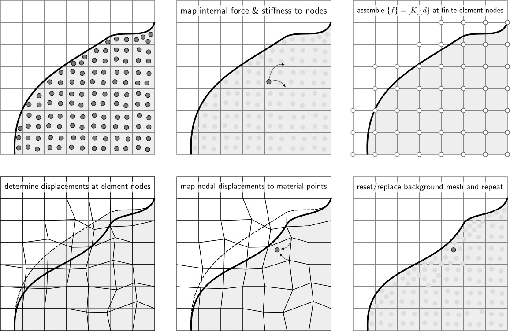

# Material Point Method

AMPSSIE is based on a number of published papers that describe fully the underlying continuum mechanics framework, material point discretisation approach and the numerical solution method. In particular, Charlton _et al._’s 2017 Generalised Interpolation Material Point Method paper [@charlton2017igimp] provides the scientific basis of the material point method implemented in AMPSSIE. 

## Material point discretisation

In material point methods the physical domain is discretised by a number of material points. These points are used to numerically approximate the stiffness of the elements in the background mesh, essentially replacing the conventional Gauss points (or other integration method). The key difference between material point and finite element methods is that these integration points move relative to the background mesh rather than being directly coupled to the positions of the background grid nodes.

## Background mesh

The material point method requires a finite element-like background mesh that covers the full extent of the physical material being analysed, that is, the full extent of the material points in the analysis. It is on this background mesh that the governing equations of the problem being analysed are assembled and solved, before the information is mapped back to the material points. AMPSSIE uses an octree background mesh. 

## Boundary conditions

As with other numerical methods that decouple the physical boundaries of the analysis domain with the computational mesh, boundary conditions are one of the more challenging aspects of the material point method.

In implicit material point formulations **displacement boundary conditions** must, in some way, be imposed on the background mesh. In AMPSSIE displacement boundary conditions are imposed directly on the background mesh. This restricts the forms of boundaries that can be modelled in the method.

## External loads/actions

Two types of **external loads** are included within AMPSSIE:

- body forces, such as gravitational loads, that are controlled by the mass at each material point and the imposed gravitational load; and
- point forces that are held at material points.

Traction boundary conditions are not included in the initial AMPSSIE release.

## Non-linear solution

AMPSSIE adopts an implicit solution procedure based on a full Newton-Raphson method for both quasi-static and dynamic problems. In this iterative method, the stiffness of the background mesh is determined within each iteration of each loadstep based on the stiffness of each of the material points. The algorithm continues until the equilibrium equation converges within a given tolerance. Once equilibrium has been obtained the material points can be updated.

## Material point update

Once equilibrium has been found the position, volume, deformation gradient, stress and elastic strain at each of the material points needs to be updated by mapping the background grid displacement field to the material points using the basis functions. Once this is complete the background mesh can be replaced or reset as appropriate. 

## Computational procedure

The applied body forces and/or tractions are split into a number of loadsteps and for each of these steps the following process is adopted:

1.  calculate the stiffness contribution, $[k^p]$, of all of the material points and assemble the individual contribution of each material point into the global stiffness matrix;
    
2.  calculate the internal force contribution, $\\{f^p\\}$, of all of the material points and assemble the contributions into the global internal force vector;
    
3.  increment the external tractions and/or body forces and solve for the nodal displacements within a loadstep, using the Newton-Raphson process until the out-of-balance force converges within a specified tolerance;
    
4.  the material point positions and volumes can then be updated through interpolation from node data;
    
5.  reset or replace the background grid.
    

These steps are shown schematically below.

