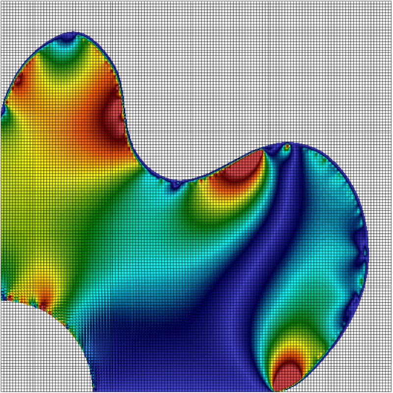

---

AMPSSIE is based on a number of published papers that describe fully the underlying continuum mechanics framework, include the weak form of the governing equilibrium equations. In particular, Charlton _et al._’s 2017 Generalised Interpolation Material Point Method paper [@charlton2017igimp] provides the scientific basis of AMPSSIE. Key aspects of the formulation are described below.

Equilibrium
---

AMPLE adopts an updated Lagrangian weak statement of equilibrium for quasi-static analysis. The Galerkin form of the weak statement of equilibrium over each background grid element, E, can be expressed as

$$\int_{\varphi_t(E)}[\nabla_x S_{vp}]^{T}\{\sigma\} \text{d}v - \int_{\varphi_t(E)}[S_{vp}]^{T}\{b\} \text{d}v - \int_{\varphi_t(\partial E)}[S_{vp}]^{T}\{t\} \text{d}s = \{0\}$$

where $\varphi_t$ is the motion of the material body which is subjected to tractions, $\{t\}$, on its boundary, $\partial E$ with surface, $s$, and body forces, $\{b\}$, acting over its volume, $v$. These external forces lead to a Cauchy stress field, $\{\sigma\}$, through the body. $[\nabla_x S_{vp}]$ is the tensorial form of the strain-displacement matrix containing derivatives of the basis functions, $[S_{vp}]$, with respect to the updated coordinates, $\{x\}$. The first term in the equilibrium equation is the internal force within an element and the combination of the second (body forces) and third (tractions) terms is the external force vector. The equilibrium equation is non-linear in terms of the unknown nodal displacements and can be efficiently solved using the standard implicit Newton-Raphson procedure (see below).

Large deformation mechanics
---

In large deformation analysis the deformation gradient provides the fundamental link between the original and the deformed states of a body. For elasto-plasticity this deformation gradient can be multiplicatively decomposed into elastic and plastic components. In AMPLE, this multiplicative decomposition is combined with a linear relationship between elastic logarithmic (or Hencky) strains and Kirchhoff stress. This allows any small strain constitutive model to be included within the code without modification.

Constitutive model
------------------

Constitutive models provide the fundamental link between stress and strain within any stress analysis algorithm. Two constitutive models are included within AMPLE:

*   linear elasticity; and
*   linear elastic-perfectly plasticity with an associated flow von Mises yield envelope.

It is straightforward to include other constitutive models.

<!--
* * *

AMPLE: A Material Point Learning Environment
--------------------------------------------

AMPLE was developed to address the severe learning curve for researchers wishing to understand, and start using, the material point method. The software was developed at Durham University between 2014 and 2018 by Dr Will Coombs as a platform to test our new research ideas and understand the impact of adopting different material point variants. AMPLE was first released in January 2019 at the 2nd International Conference on the Material Point Method held at Cambridge University, UK.

*   [Prof. Will Coombs](mailto:w.m.coombs@durham.ac.uk)
*   [Department of Engineering](http://www.dur.ac.uk/engineering)
*   [DU Computational mechanics on X](https://twitter.com/DU_comp_mech)

2020 © AMPLE: A Material Point Learning Environment

-->
