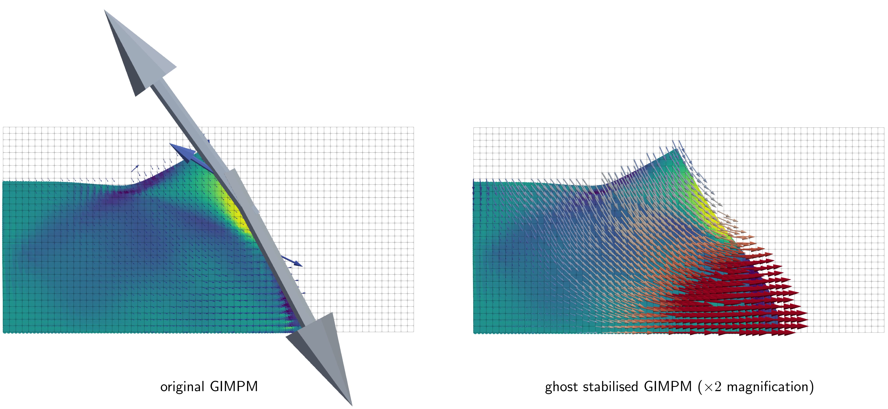
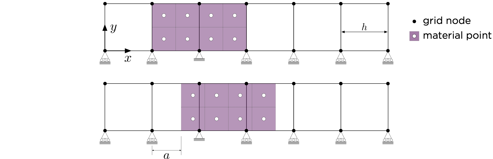
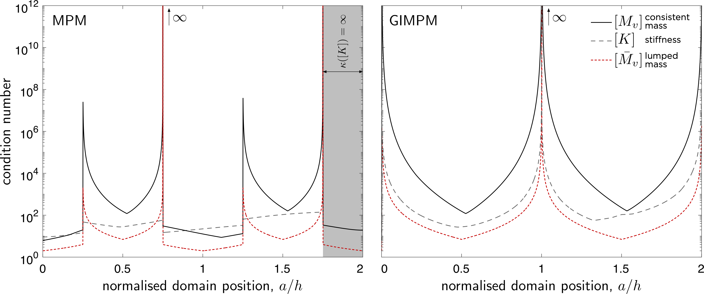
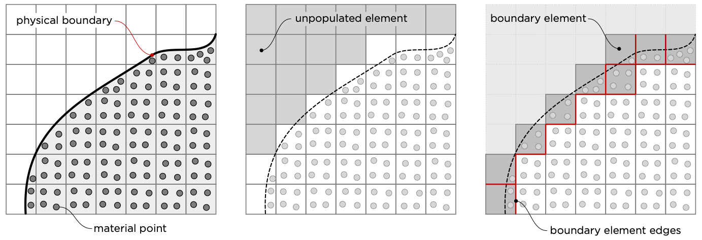
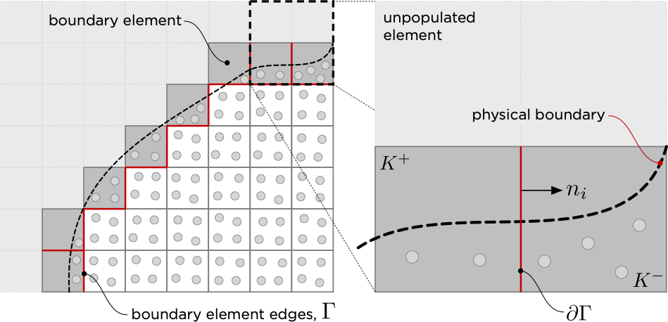

# Ghost stabilisation

The non-mesh-matching nature of the Material Point Method (MPM) means that small overlaps between material point domains and background mesh elements can generate vanishingly small mass and stiffness contributions at certain nodes . These small-cut interactions degrade the conditioning of the resulting global linear system of equations and often produce spurious stress oscillations near the physical boundary of the body.

For implicit MPM formulations using generalised interpolation basis functions, two stabilisation strategies currently exist: ghost stabilisation  and mesh aggregation. This code adopts ghost stabilisation, which introduces a penalty term into the mass and/or stiffness matrix to control the gradient of the solution across background mesh faces adjacent to the boundary of the physical body. This restores coercivity, improves the conditioning of the linear system, and significantly enhances solution quality in boundary regions.

## Small cut instability

Without stabilisation the material point method has the potential to be highly unstable. This is because the nature of the linear system of equations being solved is highly dependent on the positioning of material points relative to the background grid. There is the potential for very small values of mass/stiffness to be generated at background grid degrees of freedom if small overlaps are generated between the physical body (i.e. the material points) and the background grid. This can result in large spurious incremental displacements/velocities/accelerations being generated at the boundary of the physical body, which have the potential to lead to failure of the numerical solver within a time step. An example of this is shown below for a quasi-static elasto-plastic collapse problem, where at a given time step the original, non-stabilised, Generalised Interpolation Material Point Method (GIMPM) predicts very large spurious incremental nodal displacements, which are removed with stabilisation.  

To explore this issue in more detail, consider the simpler problem shown in Figure 2, which a block of material is displaced with a value of $a$, as a rigid body through a 2D background mesh with element size $h$. The condition number (the ratio of the largest to smallest eigenvalue) of the mass and stiffness matrices are determined at each displaced solution. The test case assumes linear elastic material behaviour with a Young's modulus of $E=1$ Pa, a Poisson's ratio of $\nu=0$ and a density of $\rho=1~\text{kg/m}^3$.   

Figure 3 provides the condition numbers of the unstabilised consistent mass, $[M_v]$, lumped mass, $[\bar{M}_v]$, and stiffness, $[K]$, matrices for the standard Material Point Method (MPM) and the GIMPM. Although the stiffness matrix for the standard MPM is well behaved, all other matrices show condition number spikes generate by small material point-background mesh node interactions. 

## Boundary identification

A central requirement of ghost stabilisation is determining which element faces lie on or near the physical boundary of the body. Unlike unfitted finite element methods, most Material Point Method simulations do not explicitly track the geometry of the physical domain. As a result, we need a robust way to identify these boundary faces without reconstructing or tracking the boundary itself.

The process consists of two steps (shown graphically in Figure 4):

- Boundary element detection: first boundary elements are identified as the elements that share a face with any unpopulated element.
- Boundary face extraction: relevant faces are then defined as those belonging to boundary elements that border either: another boundary element; or an element populated by material points.

These faces are stabilised. Each of the faces will connect two elements, one of which is labelled as the *positive* element, $K^+$, and the other the *negative* element, $K^-$. The labelling is arbitrary and flipping positive/negative elements has no impact of the stabilisation. 

The stabilisation of the faces between between boundary elements and active (populated) elements is important as it enforces gradient continuity between the well-conditioned interior region and the partially filled boundary elements, greatly improving stability. For simulations involving multiple bodies defined by material point, the procedure is applied independently to each body, and the stabilisation faces are taken as the union of all identified faces.

## Ghost stabilsation 

The ghost stabilisation term for linear elements can be expressed as

$$
	j(u_i,w_i) = \frac{h^{3}}{3} \int_{\Gamma} \left( \frac{\partial u^+_i}{\partial x_j}n_j- \frac{\partial u^-_i}{\partial x_j}n_j\right) \left( \frac{\partial w^+_i}{\partial x_j}n_j- \frac{\partial w^-_i}{\partial x_j}n_j\right) d\Gamma,
$$

where $h$ is the background mesh grid size, $u_i$ and $w_i$ are the test and trial functions, $x_j$ are the Cartesian coordinates, $n_j$ is the outward normal to the face of the positive element (see Figure 5) and $\Gamma$ are the boundary element faces that require stabilisation.  

Introducing the finite element approximation space for the test and trial functions and eliminating the nodal values associated with the test function (full derivation given in Coombs (2023)) results in a matrix comprised of four sub components multiplied by the physical displacements of the positive, $\{d^+\}$, and negative, $\{d^-\}$, elements 

$$
	\{f_G\} = \left[\begin{array}{cc}
		 {[J_G^{++}]}  &  [J_G^{+-}] \\  
		 {[J_G^{-+}]} &  [J_G^{--}]  
	\end{array} \right]\left\{\begin{array}{c}
		\{d^+\}\\ \{d^-\}
	\end{array}\right\} = [J_G]\{d\},
$$

the combined $[J_G]$ matrix can be compactly expressed as

$$
	[J_G] = \frac{h^{3}}{3}  \int_{\Gamma} \Bigl([G]^T[m][G]\Bigr) d\Gamma,
	\qquad \text{where} \qquad
	[G] = \Bigl[ [G^+] \quad -[G^-] \Bigr]
$$

and $[m]=[n][n]^T$.  

For three dimensional analysis are the normal matrix associated with the positive element, $[n]$, and the matrix containing the shape function derivatives, $[G^+]$,  are

$$
    [n]^T = \left[\begin{array}{cccccc}
        n_x & 0 & 0 & n_y & 0 & n_z\\
        0 & n_y & 0 & n_x & n_z & 0\\
        0 & 0 & n_z & 0 & n_y & n_x
    \end{array}\right]
$$

and 

$$
    [G^+] = \left[\begin{array}{ccc c ccc}
        {N_1^+}_{,x}    & 0             & 0 & \ldots & {N_n^+}_{,x}    & 0             & 0\\
        0               & {N_1^+}_{,y}  & 0 & \ldots & 0               & {N_n^+}_{,y}  & 0\\
        0               & 0             & {N_1^+}_{,z} & \ldots & 0               & 0             & {N_n^+}_{,z}\\
        {N_1^+}_{,y}    & {N_1^+}_{,x}  & 0 & \ldots & {N_n^+}_{,y}    & {N_n^+}_{,x}  & 0\\
        0               & {N_1^+}_{,z}  & {N_1^+}_{,y} & \ldots & 0               & {N_n^+}_{,z}  & {N_n^+}_{,y}\\
        {N_1^+}_{,z}    & 0             & {N_1^+}_{,x} & \ldots & {N_n^+}_{,z}    & 0             & {N_n^+}_{,x}\\
    \end{array}\right].
$$

where $N_i$ are the basis functions of the background finite element mesh and $n$ is the number of nodes associated with the positive element. 

### Stiffness stabilisation

For quasi-static analysis, ghost stabilisation acts as a penalty approach that modifies the weak form of the equilibrium equation to 

$$
\int_{\varphi_t(K)}[\nabla_x S_{vp}]^{T}\{\sigma_p\} \text{d}V - \int_{\varphi_t(K)}[S_{vp}]^{T}\{b\} \text{d}V  + \beta_k \int_{\Gamma} [G]^T[n]\{g\}  d\Gamma= \{0\},
$$

where $\{g\}=[n]^T[G]\{d\}$ is the jump in the displacement over a boundary element edge, $\beta_k = \gamma_k h^3/3$ and $\gamma_k$ is a ghost stabilisation stiffness penalty parameter that controls the magnitude of the ghost stabilisation. 

Linearising the ghost stabilisation term in the weak equilibrium equation with respect to the unknown displacements of the background mesh results in a stiffness stabilisation term with the following form

$$
{[K_G]} = \frac{\gamma_k h^3}{3}  \int_{\Gamma} \Bigl([G]^T[m][G]\Bigr) d\Gamma = \gamma_k {[J_G]}
$$

### Mass stabilisation 

For dynamic problems, the consistent mass matrix can be stabilised by the addition of 

$$
[M_G] = \gamma_M [J_G]
$$

where $\gamma_M$ is the ghost stabilisation mass penalty parameter, which is typically to set $\gamma_M=\rho/4$, where $\rho$ is the density of the material being analysed.

Note that the sum of the rows/columns in $[J_G]$ is equal to zero. This means that no additional physical mass is introduced into the linear system. However, it also means that stabilising the consistent mass matrix and then lumping entries into a diagonal lumped mass matrix removes any stabilisation in the resultant matrix.  

## Practical application

The implemented MPM software utilises stiffness matrix ghost stabilisation for quasi-static and dynamic analysis. It is possible to apply stiffness and mass stabilisation when using implicit methods to solve dynamic problems, however it has been found that stiffness stabilisation is sufficient to mitigate the small cut instability. 

### Penalty parameter value

The stiffness penalty parameter is set to

$$
\gamma_k = \frac{\bar{E}}{30}
$$

where $\bar{E}$ is the volume weighted average Young's modulus of the material points that occupy the elements that share the element boundary where the stabilisation is applied.

### Numerical integration

The integrals required to calculate $[K_G]$ are evaluated using standard Gauss-Legendre quadrature on each stabilised face

$$
{[K_G]} = \frac{\gamma_k h^3}{3}  \sum_{i=1}^{n_{Gp}}\Bigl([G_i]^T[m][G_i]\det([J])w_i\Bigr)  
$$

where $n_{Gp}$ is the number of Gauss points, $w_i$ is the weight associated with the Gauss point and $[J]$ is the Jacobian that links the local face and global coordinate systems. The determinant of $[J]$ provides the ratio of the global to local areas of the face; for cubic elements $\det([J])=h^2/4$. Note that $[G]$ can vary between Gauss points whereas $[m]$ is constant for a given face. The polynomial order of the terms in $[K_G]$ means that a 2-by-2 grid of quadrature points is used, such that $n_{Gp}=4$. The local positions of the Gauss points are tied to the positive element. The local positions on the negative element determined through a robust  local-to-global-to-local coordinate map that avoids the implementation of case by case algorithms. 

On octree meshes, the integration is performed over the face of the smallest element when applying stabilisation on non-matching faces. This choice avoids over penalising the smaller background mesh elements.  

