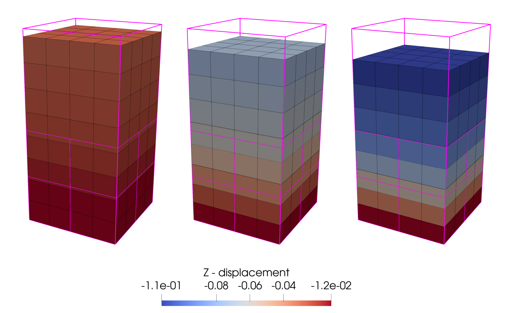
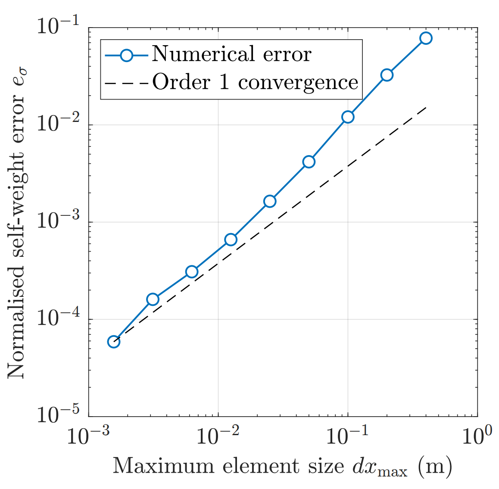

---
hide:
  - toc
---

# Tutorial 1: Self-weight column convergence

## Introduction
This quick start tutorial walks through the steps of running your first AMPSSIE problem. 

The problem is a convergence analysis of a column deforming under self-weight. It is a simple problem that runs quickly and uses all components of the code that are used to create the [deformable body's equations to be solved.](../TechnicalReferences/StaticWeakForm.md)

This tutorial has four sections:

- [Problem description](#problem-description)
- [Input setup](#input-setup)
- [Deploying and running the problem](#deploying-and-running-the-problem)
- [Viewing the results](#viewing-the-results)

## Problem description

You will define the geometry, mesh, boundary conditions, material, and solver in the input file. All the inputs to the simulation are defined using the [`input_data.json` file format](../UsingTheSoftware/InputFormat.md).

The values below give you a column that deforms significantly under self-weight. The deformation is large enough that the Generalised Interpolation Material Points (GIMPs) will traverse several elements and will interact with hanging nodes.

<div class="grid" markdown>

{ #fig-example-mesh width="100%" }

{ #fig-example-mesh-gimp width="100%" }

</div>

*Figures reproduced from [@bird2026implicitoctreebasedadaptivematerial].*

**Mesh:** Set the geometry to a $h \times h \times 0.8$ m column, i.e. $(x,y,z)\in[0,h]\times[0,h]\times[0,0.8]$ m. Start with $h = 0.4$ m. For the convergence study you will halve $h$ at each refinement step (see [](#fig-example-mesh)). The initial GIMP layout filling that mesh is shown in [](#fig-example-mesh-gimp). The element *size* $h$ is what you will plot later against the stress error:

$$
e_{\sigma} = \frac{1}{\sigma_g\, V_\Omega} \sum_{p \in P} \left| \sigma^z(z^0_p) - \sigma_p^z \right| V_p ,
$$

where:

- $\sigma_g = \rho g L$ is the characteristic stress at the bottom of the domain, with $L = 0.8$ m the column height
- $V_\Omega = L h^2$ is the total domain volume
- $\sigma^z(z_p^0) = \rho g (L - z_p)$ is the analytical vertical stress
- $z_p^0$ is the vertical position of the material point at time $t = 0$
- $V_p$ is the GIMP volume

**Initial GIMP distribution:** The mesh and initial GIMP distribution at $t=0$ do not normally coincide; however, for this problem the GIMPs will be distributed in the volume $V_\Omega = [0,h]\times[0,h]\times[0,0.8]$ m.

**Boundary conditions:** Apply roller boundaries on the four sides and the base. Leave the top as a free surface. Fix every node in $x$ and $y$ so the problem stays one-dimensional.

**Material:** Use a Hencky elastic model with constant parameters: Young's modulus $E = 10^3$ Pa, Poisson's ratio $\nu = 0$ and density $\rho = 50$ kg/m$^3$.

These properties differ slightly from Charlton et al. [@charlton_implicit_2018] on purpose - they produce large enough deformation for GIMPs to span elements of different sizes, which is the point of the test.

**Loading:** Apply gravity as a body force, $g_i = [0,\,0,\,-9.81]$ m/s$^2$.

**Solver:** Use Newton-Raphson and ramp the load on incrementally over 20 load steps.

## Input setup
The input file is a single JSON object - a human-readable, editable text file. The complete file for this problem can be found [here](Tutorial_1_input_data.md).

This problem has six top-level sections, broken out below alongside the [Problem description](#problem-description). 

Defaults (a face being free, a DOF being unconstrained, etc.) are not included in the file; only non-default settings are specified. See the [`input_data.json` file format](../UsingTheSoftware/InputFormat.md) for the full list of defaults.

<div class="json-side-header">
<div>Description</div>
<div><code>input_data.json</code></div>
</div>

<div class="json-side" markdown>

<div class="js-text" markdown>

### Mesh data

The mesh matches the $h \times h \times 0.8$ m column, with $h = 0.4$ m for the first run.

`dx refined` always gives the smallest elements in the domain.

`Refinement type` is set to `column validation` for the bespoke refinement scheme for this problem; see [](#fig-example-mesh).

</div>

<div class="js-code" markdown>

```json
 "Mesh": {
    "domain size x": 0.4,
    "domain size y": 0.4,
    "domain size z": 0.8,
    "dx refined": 0.2,
    "Refinement type": "column validation"
}
```

</div>

</div>

<div class="json-side" markdown>

<div class="js-text" markdown>

### Initial GIMP distribution

The `Initial GIMP distribution` is set to fill the whole domain and so is given the same parameters as the `Mesh data`.

The default initial GIMP distribution is $2\times2\times2$ within each element. However, for this problem larger elements will have $4\times4\times4$ whilst the smaller elements have $2\times2\times2$. `Specialised distribution` is used to set up this distribution with `column validation`.

</div>

<div class="js-code" markdown>

```json
"Initial GIMP distribution": {
    "Initial GIMP distribution x": 0.4,
    "Initial GIMP distribution y": 0.4,
    "Initial GIMP distribution z": 0.8,
    "Specialised distribution": "column validation"
    }
```

</div>

</div>

<div class="json-side" markdown>

<div class="js-text" markdown>

### Boundary conditions

Rollers are applied on the four side faces and the base ($\pm x$, $\pm y$, $-z$). The top ($+z$) face is left as a free surface, which is the default and so does not appear in the file. Every node has its $x$ and $y$ degrees of freedom fixed to keep the problem one-dimensional.

</div>

<div class="js-code" markdown>

```json
"Boundary conditions": {
    "neg x-plane": "roller",
    "neg y-plane": "roller",
    "neg z-plane": "roller",
    "pos x-plane": "roller",
    "pos y-plane": "roller",
    "x dof": "fixed",
    "y dof": "fixed"
}
```

</div>

</div>

<div class="json-side" markdown>

<div class="js-text" markdown>

### Material

The column is homogeneous, so a single layer is specified with the Hencky elastic model and the parameters from the Problem description ($E = 10^3$ Pa, $\nu = 0$, $\rho = 50$ kg/m$^3$).

</div>

<div class="js-code" markdown>

```json
"Material": {
    "number of layers": 1,
    "layers": [
        {
            "type": "Elastic",
            "empirical data": "homogeneous elastic",
            "assigned material properties": {"E": 1000.0, "nu": 0.0, "rho": 50.0}
        }
    ]
}
```

</div>

</div>

<div class="json-side" markdown>

<div class="js-text" markdown>

### Solver

The self-weight load is ramped on quasi-statically over 20 increments using a Newton-Raphson scheme.

</div>

<div class="js-code" markdown>

```json
"Solver": {
    "solve type": "static",
    "load type": "force",
    "number of increments": 20
}
```

</div>

</div>

<div class="json-side" markdown>

<div class="js-text" markdown>

### Output data

VTU and VTK output is enabled for visualisation in [ParaView](https://www.paraview.org/) (or [VisIt](https://visit-dav.github.io/visit-website/)). The `text data` field tags the run as `column validation` for post-processing.

</div>

<div class="js-code" markdown>

```json
"Output Data": {
    "vtu data": "yes",
    "vtk data": "yes",
    "text data": "column validation"
}
```

</div>

</div>

## Deploying and running the problem
There are several methods for [deploying](../UsingTheSoftware/DeployingTheSoftware.md). 

## Viewing the results

<div class="grid" markdown>

{ #fig-gravity-displacement width="100%" }

{ #fig-gravity-convergence width="100%" }

</div>

*Figures reproduced from [@bird2026implicitoctreebasedadaptivematerial].*