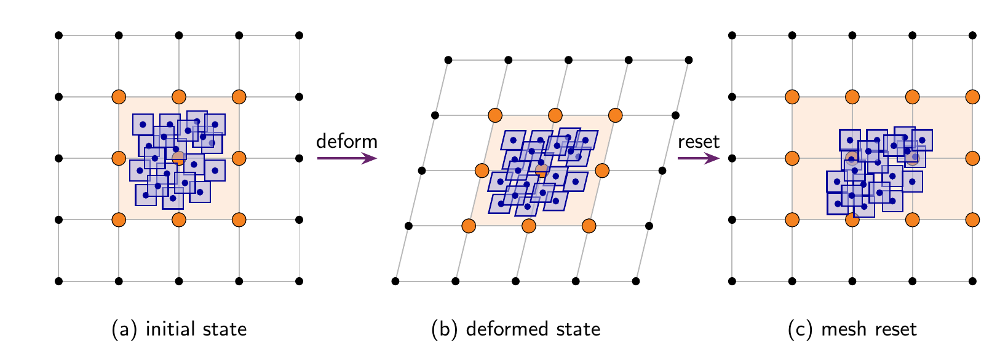
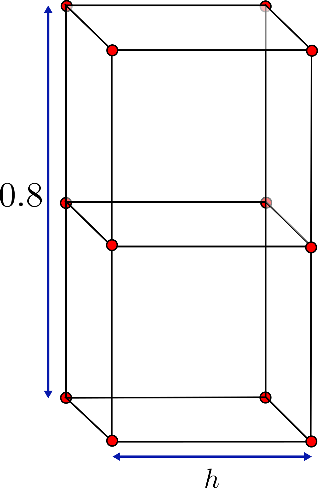
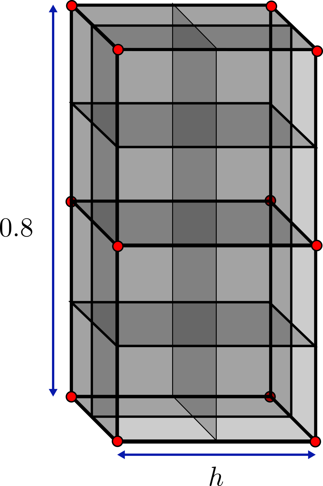
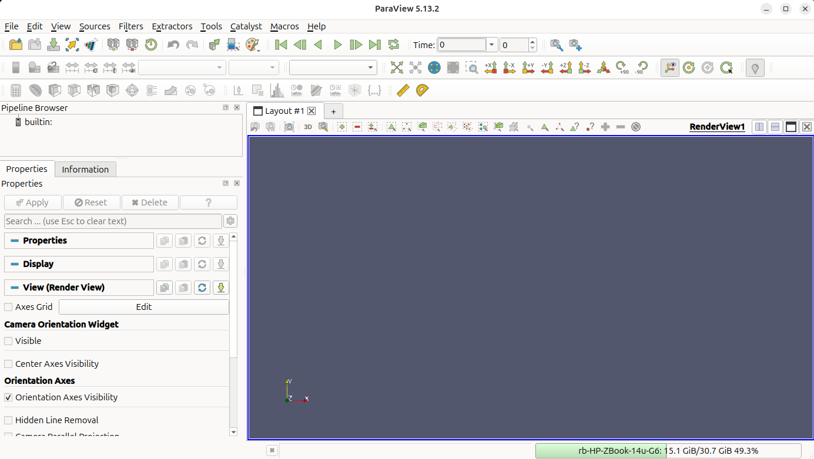
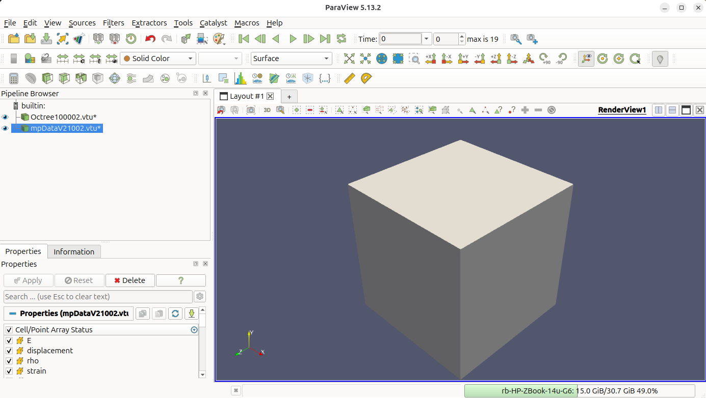
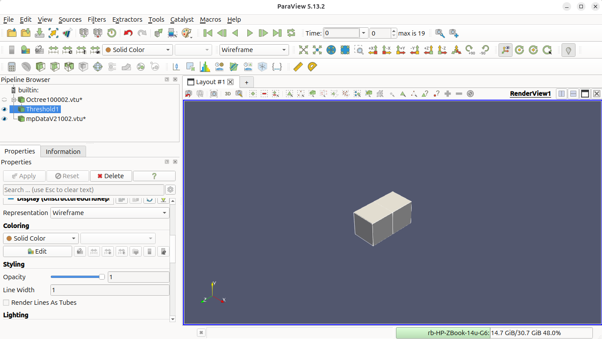
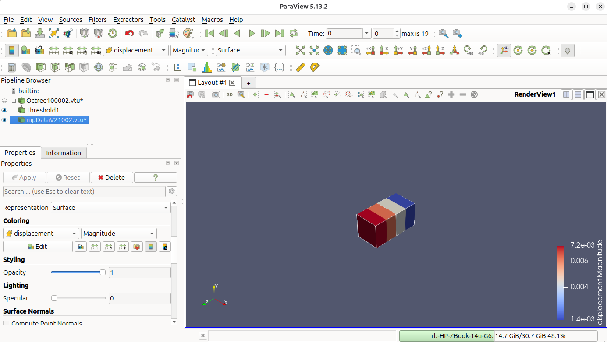
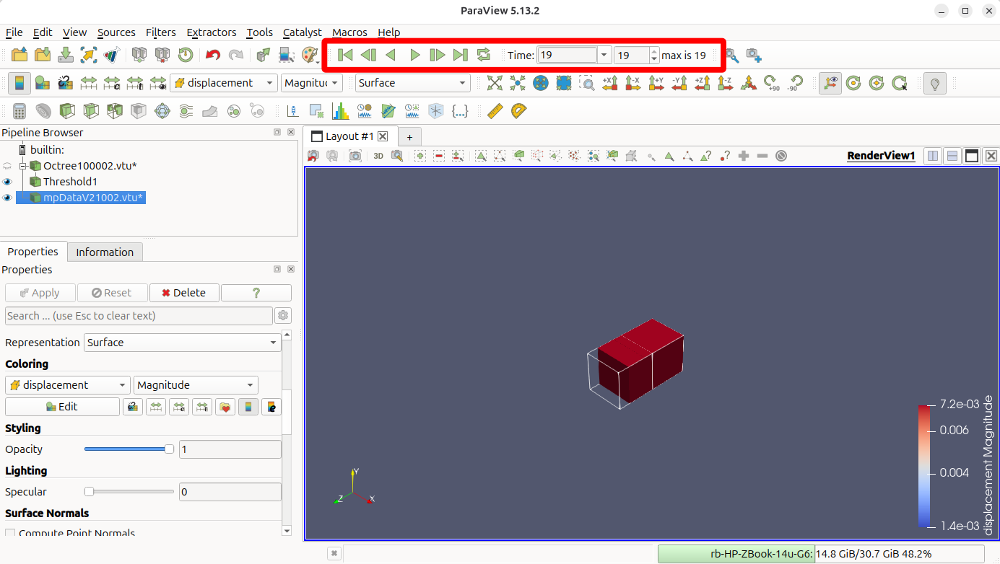
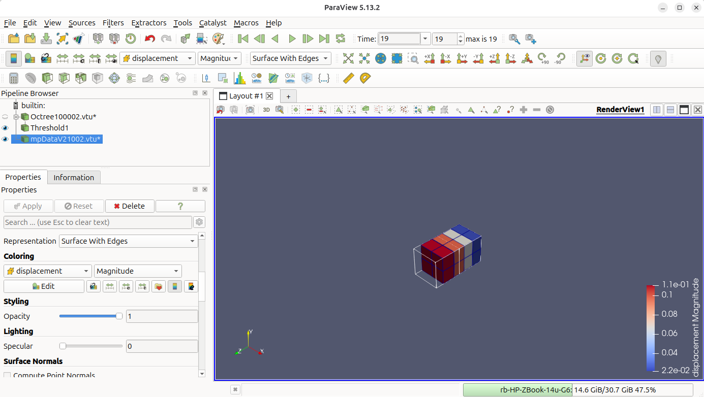
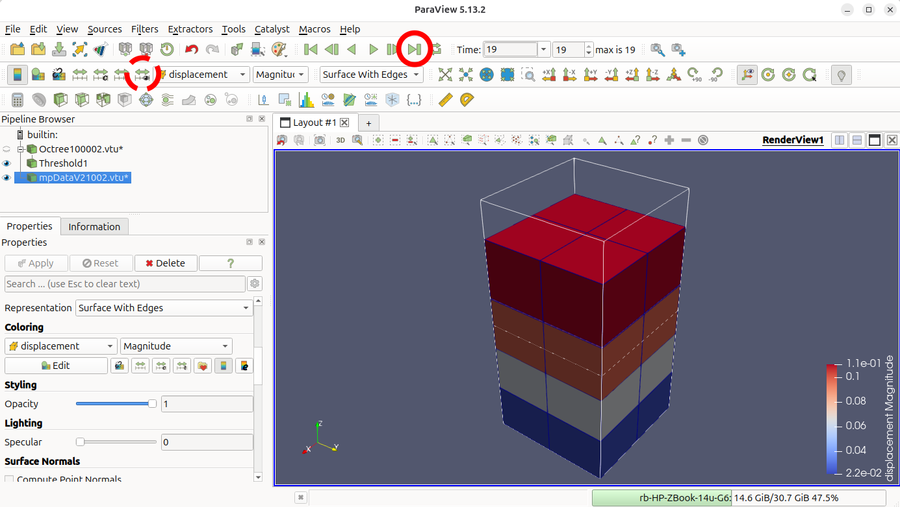

---
hide:
  - toc
---

# Tutorial 1: Self-weight column

## Introduction
This quick start tutorial walks through the steps of running your first AMPSSIE problem.

This tutorial analyses a column deforming under self-weight and solves the static weak-form [equations](../TechnicalReferences/StaticWeakForm.md). It is simple but introduces you to all components of the code: setting up, running and viewing the output data.

This tutorial has three main sections after the introduction:

- [Input setup](#input-setup)
- [Deploying and running the problem](#deploying-and-running-the-problem)
- [Viewing the results](#viewing-the-results)

This tool introduces you to the Generalised Interpolation Material Point Method (GIMPM), and how it is different to methods such as finite element analysis. The GIMPM can be classed as a fictitious domain method, this means that the mesh and boundary conditions do not necessarily align with the material domain, the body that is being modelled by the material points. This enables the GIMPM to avoid distorted mesh issues normally associated with finite elements.

The GIMPM broadly works in three steps:
{ #fig-example-GIMPM width="100%" }

- (a) initial state which loads the material point data on the background mesh
- (b) deforming the mesh and the material points together
- (c) resetting the mesh but not the material points, distorting the body relative to the mesh

This framework means that you have to define the `Mesh`, the discretisation on which the equations are solved, and the `Initial GIMP distribution`, the modelled body that carries all the material and kinematic data. This means that the `Boundary conditions`, such as fixed or rolling nodes are applied to the vertices of the `Mesh`, whereas force loads such as gravity are applied to the material points directly. 

## Input setup

**Problem summary:** The aim is to recover the vertical stress field that develops through a column that deforms vertically and compare the stress solution against the analytical one

$$
\sigma_g = \rho g (L - z_p),
$$

where $g = 9.81$ m/s$^2$ is the acceleration due to gravity, $L = 0.8$ m is the initial height of the domain and $z_p$ is the initial vertical position of the material point (m).

The column is $0.4 \times 0.4 \times 0.8$ m (see [](#fig-example-mesh)), made of a homogeneous Hencky elastic material with Young's modulus $E = 10^3$ Pa, Poisson's ratio $\nu = 0$ and density $\rho = 50$ kg/m$^3$. The material domain is filled with a $2\times2\times2$ grid of GIMPs in each element (see [](#fig-example-mesh-gimp)). This is a load-controlled problem, so the gravitational load is divided into 20 increments, with each increment solved by a Newton-Raphson scheme.


The simulation is configured through a single JSON object - a human-readable, editable text file. The complete file for this problem can be found [`here`](Tutorial_1_input_data.md) and for all input settings see the [`input_data.json` file format](../UsingTheSoftware/InputFormat.md).

<div class="grid" markdown>

{ #fig-example-mesh width="100%" }

{ #fig-example-mesh-gimp width="100%" }
</div>


<div class="json-side-header">
<div>Description</div>
<div><code>input_data.json</code></div>
</div>

<div class="json-side" markdown>

<div class="js-text" markdown>

### Mesh data

The mesh matches the $0.4 \times 0.4 \times 0.8$ m column. The element size is defined with `dx refined` which gives the dimensions of the smallest elements.

</div>

<div class="js-code" markdown>

```json
 "Mesh": {
    "domain size x": 0.4,
    "domain size y": 0.4,
    "domain size z": 0.8,
    "dx refined": 0.4
}
```

</div>

</div>

<div class="json-side" markdown>

<div class="js-text" markdown>

### Initial GIMP distribution

The `Initial GIMP distribution` is set to fill the whole domain and so is given the same parameters as the `Mesh data`. The default initial GIMP distribution is a grid of 8 GIMPs, $2\times2\times2$ within each element, this is set with `number GIMP`.

</div>

<div class="js-code" markdown>

```json
"Initial GIMP distribution": {
    "Initial GIMP distribution x": 0.4,
    "Initial GIMP distribution y": 0.4,
    "Initial GIMP distribution z": 0.8,
    "number GIMP": 2
    }
```

</div>

</div>

<div class="json-side" markdown>

<div class="js-text" markdown>

### Boundary conditions

Rollers are applied on the four side faces and the base ($\pm x$, $\pm y$, $-z$). The top ($+z$) face is left as a free surface. Faces of the domain are by default free so `pos z-plane` does not appear in the file. Every node also has its $x$ and $y$ degrees of freedom fixed to keep the problem one-dimensional, the default is for the degree of freedom to be `free` so $z$ is not set.

</div>

<div class="js-code" markdown>

```json
"Boundary conditions": {
    "neg x-plane": "roller",
    "neg y-plane": "roller",
    "neg z-plane": "roller",
    "pos x-plane": "roller",
    "pos y-plane": "roller",
    "x dof": "fixed",
    "y dof": "fixed"
}
```

</div>

</div>

<div class="json-side" markdown>

<div class="js-text" markdown>

### Material

The column is homogeneous, so a single layer is specified with the Hencky elastic model and the parameters from the Problem description ($E = 10^3$ Pa, $\nu = 0$, $\rho = 50$ kg/m$^3$).

</div>

<div class="js-code" markdown>

```json
"Material": {
    "number of layers": 1,
    "layers": [
        {
            "type": "Elastic",
            "empirical data": "homogeneous elastic",
            "assigned material properties": {"E": 1000.0, "nu": 0.0, "rho": 50.0}
        }
    ]
}
```

</div>

</div>

<div class="json-side" markdown>

<div class="js-text" markdown>

### Solver

The self-weight load is ramped quasi-statically over 20 increments using a Newton-Raphson scheme.

</div>

<div class="js-code" markdown>

```json
"Solver": {
    "solve type": "static",
    "load type": "body force",
    "number of increments": 20
}
```

</div>

</div>

<div class="json-side" markdown>

<div class="js-text" markdown>

### Output data

VTU and VTK output is enabled for visualisation in [ParaView](https://www.paraview.org/) (or [VisIt](https://visit-dav.github.io/visit-website/)). The `text data` field outputs the vertical stress GIMP data with the deformed and initial height.

</div>

<div class="js-code" markdown>

```json
"Output Data": {
    "vtu data": "yes",
    "vtk data": "yes",
    "text data": "self-weight column"
}
```

</div>

</div>

## Deploying and running the problem

AMPSSIE is written in the [Julia](https://julialang.org/) programming language, and there are two ways to run the code, both explored on the [deployment page](../UsingTheSoftware/DeployingTheSoftware.md). As this is a small problem that runs quickly, this tutorial will use Julia directly; see the [installation guide](../GettingStarted/Installation.md) for instructions on installing Julia and the AMPSSIE library.


<div class="json-side-header">
<div>Deployment instructions</div>
<div><code>terminal</code></div>
</div>

<div class="json-side" markdown>

<div class="js-text" markdown>

### Setting up and running the problem

Once Julia is installed, download the AMPSSIE package from GitHub - the [deployment page](../UsingTheSoftware/DeployingTheSoftware.md) covers how to do this. The commands below work the same on Windows, macOS and Linux.

The first step is to copy the `input_data.json` into the top-level AMPSSIE directory, provided [here](Tutorial_1_input_data.md). If you do this on the command line it will look like this
```
cp path/to/input_data_location/input_data.json path/to/AMPSSIE/MaterialPoints
```
where the first path is the location of your `input_data.json` and the second is the top-level AMPSSIE directory.

The next steps are for starting julia and loading up the AMPSSIE package. Open a terminal (command line or PowerShell on Windows) and start Julia with the command:
```
julia
``` 

Then change into the top-level AMPSSIE directory
```
cd("path/to/AMPSSIE/MaterialPoints")
```

and run
```
include("setup_workers.jl")
```
to install the AMPSSIE package and start multiple parallel workers.

If it works correctly the output should match something similar to the corresponding terminal window. If there are issues, see the [deployment page](../UsingTheSoftware/DeployingTheSoftware.md) for troubleshooting.


</div>

<div class="js-code" markdown>

<div class="terminal" markdown>

```console
$ julia
               _
   _       _ _(_)_     |  Documentation: https://docs.julialang.org
  (_)     | (_) (_)    |
   _ _   _| |_  __ _   |  Type "?" for help, "]?" for Pkg help.
  | | | | | | |/ _` |  |
  | | |_| | | | (_| |  |  Version 1.12.4 (2026-01-06)
 _/ |\__'_|_|_|\__'_|  |  Official https://julialang.org release
|__/                   |

julia> cd("path/to/AMPSSIE/MaterialPoints")

julia> include("setup_workers.jl")
   Resolving package versions...
  Activating project at `path/to/AMPSSIE/MaterialPoints`
      From worker 2:    Activating project at `path/to/AMPSSIE/MaterialPoints`
      From worker 3:    Activating project at `path/to/AMPSSIE/MaterialPoints`
starting sim
total memory 30.66 GB
free memory  17.81 GB
      From worker 2:    total memory 30.66 GB
      From worker 2:    free memory  17.81 GB
      From worker 3:    total memory 30.66 GB
      From worker 3:    free memory  17.81 GB
```

</div>

</div>

</div>

<div class="json-side" markdown>

<div class="js-text" markdown>

### Running the problem

With the `input_data.json` in the correct place and Julia running with the AMPSSIE package loaded, the simulation can be started by calling the AMPSSIE entry point. This reads `input_data.json` from the current directory, steps through the 20 load increments under self-weight, and writes the `.vtu`, or `vtk`, output files for ParaView visualisation and a `.csv` file specific for this validation problem.

**Reading the output.** Each `time …` block in the terminal corresponds to one of the 20 load increments. For a static problem AMPSSIE uses a pseudo-time that runs from $t = 0$ to $t = 1$, with the increment size `dt` calculated automatically as $1 / \text{number of increments}$ (so `dt` $= 0.05$ for this run). For each step the solver prints:

- `time X.XXXXXe+XX ----` - the pseudo-time at the start of the step.
- `number of isolated material points` - a connectivity check; should stay at `0` for this problem.
- `minimum ghost value` - the ghost-stabilisation parameter in use.
- `Iteration N | Error: … | dt: …` - the Newton-Raphson iteration number, the residual norm and the step size. The error should drop sharply (quadratic convergence) until it falls below the solver tolerance.
- `solve time X.XXX s` - wall-clock time spent on that iteration.
- `vtk storage start … complete` - the per-step results being written to disk.

When all 20 increments are finished the simulation prints `Simulation complete!`.

</div>

<div class="js-code" markdown>

<div class="terminal" markdown>

```console
julia> Ampse.run("input_data.json");

time 0.00000e+00 ----------------------------------
number of isolated material points: 0
minimum ghost value 1000.0
Iteration   0 | Error: 1.000000e+00 | dt: 5.000e-02
solve time 0.053 s | Iteration   1 | Error: 1.373106e-02 | dt: 5.000e-02
solve time 0.005 s | Iteration   2 | Error: 2.461949e-06 | dt: 5.000e-02
solve time 0.003 s | Iteration   3 | Error: 7.164958e-12 | dt: 5.000e-02
vtk storage start  ... complete

time 5.00000e-02 ----------------------------------
number of isolated material points: 0
minimum ghost value 1000.0
Iteration   0 | Error: 5.000054e-01 | dt: 5.000e-02
solve time 0.006 s | Iteration   1 | Error: 6.732525e-03 | dt: 5.000e-02
solve time 0.007 s | Iteration   2 | Error: 1.161798e-06 | dt: 5.000e-02
solve time 0.005 s | Iteration   3 | Error: 3.522579e-12 | dt: 5.000e-02
vtk storage start  ... complete

time 1.00000e-01 ----------------------------------
number of isolated material points: 0
minimum ghost value 1000.0
Iteration   0 | Error: 3.333494e-01 | dt: 5.000e-02
solve time 0.007 s | Iteration   1 | Error: 4.403240e-03 | dt: 5.000e-02
solve time 0.009 s | Iteration   2 | Error: 7.318912e-07 | dt: 5.000e-02
vtk storage start  ... complete

time 1.50000e-01 ----------------------------------
number of isolated material points: 0
minimum ghost value 1000.0
Iteration   0 | Error: 2.500237e-01 | dt: 5.000e-02
solve time 0.004 s | Iteration   1 | Error: 3.241109e-03 | dt: 5.000e-02
solve time 0.005 s | Iteration   2 | Error: 5.192950e-07 | dt: 5.000e-02
vtk storage start  ... complete

time 2.00000e-01 ----------------------------------
number of isolated material points: 0
minimum ghost value 1000.0
Iteration   0 | Error: 2.000223e-01 | dt: 5.000e-02
solve time 0.004 s | Iteration   1 | Error: 2.545782e-03 | dt: 5.000e-02
solve time 0.004 s | Iteration   2 | Error: 3.934660e-07 | dt: 5.000e-02
vtk storage start  ... complete

time 2.50000e-01 ----------------------------------
number of isolated material points: 0
minimum ghost value 1000.0
Iteration   0 | Error: 1.667068e-01 | dt: 5.000e-02
solve time 0.004 s | Iteration   1 | Error: 2.083781e-03 | dt: 5.000e-02
solve time 0.006 s | Iteration   2 | Error: 3.108938e-07 | dt: 5.000e-02
vtk storage start  ... complete

time 3.00000e-01 ----------------------------------
number of isolated material points: 0
minimum ghost value 1000.0
Iteration   0 | Error: 1.429193e-01 | dt: 5.000e-02
solve time 0.005 s | Iteration   1 | Error: 1.755140e-03 | dt: 5.000e-02
solve time 0.004 s | Iteration   2 | Error: 2.529541e-07 | dt: 5.000e-02
vtk storage start  ... complete

time 3.50000e-01 ----------------------------------
number of isolated material points: 0
minimum ghost value 1000.0
Iteration   0 | Error: 1.250602e-01 | dt: 5.000e-02
solve time 0.006 s | Iteration   1 | Error: 1.509764e-03 | dt: 5.000e-02
solve time 0.004 s | Iteration   2 | Error: 2.103297e-07 | dt: 5.000e-02
vtk storage start  ... complete

time 4.00000e-01 ----------------------------------
number of isolated material points: 0
minimum ghost value 1000.0
Iteration   0 | Error: 1.111562e-01 | dt: 5.000e-02
solve time 0.003 s | Iteration   1 | Error: 1.319980e-03 | dt: 5.000e-02
solve time 0.004 s | Iteration   2 | Error: 1.778906e-07 | dt: 5.000e-02
vtk storage start  ... complete

time 4.50000e-01 ----------------------------------
number of isolated material points: 0
minimum ghost value 1000.0
Iteration   0 | Error: 1.000674e-01 | dt: 5.000e-02
solve time 0.004 s | Iteration   1 | Error: 1.168819e-03 | dt: 5.000e-02
solve time 0.004 s | Iteration   2 | Error: 1.524495e-07 | dt: 5.000e-02
vtk storage start  ... complete

time 5.00000e-01 ----------------------------------
number of isolated material points: 0
minimum ghost value 1000.0
Iteration   0 | Error: 9.102898e-02 | dt: 5.000e-02
solve time 0.003 s | Iteration   1 | Error: 1.046259e-03 | dt: 5.000e-02
solve time 0.004 s | Iteration   2 | Error: 1.321833e-07 | dt: 5.000e-02
vtk storage start  ... complete

time 5.50000e-01 ----------------------------------
number of isolated material points: 0
minimum ghost value 1000.0
Iteration   0 | Error: 8.350890e-02 | dt: 5.000e-02
solve time 0.004 s | Iteration   1 | Error: 9.447820e-04 | dt: 5.000e-02
solve time 0.012 s | Iteration   2 | Error: 1.156868e-07 | dt: 5.000e-02
vtk storage start  ... complete

time 6.00000e-01 ----------------------------------
number of isolated material points: 0
minimum ghost value 1000.0
Iteration   0 | Error: 7.708897e-02 | dt: 5.000e-02
solve time 0.003 s | Iteration   1 | Error: 8.594043e-04 | dt: 5.000e-02
solve time 0.004 s | Iteration   2 | Error: 1.020430e-07 | dt: 5.000e-02
vtk storage start  ... complete

time 6.50000e-01 ----------------------------------
number of isolated material points: 0
minimum ghost value 1000.0
Iteration   0 | Error: 7.163774e-02 | dt: 5.000e-02
solve time 0.006 s | Iteration   1 | Error: 7.868987e-04 | dt: 5.000e-02
solve time 0.004 s | Iteration   2 | Error: 9.069380e-08 | dt: 5.000e-02
vtk storage start  ... complete

time 7.00000e-01 ----------------------------------
number of isolated material points: 0
minimum ghost value 1000.0
Iteration   0 | Error: 6.696646e-02 | dt: 5.000e-02
solve time 0.004 s | Iteration   1 | Error: 7.244346e-04 | dt: 5.000e-02
solve time 0.006 s | Iteration   2 | Error: 8.105128e-08 | dt: 5.000e-02
vtk storage start  ... complete

time 7.50000e-01 ----------------------------------
number of isolated material points: 0
minimum ghost value 1000.0
Iteration   0 | Error: 6.280416e-02 | dt: 5.000e-02
solve time 0.005 s | Iteration   1 | Error: 6.705482e-04 | dt: 5.000e-02
solve time 0.005 s | Iteration   2 | Error: 7.288976e-08 | dt: 5.000e-02
vtk storage start  ... complete

time 8.00000e-01 ----------------------------------
number of isolated material points: 0
minimum ghost value 1000.0
Iteration   0 | Error: 5.919429e-02 | dt: 5.000e-02
solve time 0.003 s | Iteration   1 | Error: 6.230913e-04 | dt: 5.000e-02
solve time 0.004 s | Iteration   2 | Error: 6.580529e-08 | dt: 5.000e-02
vtk storage start  ... complete

time 8.50000e-01 ----------------------------------
number of isolated material points: 0
minimum ghost value 1000.0
Iteration   0 | Error: 5.597731e-02 | dt: 5.000e-02
solve time 0.004 s | Iteration   1 | Error: 5.815146e-04 | dt: 5.000e-02
solve time 0.007 s | Iteration   2 | Error: 5.977072e-08 | dt: 5.000e-02
vtk storage start  ... complete

time 9.00000e-01 ----------------------------------
number of isolated material points: 0
minimum ghost value 1000.0
Iteration   0 | Error: 5.309161e-02 | dt: 5.000e-02
solve time 0.004 s | Iteration   1 | Error: 5.439947e-04 | dt: 5.000e-02
solve time 0.004 s | Iteration   2 | Error: 5.428270e-08 | dt: 5.000e-02
vtk storage start  ... complete

time 9.50000e-01 ----------------------------------
number of isolated material points: 0
minimum ghost value 1000.0
Iteration   0 | Error: 5.058659e-02 | dt: 5.000e-02
solve time 0.003 s | Iteration   1 | Error: 5.123367e-04 | dt: 5.000e-02
solve time 0.003 s | Iteration   2 | Error: 4.983456e-08 | dt: 5.000e-02
vtk storage start  ... complete

time 1.00000e+00 ----------------------------------
number of isolated material points: 0
minimum ghost value 1000.0
Iteration   0 | Error: 4.824111e-02 | dt: 5.000e-02
solve time 0.003 s | Iteration   1 | Error: 4.828890e-04 | dt: 5.000e-02
solve time 0.011 s | Iteration   2 | Error: 4.577559e-08 | dt: 5.000e-02
vtk storage start  ... complete

Simulation complete!
```

</div>

</div>

</div>


## Viewing the results

The simulation results appear as the simulation runs, so you do not need to wait until it has finished. When the problem is run using your local Julia installation, the `.csv`, `.vtk` and `.vtu` files are stored in `MaterialPoints/src/output` (as configured in the [`output data`](#output-data) section of the input file).

### Visualising the output in ParaView

The output files can be opened in [ParaView](https://www.paraview.org/) to inspect the deformed column and the stress field. The walkthrough below opens the GIMP data (`mpDataV..vtu`) and the background mesh (`Octree..vtu`), thresholds the mesh to the active region, colours the GIMPs by displacement, and finally shows the vertical stress.

**1. Open ParaView.** Launch ParaView from your applications menu or terminal; you should see an empty render view.

{ #fig-paraview-1 width="80%" }

**2. Open the output files.** *File → Open* and navigate to `MaterialPoints/src/output`. Select `mpDataV..vtu` (the GIMP data) and `Octree..vtu` (the background mesh) - hold `Ctrl` to select both - then click *OK*.

{ #fig-paraview-2 width="80%" }

**3. Apply the readers.** Click *Apply* in the Properties panel for each reader. The full GIMP domain appears as a solid grey cube and the cell/point arrays `displacement`, `strain`, `E` and `rho` become available.

{ #fig-paraview-3 width="80%" }

**4. Threshold to the active region.** With the Octree mesh selected, *Filters → Common → Threshold*. Set the scalar to `Sim active`, lower threshold `0.73`, upper `1.0`, then *Apply*. This hides the inactive padding cells outside the column.

{ #fig-paraview-4 width="80%" }

**5. Switch to Wireframe.** Set the representation of the threshold to *Wireframe* so the active mesh edges are visible.

{ #fig-paraview-5 width="80%" }

**6. Colour the GIMPs by displacement.** Select `mpDataV..vtu`, change *Coloring* to `displacement` → `Magnitude`. At step 0 (undeformed) the GIMPs sit near the low end of the colour bar.

{ #fig-paraview-6 width="80%" }

**7. Advance to the final step.** Use the time controls at the top (set time to the maximum, `19`, for the last of the 20 increments). The GIMPs shift to the high end of the colour bar, showing the maximum self-weight deformation.

{ #fig-paraview-7 width="80%" }

**8. Show element edges.** Change the representation to *Surface With Edges* to see the individual GIMP cells.

{ #fig-paraview-8 width="80%" }

**9. View the vertical stress.** Switch *Coloring* from `displacement` to the vertical stress component. The result should match the analytical solution $\sigma_g = \rho g (L - z_p)$ from the [Problem summary](#input-setup) - linearly varying from zero at the top to a compressive maximum at the base.

{ #fig-paraview-9 width="80%" }