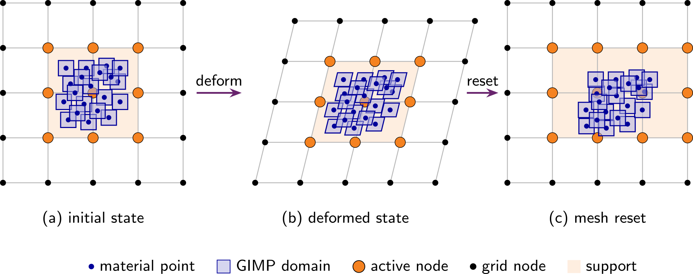

# Tutorial 1: Self-weight column

## Introduction
This quick start tutorial walks through the steps of running your first S3-MPM problem.

This tutorial analyses a column deforming under its own weight and solves the static [equilibrium equations](../TechnicalReferences/EquilibriumEquations.md). It is simple but introduces you to all components of the code: setting up the input file, running the analysis and viewing the output data.

This tutorial has three main sections after the introduction:

- [Input setup](#input-setup)
- [Deploying and running the problem](#deploying-and-running-the-problem)
- [Viewing the results](#viewing-the-results)

### Background: the GIMPM

This problem introduces you to the S3-MPM code, and how it is different to methods such as finite element analysis. The GIMPM can be classed as a fictitious domain method: the mesh and boundary conditions do not necessarily align with the material domain, the body that is being modelled by the material points. This enables the GIMPM to avoid the distorted mesh issues normally associated with finite elements.

The GIMPM broadly works in three steps:
{ #fig-example-GIMPM width="70%" }

- (a) initial state which loads the material point data on the background mesh
- (b) deforming the mesh and the material points together
- (c) resetting the mesh but not the material points, distorting the body relative to the mesh

Under this framework you define two things: the background mesh on which the equations are solved, through its element size, and the material points - the modelled body, which carries all the material and kinematic data at the Generalised Interpolation Material Points (GIMPs). In S3-MPM both are set in the `"material points"` section of the input file. Boundary conditions (roller or fixed faces) are applied to the nodes of the background mesh, whereas body forces such as gravity are applied to the material points directly.

## Input setup

### Problem summary

The aim is to recover the vertical stress field that develops in a column compressed by its own weight, and to compare it against the analytical solution

$$
\sigma_{zz} = -\rho\, g\, (L - z_p),
$$

where $\rho$ is the density, $g = 9.81$ m/s$^2$ is the acceleration due to gravity, $L = 0.8$ m is the initial height of the column and $z_p$ is the initial height of the material point. Stress is tension positive, so the column is in compression. Because Poisson's ratio is zero and the sides of the column are on rollers, the cross-section does not change, so this Cauchy stress holds however large the deformation.

The column is $0.05 \times 0.05 \times 0.8$ m, made of a homogeneous Hencky elastic material with Poisson's ratio $\nu = 0$ and density $\rho = 50$ kg/m$^3$. The Young's modulus, $E = \rho g L / (2 \ln 2) = 283$ Pa, is chosen to make the deformation large: the material at the base is compressed to half its original length, and the column shortens from $0.8$ m to about $0.54$ m.

The column is divided into 16 elements of $0.05$ m, each filled with a $2 \times 2 \times 2$ grid of GIMPs - 128 in total. Gravity is applied gradually over 50 load steps, each solved by a Newton-Raphson scheme.

!!! example "Placeholder: ParaView screenshot"
    `img/tutorial_1/column_setup.png` - the column of material points at the first output step, with the element size marked.

The simulation is configured through a single JSON object - a human-readable, editable text file. The complete file for this problem can be found [here](Tutorial_1_input_data.md), and every key is described on the [`input_data.json` file format](../UsingTheSoftware/InputFormat.md) page.

<div class="json-side-header">
<div>Description</div>
<div><code>input_data.json</code></div>
</div>

<div class="json-side" markdown>

<div class="js-text" markdown>

### Machine

`"GPU": "off"` runs the analysis on the CPU, which is plenty for a problem this small.

`"domain update": "stretch"` lets the domain of each GIMP stretch with the deformation of the material, so that the GIMPs near the base shrink to half their height as the column is compressed. It is optional; without it the domains keep their initial size.

</div>

<div class="js-code" markdown>

```json
"GPU": "off",

"domain update": "stretch"
```

</div>

</div>

<div class="json-side" markdown>

<div class="js-text" markdown>

### Domain

`"size"` is a lower bound on the side of the cubic background mesh. The mesh is enlarged automatically to hold the column plus the same height of empty space above it, which here makes it a cube of side $1.6$ m. Gravity acts in $-z$.

</div>

<div class="js-code" markdown>

```json
"domain": {
    "size": 0.1,
    "gravity": [0.0, 0.0, -9.81]
}
```

</div>

</div>

<div class="json-side" markdown>

<div class="js-text" markdown>

### Material points

The column is one layer, $0.8$ m thick, on a $0.05 \times 0.05$ m footprint. `"element size"` sets the background elements to $0.05$ m, and `"number of material points per element 1": 2` places a $2 \times 2 \times 2$ grid of GIMPs in each element.

The material is the Hencky elastic model with the parameters from the [Problem summary](#problem-summary). `"extra capacity"` reserves spare storage for material points created by mesh refinement; there is no refinement here, but the key is still required.

</div>

<div class="js-code" markdown>

```json
"material points": {
    "extra capacity": 1.2,
    "element size": 0.05,
    "number of material points per element 1": 2,
    "material size": { "min": [0.0, 0.0], "max": [0.05, 0.05] },
    "layers": [
        {
            "thickness": 0.8,
            "material": { "type": "elastic", "E": 283.0, "nu": 0.0, "density": 50.0 }
        }
    ]
}
```

</div>

</div>

<div class="json-side" markdown>

<div class="js-text" markdown>

### Rigid bodies and contact

This problem has no rigid bodies, so `"rigid bodies"` is an empty list. The `"contact"` section is still required, and its friction coefficient has no effect.

</div>

<div class="js-code" markdown>

```json
"rigid bodies": [],

"contact": {
    "friction coefficient": 0.0
}
```

</div>

</div>

<div class="json-side" markdown>

<div class="js-text" markdown>

### Analysis

A single static stage. `"load": "gravity ramp"` increases gravity from zero to its full value over the 50 load steps, and `"rigid bodies": "off"` because there are none.

Rollers are applied on the four sides ($x$ and $y$ `"min"` and `"max"`) and the base is fixed. The top is left free; the `"max"` $z$ face lies at twice the column height, in the empty space above the column, so it never touches the material.

</div>

<div class="js-code" markdown>

```json
"analysis": [
    {
        "type": "static",
        "load steps": 50,
        "load": "gravity ramp",
        "rigid bodies": "off",
        "boundary conditions": { "min": ["roller", "roller", "fixed"], "max": ["roller", "roller", "free"] }
    }
]
```

</div>

</div>

<div class="json-side" markdown>

<div class="js-text" markdown>

### Solver

Each load step is solved by Newton-Raphson iterations to a tolerance of $10^{-6}$; a step that has not converged after 20 iterations is retried with half the load increment. The column fills its elements completely, so the [ghost stabilisation](../TechnicalReferences/ghostStabilisation.md) is switched off with both ghost factors set to zero.

</div>

<div class="js-code" markdown>

```json
"solver": {
    "tolerance": 1.0e-6,
    "max newton iterations": 20,
    "poor factor": 0.25,
    "ghost factor": 0.0,
    "ghost factor mass": 0.0
}
```

</div>

</div>

<div class="json-side" markdown>

<div class="js-text" markdown>

### Output

VTK output, for visualisation in [ParaView](https://www.paraview.org/) (or [VisIt](https://visit-dav.github.io/visit-website/)), is written to `vtk_column` at every load step (`"vtk percent": 0`), with the displacement, stress, strain and volume of each GIMP.

CSV output is written to `csv_column`, also at every load step, with each GIMP's initial position, current position and stress - everything needed to compare against the analytical solution. There are no rigid bodies, so no rigid-body fields are needed.

</div>

<div class="js-code" markdown>

```json
"output": {
    "vtk": "on",
    "vtk directory": "vtk_column",
    "vtk percent": 0,
    "vtk material point fields": ["displacement", "stress", "strain", "volume"],

    "csv": "on",
    "csv directory": "csv_column",
    "csv percent": 0,
    "csv material point fields": ["initial position", "position", "stress"],
    "csv rigid body fields": []
}
```

</div>

</div>

## Deploying and running the problem

S3-MPM is written in the [Julia](https://julialang.org/) programming language, and there are two ways to run the code, both explored on the [deployment page](../UsingTheSoftware/DeployingTheSoftware.md). As this is a small problem that runs quickly, this tutorial uses Julia directly; see the [installation guide](../GettingStarted/Installation.md) for installing Julia and S3-MPM.

<div class="json-side-header">
<div>Deployment instructions</div>
<div><code>terminal</code></div>
</div>

<div class="json-side" markdown>

<div class="js-text" markdown>

### Setting up and running the problem

Create a folder for the run and copy into it the `input_data.json` provided [here](Tutorial_1_input_data.md). The output folders `vtk_column` and `csv_column` are created in the folder Julia is started from.

Open a terminal (a command prompt or PowerShell on Windows), change into the run folder and start Julia with the S3-MPM project active. `--project` points to the folder where you downloaded S3-MPM, and `-t auto` makes every CPU core available:

```
cd path/to/run_folder
julia --project=path/to/S3-MPM -t auto
```

Then load S3-MPM:

```
using S3MPM
```

The commands work the same on Windows, macOS and Linux. The first time you use S3-MPM, install its dependencies as described in the [installation guide](../GettingStarted/Installation.md).

</div>

<div class="js-code" markdown>

<div class="terminal terminal-full" markdown>

```console
$ cd path/to/run_folder
$ julia --project=path/to/S3-MPM -t auto
               _
   _       _ _(_)_     |  Documentation: https://docs.julialang.org
  (_)     | (_) (_)    |
   _ _   _| |_  __ _   |  Type "?" for help, "]?" for Pkg help.
  | | | | | | |/ _` |  |
  | | |_| | | | (_| |  |  Version 1.12.4 (2026-01-06)
 _/ |\__'_|_|_|\__'_|  |  Official https://julialang.org release
|__/                   |

julia> using S3MPM
```

</div>

</div>

</div>

<div class="json-side" markdown>

<div class="js-text" markdown>

### Running the problem

With Julia running in the run folder and S3-MPM loaded, start the simulation by calling the S3-MPM entry point:

```
S3MPM.non_linear_solve("input_data.json");
```

This reads `input_data.json` from the current folder, steps through the 50 load steps and writes the VTK and CSV output as it goes. The semicolon stops Julia printing the returned material-point data. The first run in a Julia session takes longer, because the code is compiled as it is first used.

#### Reading the output

S3-MPM prints a single progress line, redrawn in place after every step; in a log file a new line is kept for every whole percent. When the analysis finishes, the line reads:

- `stage 1/1` - the current stage and the number of stages.
- the bar and `100.0%` - progress through the stage.
- `t 1.0/1.0` - the load fraction reached in a static stage (or the time in a dynamic stage), out of its final value.
- `step 51` - the step counter. It starts at 1 and counts every converged step of the analysis; it is also the number in the output file names.
- `Δt 0.02` - the current increment, here $1/50$ of the load.
- `NR 3` - the Newton-Raphson iterations used by the last step.
- `cuts 0` - steps that did not converge and were retried with half the increment.
- `del 0` - material points deleted because they became too distorted or isolated.
- `N 257` - the number of nodes in the background mesh.

In dynamic analyses a `P2G-fail` count is added if a velocity projection fails to converge.

</div>

<div class="js-code" markdown>

<div class="terminal" markdown>

```console
julia> S3MPM.non_linear_solve("input_data.json");
stage 1/1 ████████████ 100.0% t 1.0/1.0 step 51 Δt 0.02 NR 3 cuts 0 del 0 N 257
```

In a log file, the last lines are:

```text
stage 1/1 ███████████░  94.0% t 0.94/1.0 step 48 Δt 0.02 NR 3 cuts 0 del 0 N 257
stage 1/1 ████████████  96.0% t 0.96/1.0 step 49 Δt 0.02 NR 3 cuts 0 del 0 N 257
stage 1/1 ████████████  98.0% t 0.98/1.0 step 50 Δt 0.02 NR 3 cuts 0 del 0 N 257
stage 1/1 ████████████ 100.0% t 1.0/1.0 step 51 Δt 0.02 NR 3 cuts 0 del 0 N 257
```

</div>

</div>

</div>

## Viewing the results

The results are written as the simulation runs, so you do not need to wait until it has finished to view them. The VTK files are in `vtk_column` and the CSV files in `csv_column`, one file per load step, numbered from `00002` to `00051`. The `1` in `mps_1_...` is the layer number.

### Visualising the output in ParaView

The output files can be opened in [ParaView](https://www.paraview.org/) to inspect the deformed column and the data carried by the GIMPs. Each GIMP is drawn as a box the size of its domain. The walkthrough below opens the GIMP data, colours it by displacement and stress, and shows how the GIMP domains have deformed.

<div class="walkthrough" markdown>
<div markdown>
**1. Open ParaView.** Launch ParaView from your applications menu or terminal; you should see an empty render view.
</div>
<div markdown>
!!! example "Placeholder: ParaView screenshot"
    `img/tutorial_1/paraview_1.png` - ParaView on launch, with an empty render view.
</div>
</div>

<div class="walkthrough" markdown>
<div markdown>
**2. Open the output files.** *File → Open* and navigate to `vtk_column`. ParaView groups the numbered files into one series, `mps_1_..vtu`; select it and click *OK*.
</div>
<div markdown>
!!! example "Placeholder: ParaView screenshot"
    `img/tutorial_1/paraview_2.png` - the Open File dialog with the `mps_1_..vtu` series selected.
</div>
</div>

<div class="walkthrough" markdown>
<div markdown>
**3. Apply the reader.** Click *Apply* in the Properties panel. The column of GIMPs appears at the first load step.
</div>
<div markdown>
!!! example "Placeholder: ParaView screenshot"
    `img/tutorial_1/paraview_3.png` - the column of GIMPs after *Apply*.
</div>
</div>

!!! tip "Navigating the 3D view"
    Once a dataset is rendered you can move the camera with the mouse inside the *RenderView*:

    - **Left-click and drag** to rotate the view about the focal point.
    - **Middle-click and drag** (or `Shift`+left-drag) to pan.
    - **Scroll wheel** (or right-click and drag) to zoom in and out.
    - Press `R` or use *View → Reset Camera* to reframe the scene if you get lost.

<div class="walkthrough" markdown>
<div markdown>
**4. Colour the GIMPs by vertical displacement.** Change *Coloring* to `displacement` → `Z`. At the first load step the displacements are still small.
</div>
<div markdown>
!!! example "Placeholder: ParaView screenshot"
    `img/tutorial_1/paraview_4.png` - GIMPs coloured by vertical displacement at the first load step.
</div>
</div>

<div class="walkthrough" markdown>
<div markdown>
**5. Advance to the final step.** Click the *Go to Last* button (`▶|`) in the time toolbar, then *Rescale to Data Range* in the colour-bar toolbar so the colour scale matches the deformed column. The column has shortened from $0.8$ m to about $0.54$ m, so the top has moved down by about $0.26$ m.
</div>
<div markdown>
!!! example "Placeholder: ParaView screenshot"
    `img/tutorial_1/paraview_5.png` - the deformed column at the final load step, coloured by vertical displacement.
</div>
</div>

<div class="walkthrough" markdown>
<div markdown>
**6. Colour by vertical stress.** Change *Coloring* to `stress` → `ZZ` and rescale. The compressive stress increases steadily from zero at the top to its largest value at the base.
</div>
<div markdown>
!!! example "Placeholder: ParaView screenshot"
    `img/tutorial_1/paraview_6.png` - the final column coloured by vertical stress.
</div>
</div>

<div class="walkthrough" markdown>
<div markdown>
**7. Look at the GIMP domains.** Change the *Representation* to *Surface With Edges* and zoom in on the base and the top of the column. With `"domain update": "stretch"` the GIMPs near the base are squashed to about half their original height, while those near the top are barely deformed.
</div>
<div markdown>
!!! example "Placeholder: ParaView screenshot"
    `img/tutorial_1/paraview_7.png` - close-up of the squashed GIMP domains at the base of the column.
</div>
</div>

## Analysing the stress variation with height

`csv_column` holds one CSV file per load step. The first line of each file is the load fraction, `time`, and the second line holds the column headers; after that there is one row per GIMP. The final step, `mps_1_00051.csv`, starts:

```text
time,1.0000000000000004
initial position_x,initial position_y,initial position_z,position_x,position_y,position_z,stress_xx,stress_yy,stress_zz,stress_xy,stress_yz,stress_xz
0.0125,0.0125,0.0125,0.0125,0.0125,0.0063402156514166625,0.0,0.0,-378.74281316505846,0.0,0.0,0.0
0.0125,0.0125,0.037500000000000006,0.0125,0.0125,0.01902064695425,0.0,0.0,-378.74281316505824,0.0,0.0,0.0
0.0125,0.0125,0.0625,0.0125,0.0125,0.03176546486174408,0.0,0.0,-365.6843044912428,0.0,0.0,0.0
```

`initial position_z` is $z_p$ in the analytical solution, `position_z` is the GIMP's current height, and `stress_zz` is the vertical Cauchy stress in Pa.

!!! note "Floating-point spellings in the raw CSV"
    Values such as `1.0000000000000004` and `0.037500000000000006` are the exact binary representations Julia stores for `1.0` and `0.0375`, and the trailing digits of the stresses are floating-point noise.

The short Python script below, run from the run folder, plots the stresses from the final step against the analytical solution from the [Problem summary](#problem-summary). It needs [NumPy](https://numpy.org/) and [Matplotlib](https://matplotlib.org/).

```python
import csv
import numpy as np
import matplotlib.pyplot as plt

# the final output step of the column
with open("csv_column/mps_1_00051.csv") as f:
    rows = list(csv.reader(f))
header = rows[1]                                  # rows[0] is the "time" line
data = np.array(rows[2:], dtype=float)
z0 = data[:, header.index("initial position_z")]
szz = data[:, header.index("stress_zz")]

rho, g, L = 50.0, 9.81, 0.8
z = np.linspace(0.0, L, 100)
plt.plot(-szz, z0, "o", label="S3-MPM")
plt.plot(rho * g * (L - z), z, "-", label="analytical")
plt.xlabel("vertical compressive stress (Pa)")
plt.ylabel("initial height (m)")
plt.legend()
plt.show()
```

!!! example "Placeholder: results plot"
    `img/tutorial_1/stress_validation.png` - the plot produced by the script: GIMP stresses against the analytical solution.

The numerical stresses agree with the analytical solution to within 2% of the stress at the base ($392.4$ Pa), with the largest differences in the elements at the base and at the free surface. The GIMPs' final heights also match the large-deformation solution - in which each slice of the column is compressed by the stretch $\lambda$ satisfying $E \ln\lambda / \lambda = \sigma_{zz}$ - to within $1$ mm.

To see how the accuracy depends on the mesh, halve `"element size"` in [Material points](#material-points) to `0.025` and run the problem again.
