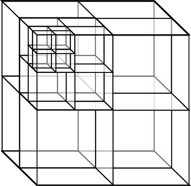
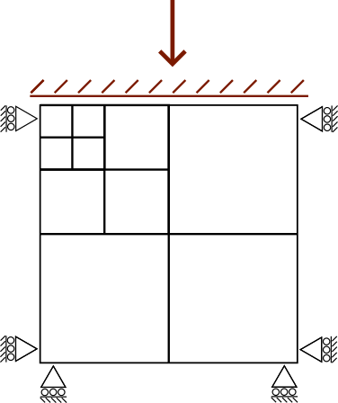
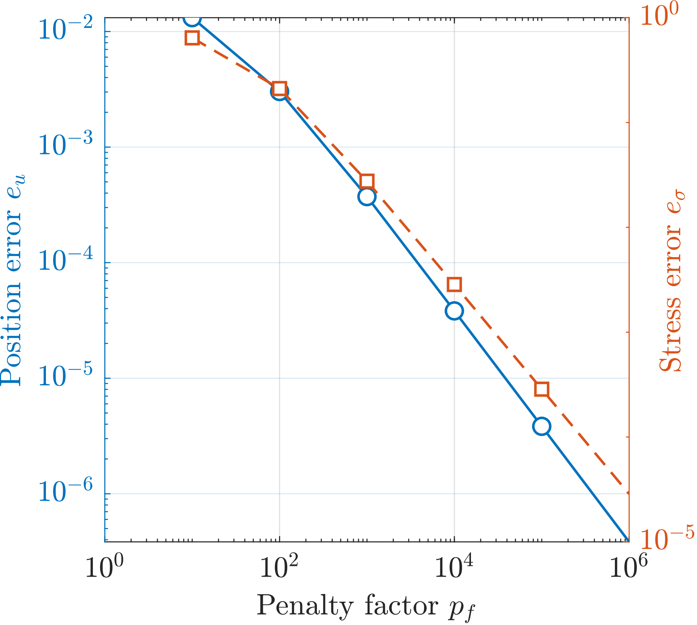

---
hide:
  - toc
---

# Tutorial 2: Compaction via a rigid body

## Introduction
This quick start tutorial walks through an AMPSSIE problem with rigid-body contact.

This tutorial analyses a cube compressed by a rigid plate through 25% of its height. It exercises the normal-contact penalty formulation and the hanging-node formulation simultaneously; convergence of the stress error with the penalty factor `pf` validates the implementation. The original contact validation is from [@bird_dynamic_2025]; this tutorial reapplies it to a mesh with hanging nodes.

This tutorial has three main sections after the introduction:

- [Input setup](#input-setup)
- [Deploying and running the problem](#deploying-and-running-the-problem)
- [Viewing the results](#viewing-the-results)

### Background: rigid-body contact

The GIMPM is introduced in [Tutorial 1](Tutorial_1.md#background-the-gimpm). This tutorial extends it by adding a rigid body: a flat plate is brought into contact with the deformable cube and pushed downward by a prescribed displacement. Contact between the rigid body and the GIMPs is enforced through a penalty method - the normal contact penalty is

$$
\epsilon_N = p_f\, E_p\, A_p^0,
$$

where $E_p$ is the Young's modulus of the GIMP in contact, $A_p^0 = (V_p^0)^{2/3}$ is its characteristic contact area, and $p_f$ is the penalty factor that you vary. The penalty factor controls how stiffly the contact constraint is enforced; the stress error decreases as $p_f$ increases. For this stiff problem $p_f > 1000$ is required for stress error below 1%; for less constrained problems $p_f = 50$ is typically sufficient.

## Input setup

### Problem summary

The aim is to validate the contact penalty formulation by compressing a cube with a rigid plate and confirming that the resulting vertical stress field is uniform throughout the cube. The cube is $0.8 \times 0.8 \times 0.8$ m (see [](#fig-cube-mesh)), made of a homogeneous Hencky elastic material with Young's modulus $E = 10^6$ Pa and Poisson's ratio $\nu = 0$. The material domain is filled with a $2 \times 2 \times 2$ grid of GIMPs in each element. The mesh is refined near the contact face so the hanging-node formulation is exercised in the contact region.

The rigid plate sits above the cube and is moved downward by $\Delta z = -0.2$ m (25% of the cube's height) uniformly over 20 load increments (see [](#fig-cube-bcs)). Boundary conditions on the cube are roller boundaries on the four side faces and the base; the top face is left as a free surface so the load is delivered entirely by the rigid plate. Every node has its $x$ and $y$ degrees of freedom fixed so the problem stays one-dimensional in compression.

This is a displacement-controlled problem; each increment is solved by a Newton-Raphson scheme. The problem is intentionally stiff (elastic, heavily constrained) - it is the worst case for penalty contact and so isolates the penalty parameter as the main source of error.

The simulation is configured through a single JSON object - a human-readable, editable text file. The complete file for this problem can be found [`here`](Tutorial_2_input_data.md) and for all input settings see the [`input_data.json` file format](../UsingTheSoftware/InputFormat.md).

<div class="grid" markdown>

{ #fig-cube-mesh width="100%" }

{ #fig-cube-bcs width="100%" }

</div>

*Figures reproduced from [@bird2026implicitoctreebasedadaptivematerial].*

<div class="json-side-header">
<div>Description</div>
<div><code>input_data.json</code></div>
</div>

<div class="json-side" markdown>

<div class="js-text" markdown>

### Mesh data

The mesh matches the $0.8 \times 0.8 \times 0.8$ m cube, with refinement at the contact face. `dx refined` gives the smallest element size, used near the rigid-body contact face; `Refinement type` selects the bespoke refinement scheme for this validation (see [](#fig-cube-mesh)).

</div>

<div class="js-code" markdown>

```json
"Mesh": {
    "domain size x": 0.8,
    "domain size y": 0.8,
    "domain size z": 0.8,
    "dx refined": 0.1,
    "Refinement type": "contact cube"
}
```

</div>

</div>

<div class="json-side" markdown>

<div class="js-text" markdown>

### Initial GIMP distribution

The `Initial GIMP distribution` is set to fill the whole cube and so is given the same parameters as the `Mesh data`. The default initial GIMP distribution is a grid of 8 GIMPs, $2 \times 2 \times 2$ within each element.

</div>

<div class="js-code" markdown>

```json
"Initial GIMP distribution": {
    "Initial GIMP distribution x": 0.8,
    "Initial GIMP distribution y": 0.8,
    "Initial GIMP distribution z": 0.8
}
```

</div>

</div>

<div class="json-side" markdown>

<div class="js-text" markdown>

### Boundary conditions

Rollers are applied on the four side faces and the base ($\pm x$, $\pm y$, $-z$). The top ($+z$) face is left as a free surface (default) and does not appear in the file - the load comes from the rigid plate rather than a traction. Every node has its $x$ and $y$ degrees of freedom fixed to keep the problem one-dimensional in compression.

</div>

<div class="js-code" markdown>

```json
"Boundary conditions": {
    "neg x-plane": "roller",
    "neg y-plane": "roller",
    "neg z-plane": "roller",
    "pos x-plane": "roller",
    "pos y-plane": "roller",
    "x dof": "fixed",
    "y dof": "fixed"
}
```

</div>

</div>

<div class="json-side" markdown>

<div class="js-text" markdown>

### Material

The cube is homogeneous, so a single layer is specified with the Hencky elastic model and the parameters from the Problem summary ($E = 10^6$ Pa, $\nu = 0$).

</div>

<div class="js-code" markdown>

```json
"Material": {
    "number of layers": 1,
    "layers": [
        {
            "type": "Elastic",
            "empirical data": "homogeneous elastic",
            "assigned material properties": {"E": 1000000.0, "nu": 0.0}
        }
    ]
}
```

</div>

</div>

<div class="json-side" markdown>

<div class="js-text" markdown>

### Rigid body

A flat rigid plate sits above the cube and is given a prescribed downward displacement of $0.2$ m over the 20 increments. The `normal penalty factor` `pf` is the parameter you vary to study convergence; try $p_f \in \{50, 100, 1000, 10000\}$.

</div>

<div class="js-code" markdown>

```json
"Rigid body": {
    "geometry": "plate",
    "initial position z": 0.8,
    "prescribed displacement z": -0.2,
    "normal penalty factor": 1000
}
```

</div>

</div>

<div class="json-side" markdown>

<div class="js-text" markdown>

### Solver

The rigid-body displacement is ramped on quasi-statically over 20 increments using a Newton-Raphson scheme.

</div>

<div class="js-code" markdown>

```json
"Solver": {
    "solve type": "static",
    "load type": "displacement",
    "number of increments": 20
}
```

</div>

</div>

<div class="json-side" markdown>

<div class="js-text" markdown>

### Output data

VTU and VTK output is enabled for visualisation in [ParaView](https://www.paraview.org/) (or [VisIt](https://visit-dav.github.io/visit-website/)). The `text data` field tags the run as `contact cube` for post-processing.

</div>

<div class="js-code" markdown>

```json
"Output Data": {
    "vtu data": "yes",
    "vtk data": "yes",
    "text data": "contact cube"
}
```

</div>

</div>

## Deploying and running the problem

AMPSSIE is written in the [Julia](https://julialang.org/) programming language, and there are two ways to run the code, both explored on the [deployment page](../UsingTheSoftware/DeployingTheSoftware.md). As this is a small problem that runs quickly, this tutorial will use Julia directly; see the [installation guide](../GettingStarted/Installation.md) for instructions on installing Julia and the AMPSSIE library.


<div class="json-side-header">
<div>Deployment instructions</div>
<div><code>terminal</code></div>
</div>

<div class="json-side" markdown>

<div class="js-text" markdown>

### Setting up and running the problem

Once Julia is installed, download the AMPSSIE package from GitHub - the [deployment page](../UsingTheSoftware/DeployingTheSoftware.md) covers how to do this. The commands below work the same on Windows, macOS and Linux.

The first step is to copy the `input_data.json` into the top-level AMPSSIE directory, provided [here](Tutorial_2_input_data.md). If you do this on the command line it will look like this
```
cp path/to/input_data_location/input_data.json path/to/AMPSSIE/MaterialPoints
```
where the first path is the location of your `input_data.json` and the second is the top-level AMPSSIE directory.

The next steps are for starting julia and loading up the AMPSSIE package. Open a terminal (command line or PowerShell on Windows) and start Julia with the command:
```
julia
```

Then change into the top-level AMPSSIE directory
```
cd("path/to/AMPSSIE/MaterialPoints")
```

and run
```
include("setup_workers.jl")
```
to install the AMPSSIE package and start multiple parallel workers.

If it works correctly the output should match something similar to the corresponding terminal window. If there are issues, see the [deployment page](../UsingTheSoftware/DeployingTheSoftware.md) for troubleshooting.

</div>

<div class="js-code" markdown>

<div class="terminal" markdown>

```console
$ julia
               _
   _       _ _(_)_     |  Documentation: https://docs.julialang.org
  (_)     | (_) (_)    |
   _ _   _| |_  __ _   |  Type "?" for help, "]?" for Pkg help.
  | | | | | | |/ _` |  |
  | | |_| | | | (_| |  |  Version 1.12.4 (2026-01-06)
 _/ |\__'_|_|_|\__'_|  |  Official https://julialang.org release
|__/                   |

julia> cd("path/to/AMPSSIE/MaterialPoints")

julia> include("setup_workers.jl")
   Resolving package versions...
  Activating project at `path/to/AMPSSIE/MaterialPoints`
      From worker 2:    Activating project at `path/to/AMPSSIE/MaterialPoints`
      From worker 3:    Activating project at `path/to/AMPSSIE/MaterialPoints`
starting sim
total memory 30.66 GB
free memory  17.81 GB
      From worker 2:    total memory 30.66 GB
      From worker 2:    free memory  17.81 GB
      From worker 3:    total memory 30.66 GB
      From worker 3:    free memory  17.81 GB
```

</div>

</div>

</div>

<div class="json-side" markdown>

<div class="js-text" markdown>

### Running the problem

With the `input_data.json` in the correct place and Julia running with the AMPSSIE package loaded, the simulation can be started by calling the AMPSSIE entry point.
```
Ampse.run("input_data.json");
```
This reads `input_data.json` from the current directory, steps through the 20 load increments under the prescribed rigid-body displacement, and writes `.vtu` and `.vtk` output files for ParaView visualisation along with a `.csv` file specific to this validation problem.

#### Reading the output

Each `time …` block in the terminal corresponds to one of the 20 load increments. AMPSSIE uses a pseudo-time that runs from $t = 0$ to $t = 1$, with the increment size `dt` calculated automatically as $1 / \text{number of increments}$ (so `dt` $= 0.05$ for this run). For each step the solver prints:

- `time X.XXXXXe+XX ----` - the pseudo-time at the start of the step.
- `number of isolated material points` - a connectivity check; should stay at `0` for this problem.
- `minimum ghost value` - the ghost-stabilisation parameter in use.
- `Iteration N | Error: … | dt: …` - the Newton-Raphson iteration number, the residual norm and the step size. The error should drop sharply (quadratic convergence) until it falls below the solver tolerance.
- `solve time X.XXX s` - wall-clock time spent on that iteration.
- `vtk storage start … complete` - the per-step results being written to disk.

When all 20 increments are finished the simulation prints `Simulation complete!`.

</div>

<div class="js-code" markdown>

<div class="terminal" markdown>

```console
julia> Ampse.run("input_data.json");

time 0.00000e+00 ----------------------------------
number of isolated material points: 0
minimum ghost value 1000.0
Iteration   0 | Error: 1.000000e+00 | dt: 5.000e-02
solve time 0.071 s | Iteration   1 | Error: 4.812371e-02 | dt: 5.000e-02
solve time 0.012 s | Iteration   2 | Error: 1.354906e-04 | dt: 5.000e-02
solve time 0.008 s | Iteration   3 | Error: 6.821594e-09 | dt: 5.000e-02
vtk storage start  ... complete

time 5.00000e-02 ----------------------------------
number of isolated material points: 0
minimum ghost value 1000.0
Iteration   0 | Error: 5.043217e-01 | dt: 5.000e-02
solve time 0.010 s | Iteration   1 | Error: 2.310546e-02 | dt: 5.000e-02
solve time 0.009 s | Iteration   2 | Error: 5.872144e-05 | dt: 5.000e-02
solve time 0.008 s | Iteration   3 | Error: 1.974823e-09 | dt: 5.000e-02
vtk storage start  ... complete

...   [18 further increments]   ...

time 1.00000e+00 ----------------------------------
number of isolated material points: 0
minimum ghost value 1000.0
Iteration   0 | Error: 3.812044e-02 | dt: 5.000e-02
solve time 0.009 s | Iteration   1 | Error: 8.413572e-04 | dt: 5.000e-02
solve time 0.008 s | Iteration   2 | Error: 1.926811e-07 | dt: 5.000e-02
vtk storage start  ... complete

Simulation complete!
```

</div>

</div>

</div>


## Viewing the results

The simulation results appear as the simulation runs, so you do not need to wait until it has finished. When the problem is run using your local Julia installation, the `.csv`, `.vtk` and `.vtu` files are stored in `MaterialPoints/src/output` (as configured in the [`output data`](#output-data) section of the input file).

### Visualising the output in ParaView

Follow the [ParaView walkthrough from Tutorial 1](Tutorial_1.md#visualising-the-output-in-paraview) to open `mpDataV..vtu` and `Octree..vtu`, apply the readers, threshold the Octree mesh to the active region, and colour the GIMPs by displacement → Magnitude. For this problem the numerical solution should reproduce a uniform vertical stress field through the cube and a flat contact interface with the rigid body, despite the GIMPs spanning hanging-node elements (see [](#fig-cube-stress)). The deformed mesh and GIMP positions at the end of the simulation are shown in [](#fig-cube-final).

<div class="grid" markdown>

{ #fig-cube-stress width="100%" }

{ #fig-cube-final width="100%" }

</div>

*Figures reproduced from [@bird2026implicitoctreebasedadaptivematerial].*

## Analysing the contact penalty convergence

The penalty factor $p_f$ (`normal penalty factor` in the [Rigid body](#rigid-body) JSON block) controls how stiffly the contact constraint is enforced. As $p_f$ increases, both stress and displacement errors decrease - this convergence validates the formulation. Sweep $p_f \in \{50, 100, 1000, 10000\}$ and plot the resulting errors against the analytical contact reference; the result is shown in [](#fig-cube-convergence).

{ #fig-cube-convergence width="70%" }

*Figure reproduced from [@bird2026implicitoctreebasedadaptivematerial].*

For this stiff problem $p_f > 1000$ is required for stress error below 1%. For less constrained problems $p_f = 50$ is typically sufficient [@bird_dynamic_2025]. Convergence with mesh refinement can be explored by reducing `dx refined` in the [Mesh data](#mesh-data) block.
