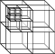
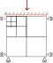
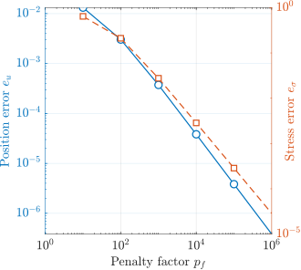
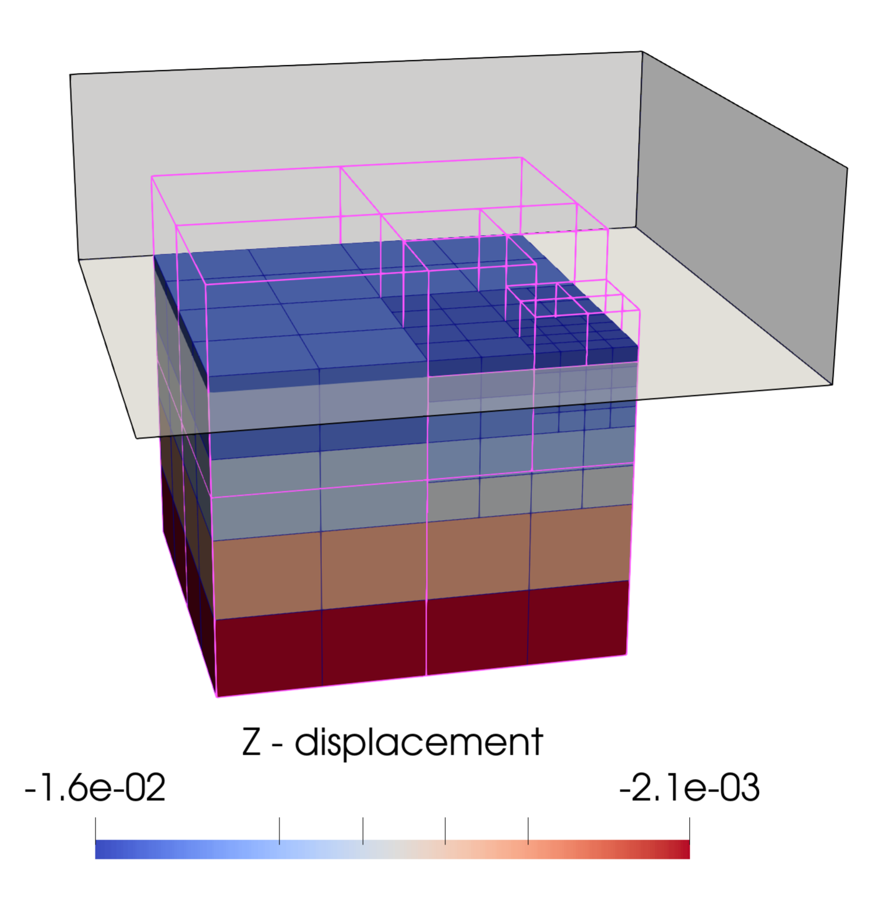
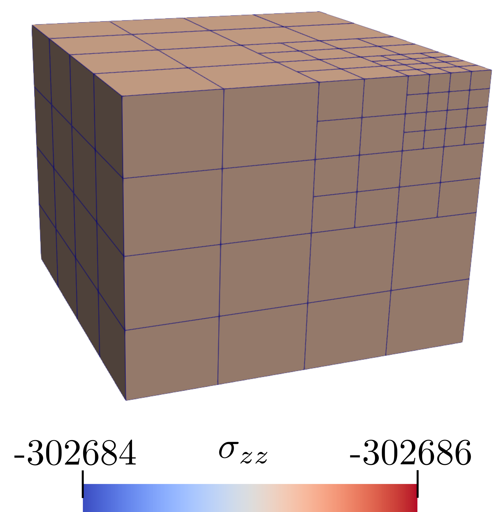

# Tutorial 2: Compaction via a rigid body

## Introduction
This tutorial walks through the second AMPSSIE quick start, which validates the GIMPM penalty-based contact formulation between a rigid body and a deformable column.

The problem is a vertical compression of a cube under a prescribed displacement applied through a rigid body. It is a stiff problem (elastic, heavily constrained) that exercises normal contact, large deformation and the hanging-node formulation simultaneously, originally presented by Bird et al. [@bird_dynamic_2025] and reapplied here with hanging nodes.

This tutorial has four sections:

- [Problem description](#problem-description)
- [Input setup](#input-setup)
- [Deploying and running the problem](#deploying-and-running-the-problem)
- [Viewing the results](#viewing-the-results)

## Problem description

You will define the geometry, mesh, boundary conditions, material, rigid body and solver in the input file. All the inputs to the simulation are defined using the [`input_data.json` file format](../UsingTheSoftware/InputFormat.md).

The values below give you a cube whose top surface is compressed by a rigid plate through 25% of the column's original height. The deformation is large enough that the GIMPs traverse several elements and interact with hanging nodes in the contact region.

<div class="grid" markdown>

{ #fig-cube-mesh width="80%" }

{ #fig-cube-bcs width="100%" }

</div>

**Mesh:** Set the geometry to a $0.8 \times 0.8 \times 0.8$ m cube, i.e. $(x,y,z)\in[0,0.8]^3$ m. The mesh is kept constant throughout this study; refinement is concentrated near the contact face so the hanging-node formulation is exercised in the contact region (see [](#fig-cube-mesh)).

**Initial GIMP distribution:** $2\times2\times2$ material points within each element, filling the cube.

**Boundary conditions:** Roller boundaries on the four side faces and the base ($\pm x$, $\pm y$, $-z$). The top ($+z$) face is left as a free surface (homogeneous Neumann), since the load is delivered by the rigid body rather than a traction. Every node has its $x$ and $y$ degrees of freedom fixed so the problem stays one-dimensional in compression.

**Material:** Use a Hencky elastic model with constant parameters: Young's modulus $E = 10^6$ Pa and Poisson's ratio $\nu = 0$.

This problem is intentionally stiff (elastic, heavily constrained) - it is the worst case for penalty contact and so isolates the penalty parameter as the main source of error.

**Rigid body:** A flat rigid plate enters from above and impinges on the top face of the cube by $\Delta z = -0.2$ m (a 25% reduction in cube height), applied uniformly over the 20 load steps. The normal contact penalty is

$$
\epsilon_N = p_f\, E_p\, A_p^0,
$$

where $E_p$ is the Young's modulus of the GIMP in contact, $A_p^0 = (V_p^0)^{2/3}$ is its characteristic contact area, and $p_f$ is the penalty factor that you can vary. For this stiff problem $p_f > 1000$ is required for stress error below 1%; for less constrained problems $p_f = 50$ is typically sufficient [@bird_dynamic_2025].

**Loading:** No body force; the load is delivered entirely by the prescribed displacement of the rigid body.

**Solver:** Newton-Raphson with the displacement ramped over 20 load steps.

## Input setup
The input file is a single JSON object - a human-readable, editable text file. The complete file for this problem can be found [here](Tutorial_2_input_data.md).

This problem has seven top-level sections, broken out below alongside the [Problem description](#problem-description).

Defaults (a face being free, a DOF being unconstrained, etc.) are not included in the file; only non-default settings are specified. See the [`input_data.json` file format](../UsingTheSoftware/InputFormat.md) for the full list of defaults.

### Mesh data

The mesh matches the $0.8 \times 0.8 \times 0.8$ m cube, with refinement at the contact face.

```json
"Mesh": {
    "domain size x": 0.8,
    "domain size y": 0.8,
    "domain size z": 0.8,
    "dx refined": 0.1,
    "Refinement type": "contact cube"
}
```

`dx refined` gives the smallest elements in the domain, used near the rigid-body contact face.

`Refinement type` selects the bespoke refinement scheme for this validation; see [](#fig-cube-mesh).

### Initial GIMP distribution

The initial GIMP distribution is the default $2\times2\times2$ per element, filling the entire cube.

```json
"Initial GIMP distribution": {
    "Initial GIMP distribution x": 0.8,
    "Initial GIMP distribution y": 0.8,
    "Initial GIMP distribution z": 0.8
}
```

### Boundary conditions

Rollers are applied on the four side faces and the base ($\pm x$, $\pm y$, $-z$). The top ($+z$) face is left as a free surface (default) and does not appear in the file. Every node has its $x$ and $y$ degrees of freedom fixed to keep the problem one-dimensional in compression.

```json
"Boundary conditions": {
    "neg x-plane": "roller",
    "neg y-plane": "roller",
    "neg z-plane": "roller",
    "pos x-plane": "roller",
    "pos y-plane": "roller",
    "x dof": "fixed",
    "y dof": "fixed"
}
```

### Material

The cube is homogeneous, so a single Hencky elastic layer is specified.

```json
"Material": {
    "number of layers": 1,
    "layers": [
        {
            "type": "Elastic",
            "emperical data": "homogeneous elastic",
            "assigned material properties": {"E": 1000000.0, "nu": 0.0}
        }
    ]
}
```

### Rigid body

A flat rigid plate is positioned above the cube and given a prescribed downward displacement of $0.2$ m. The normal penalty factor `pf` is the parameter you vary to study convergence (try $p_f = 50, 100, 1000, 10000$).

```json
"Rigid body": {
    "geometry": "plate",
    "initial position z": 0.8,
    "prescribed displacement z": -0.2,
    "normal penalty factor": 1000
}
```

### Solver

The rigid-body displacement is ramped on quasi-statically over 20 increments using a Newton-Raphson scheme.

```json
"Solver": {
    "solve type": "static",
    "load type": "displacement",
    "number of increments": 20
}
```

### Output data

VTU and VTK output is enabled for visualisation in [ParaView](https://www.paraview.org/) (or [VisIt](https://visit-dav.github.io/visit-website/)). The `text data` field tags the run as `contact cube` for post-processing.

```json
"Output Data": {
    "vtu data": "yes",
    "vtk data": "yes",
    "text data": "contact cube"
}
```


## Deploying and running the problem
## Viewing the results

The numerical solution should reproduce a uniform vertical stress field through the cube and a flat contact interface with the rigid body, despite the GIMPs spanning hanging-node elements (see [](#fig-cube-stress)). Convergence of the stress and displacement errors with the penalty factor $p_f$ confirms the formulation.

<div class="grid" markdown>

{ #fig-cube-convergence width="100%" }

{ #fig-cube-final width="100%" }

</div>

{ #fig-cube-stress width="25%" }
