# Tutorial 2: Compaction via a rigid body

## Introduction
This quick start tutorial introduces the concept of a rigid body interacting with the material points.

This tutorial analyses a cube compressed by a rigid cube through 25% of its height and is used to validate that the contact formulation produces the expected uniform vertical stress field. This problem has been used to validate our contact formulation [@bird_dynamic_2025] and our adaptive-octree extension [@bird2026implicitoctreebasedadaptivematerial].

This tutorial has three main sections after the introduction:

- [Input setup](#input-setup)
- [Deploying and running the problem](#deploying-and-running-the-problem)
- [Viewing the results](#viewing-the-results)

### Background: rigid-body contact

<div class="json-side" markdown>

<div class="js-text" markdown>

This tutorial extends [Tutorial 1](Tutorial_1.md#background-the-gimpm) to include normal contact. A brief overview is provided here for context; see the [normal-contact weak form](../TechnicalReferences/StaticWeakFormNormalContact.md) for the full technical details. [](#fig-contact-schematic) provides a schematic overview of how the contact between the rigid body and the material points works. 

When contact is detected between a GIMP and the rigid body, (a) initial state, a normal contact force is applied at the corners of the GIMP to resist the overlap. This force is proportional to the amount of overlap and can be thought of as a spring whose stiffness resists the overlap. The spring stiffness is a function of the GIMP size and material properties, calculated as

$$
\epsilon_N = p_f\, E_p\, A_p^0,
$$

where $E_p$ is the Young's modulus of the GIMP in contact, $A_p^0 = (V_p^0)^{2/3}$ is a representation of the contact area with $V_p^0$ the initial GIMP volume, and $p_f$ is the penalty factor. The penalty factor controls how stiffly the contact constraint is enforced; for this stiff problem $p_f = 1000$ gives a stress error of around $3\%$ (see [Analysing the stress variation with height](#analysing-the-stress-variation-with-height)) and is used throughout this tutorial. For less constrained problems $p_f = 50$ is typically sufficient.

After the spring has been activated the GIMPs and the mesh deform due to the contact forces created by the springs, (b) deformed state, and once convergence is obtained the mesh is reset, (c) mesh reset.

</div>

<div class="js-code" markdown>

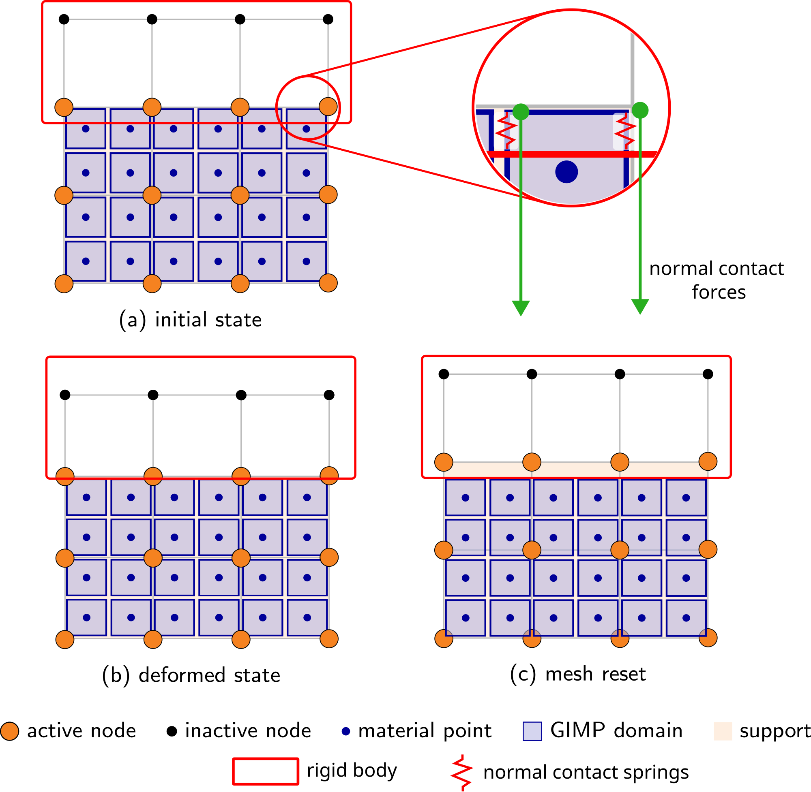{ #fig-contact-schematic width="100%" }

</div>

</div>

## Input setup

### Problem summary

The aim is to introduce the set-up and modelling of soil-structure interaction problems. The problem is a deformable cube compressed by a rigid cube; although simple, it is essential as it validates the contact formulation by confirming that the contact overlap stays small and the resulting vertical stress field is uniform throughout the cube and matches the analytical Hencky solution

$$
\sigma_{zz} = E \ln\!\left(\frac{L}{L_0}\right) \frac{L_0}{L} = \frac{10^6}{0.75} \ln(0.75) \approx -3.84 \times 10^5 \text{ Pa},
$$

where $L_0 = 0.8$ m is the initial cube height, $\Delta z = -0.2$ m is the prescribed compression and $L = L_0 + \Delta z = 0.6$ m is the final height after the $25\%$ axial compression.

As in [Tutorial 1](Tutorial_1.md#background-the-gimpm) the material is homogeneous Hencky elastic ($E = 10^6$ Pa, $\nu = 0$) and is discretised by a uniform $0.4$ m mesh ($2 \times 2 \times 2 = 8$ elements) with a $2 \times 2 \times 2$ grid of GIMPs per element. Roller boundaries are imposed on the four side faces and the base, the top face is left as a free surface, and every node has its $x$ and $y$ degrees of freedom fixed to keep the problem one-dimensional in compression.

For this problem the position of the rigid body cube is set up correctly so the user only has to import the file. A future tutorial will cover the details of designing the rigid body, making it accessible to the code and positioning it correctly.


<div class="grid" markdown>

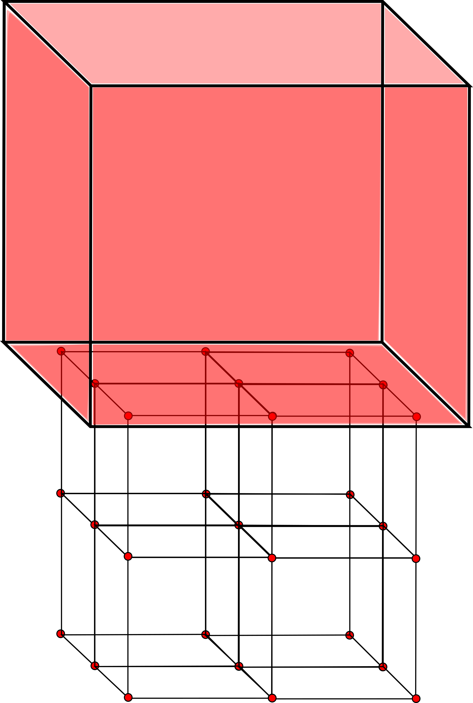{ #fig-cube-mesh style="width: 100%; height: 30em; object-fit: contain;" }

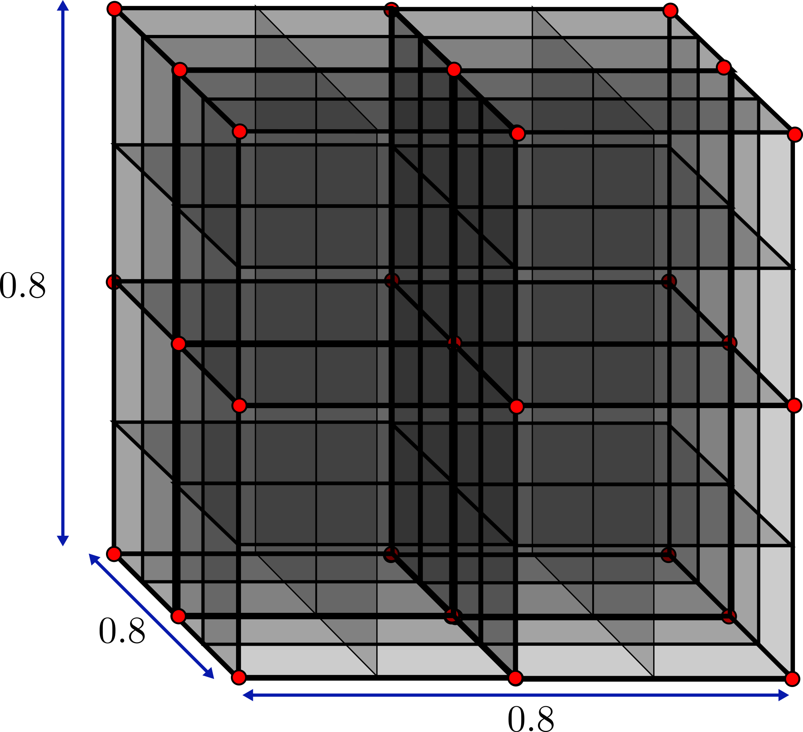{ #fig-cube-bcs style="width: 100%; height: 20em; object-fit: contain;" }

</div>

The simulation is configured through a single JSON object - a human-readable, editable text file. It is extended from [Tutorial 1](Tutorial_1.md#input-setup) to also contain the rigid body information and boundary conditions. The complete file for this problem can be found [`here`](Tutorial_2_input_data.md) and for all input settings see the [`input_data.json` file format](../UsingTheSoftware/InputFormat.md).


<div class="json-side-header">
<div>Description</div>
<div><code>input_data.json</code></div>
</div>

<div class="json-side" markdown>

<div class="js-text" markdown>

### Mesh data

The mesh matches the $0.8 \times 0.8 \times 0.8$ m cube. `dx refined` gives the uniform element size, set to $0.4$ m here so the cube is discretised by $2 \times 2 \times 2 = 8$ elements (see [](#fig-cube-mesh)).

</div>

<div class="js-code" markdown>

```json
"Mesh": {
    "domain size x": 0.8,
    "domain size y": 0.8,
    "domain size z": 0.8,
    "dx refined": 0.4
}
```

</div>

</div>

<div class="json-side" markdown>

<div class="js-text" markdown>

### Initial GIMP distribution

The `Initial GIMP distribution` is set to fill the whole cube and so is given the same parameters as the `Mesh data`. The default initial GIMP distribution is a grid of 8 GIMPs, $2 \times 2 \times 2$ within each element.

</div>

<div class="js-code" markdown>

```json
"Initial GIMP distribution": {
    "Initial GIMP distribution x": 0.8,
    "Initial GIMP distribution y": 0.8,
    "Initial GIMP distribution z": 0.8
}
```

</div>

</div>

<div class="json-side" markdown>

<div class="js-text" markdown>

### Boundary conditions

Rollers are applied on the four side faces and the base ($\pm x$, $\pm y$, $-z$). The top ($+z$) face is left as a free surface (default) and does not appear in the file - the load comes from the rigid cube rather than a traction. Every node has its $x$ and $y$ degrees of freedom fixed to keep the problem one-dimensional in compression.

</div>

<div class="js-code" markdown>

```json
"Boundary conditions": {
    "neg x-plane": "roller",
    "neg y-plane": "roller",
    "neg z-plane": "roller",
    "pos x-plane": "roller",
    "pos y-plane": "roller",
    "x dof": "fixed",
    "y dof": "fixed"
}
```

</div>

</div>

<div class="json-side" markdown>

<div class="js-text" markdown>

### Material

The cube is homogeneous, so a single layer is specified with the Hencky elastic model and the parameters from the [Problem summary](#problem-summary) ($E = 10^6$ Pa, $\nu = 0$).

</div>

<div class="js-code" markdown>

```json
"Material": {
    "number of layers": 1,
    "layers": [
        {
            "type": "Elastic",
            "empirical data": "homogeneous elastic",
            "assigned material properties": {"E": 1000000.0, "nu": 0.0}
        }
    ]
}
```

</div>

</div>

<div class="json-side" markdown>

<div class="js-text" markdown>

### Rigid body

The rigid body geometry is loaded from `cube.stl` and it is automatically placed with its lower face at the top of the deformable cube. It is then given a prescribed downward displacement of $\Delta z = -0.2$ m, applied uniformly over the 20 load increments. The `normal penalty factor` `pf` is set to $1000$, the value identified in the [Background](#background-rigid-body-contact) as giving a stress error of around $3\%$ for this stiff problem.

</div>

<div class="js-code" markdown>

```json
"Rigid body": {
    "geometry": "cube.stl",
    "prescribed displacement z": -0.2,
    "normal penalty factor": 1000
}
```

</div>

</div>

<div class="json-side" markdown>

<div class="js-text" markdown>

### Solver

The rigid-body displacement is ramped quasi-statically over 20 increments using a Newton-Raphson scheme.

</div>

<div class="js-code" markdown>

```json
"Solver": {
    "solve type": "static",
    "load type": "rigid body displacement",
    "number of increments": 20
}
```

</div>

</div>

<div class="json-side" markdown>

<div class="js-text" markdown>

### Output data

VTU and VTK output is enabled for visualisation in [ParaView](https://www.paraview.org/) (or [VisIt](https://visit-dav.github.io/visit-website/)). The `text data` field tags the run as `contact cube` for post-processing.

</div>

<div class="js-code" markdown>

```json
"Output Data": {
    "vtu data": "yes",
    "vtk data": "yes",
    "text data": "contact cube"
}
```

</div>

</div>

## Deploying and running the problem

AMPSSIE is written in the [Julia](https://julialang.org/) programming language, and there are two ways to run the code, both explored on the [deployment page](../UsingTheSoftware/DeployingTheSoftware.md). As this is a small problem that runs quickly, this tutorial will use Julia directly; see the [installation guide](../GettingStarted/Installation.md) for instructions on installing Julia and the AMPSSIE library.


<div class="json-side-header">
<div>Deployment instructions</div>
<div><code>terminal</code></div>
</div>

<div class="json-side" markdown>

<div class="js-text" markdown>

### Setting up and running the problem

Once Julia is installed, download the AMPSSIE package from GitHub - the [deployment page](../UsingTheSoftware/DeployingTheSoftware.md) covers how to do this. The commands below work the same on Windows, macOS and Linux.

The first step is to copy the `input_data.json` into the top-level AMPSSIE directory, provided [here](Tutorial_2_input_data.md). If you do this on the command line it will look like this
```
cp path/to/input_data_location/input_data.json path/to/AMPSSIE/MaterialPoints
```
where the first path is the location of your `input_data.json` and the second is the top-level AMPSSIE directory.

The next steps are to start Julia and load the AMPSSIE package. Open a terminal (command line or PowerShell on Windows) and start Julia with the command:
```
julia
```

Then change into the top-level AMPSSIE directory
```
cd("path/to/AMPSSIE/MaterialPoints")
```

and run
```
include("setup_workers.jl")
```
to install the AMPSSIE package and start multiple parallel workers.

If it works correctly the output should resemble the corresponding terminal window. If there are issues, see the [deployment page](../UsingTheSoftware/DeployingTheSoftware.md) for troubleshooting.

</div>

<div class="js-code" markdown>

<div class="terminal terminal-full" markdown>

```console
➜ julia
   _       _ _(_)_     |  Documentation: https://docs.julialang.org
  (_)     | (_) (_)    |
   _ _   _| |_  __ _   |  Type "?" for help, "]?" for Pkg help.
  | | | | | | |/ _` |  |
  | | |_| | | | (_| |  |  Version 1.12.4 (2026-01-06)
 _/ |\__'_|_|_|\__'_|  |  Official https://julialang.org release
|__/                   |

julia> include("setup_workers.jl")
   Resolving package versions...
     Project No packages added to or removed from `~/.julia/environments/v1.12/Project.toml`
    Manifest No packages added to or removed from `~/.julia/environments/v1.12/Manifest.toml`
  Activating project at `~/Documents/Codes/AMPSSIE/MaterialPoints`
  Activating       From worker 2:	  Activating project at `~/Documents/Codes/AMPSSIE/MaterialPoints`project at `~/Documents/Codes/AMPSSIE/MaterialPoints`

      From worker 3:	  Activating project at `~/Documents/Codes/AMPSSIE/MaterialPoints`
starting sim
total memory 30.655887603759766GB
free memory 15.59844970703125GB
total memory 30.655887603759766GB
      From worker 2:	total memory 30.655887603759766GB
      From worker 3:	total memory 30.655887603759766GB
free memory 15.593147277832031GB
      From worker 2:	free memory 15.593147277832031GB
```

</div>

</div>

</div>

<div class="json-side" markdown>

<div class="js-text" markdown>

### Running the problem

With the `input_data.json` in the correct place and Julia running with the AMPSSIE package loaded, the simulation can be started by calling the AMPSSIE entry point.
```
Ampse.run("input_data.json");
```
This reads `input_data.json` from the current directory, steps through the 20 load increments under the prescribed rigid-body displacement, and writes `.vtu` and `.vtk` output files for ParaView visualisation along with a `.csv` file specific to this validation problem.

#### Reading the output

Before the load steps begin, AMPSSIE prints a short rigid-body preamble:

- `Making rbdata` - the rigid body is being constructed from the `geometry` STL referenced in the [Rigid body](#rigid-body) JSON block (`cube.stl` here).
- `Output data for the construction of the cube` - a per-body diagnostic block tagged with the rigid body's name.
- `Info    : 8 nodes 18 elements` - the tessellation of the STL surface mesh that AMPSSIE will use for contact detection (8 nodes and 18 triangular elements for a unit cube).

Each `time …` block in the terminal then corresponds to one of the 20 load increments. AMPSSIE uses a pseudo-time that runs from $t = 0$ to $t = 1$, with the increment size `dt` calculated automatically as $1 / \text{number of increments}$ (so `dt` $= 0.05$ for this run). For each step the solver prints:

- `time X.XXXXXe+XX ----` - the pseudo-time at the start of the step.
- `number of isolated material points` - a connectivity check; should stay at `0` for this problem.
- `Pre NR contact search start ... complete` - the broad-phase contact search that runs once at the start of the step to identify which GIMPs lie within range of the rigid body before the Newton-Raphson iterations begin.
- `minimum ghost value` - the ghost-stabilisation parameter in use.
- `Contact sparse start ... complete` - assembly of the sparse contact stiffness contributions for the active GIMP-rigid-body pairs found by the search.
- `Iteration N | Error: … | dt: …` - the Newton-Raphson iteration number, the residual norm and the step size. The error should drop sharply (quadratic convergence) until it falls below the solver tolerance.
- `solve time X.XXX s` - wall-clock time spent on that iteration.
- `vtk storage start … complete` - the per-step results being written to disk.

When all 20 increments are finished the simulation prints `Simulation complete!`.

</div>

<div class="js-code" markdown>

<div class="terminal" markdown>

```console
julia> Ampse.run("input_data.json");

Making rbdata
...
	Output data for the construction of the cube
...
Info    : 8 nodes 18 elements

time 0.00000e+00 ----------------------------------
number of isolated material points: 0
Pre NR contact search start ... complete
minimum ghost value 1.0e6
Contact sparse start ... complete
Iteration   0 | Error: 0.000000e+00 | dt: 5.000e-02
vtk storage start  ... complete

time 5.00000e-02 ----------------------------------
number of isolated material points: 0
Pre NR contact search start ... complete
minimum ghost value 1.0e6
Contact sparse start ... complete
Iteration   0 | Error: 2.526316e+03 | dt: 5.000e-02
solve time 0.0 s | Iteration   1 | Error: 6.177756e-01 | dt: 5.000e-02
solve time 0.0 s | Iteration   2 | Error: 3.808896e-08 | dt: 5.000e-02
vtk storage start  ... complete

time 1.00000e-01 ----------------------------------
number of isolated material points: 0
Pre NR contact search start ... complete
minimum ghost value 1.0e6
Contact sparse start ... complete
Iteration   0 | Error: 2.461546e+03 | dt: 5.000e-02
solve time 0.0 s | Iteration   1 | Error: 6.309702e-01 | dt: 5.000e-02
solve time 0.0 s | Iteration   2 | Error: 4.278177e-08 | dt: 5.000e-02
vtk storage start  ... complete

time 1.50000e-01 ----------------------------------
number of isolated material points: 0
Pre NR contact search start ... complete
minimum ghost value 1.0e6
Contact sparse start ... complete
Iteration   0 | Error: 2.398652e+03 | dt: 5.000e-02
solve time 0.0 s | Iteration   1 | Error: 6.448210e-01 | dt: 5.000e-02
solve time 0.0 s | Iteration   2 | Error: 4.810514e-08 | dt: 5.000e-02
vtk storage start  ... complete

time 2.00000e-01 ----------------------------------
number of isolated material points: 0
Pre NR contact search start ... complete
minimum ghost value 1.0e6
Contact sparse start ... complete
Iteration   0 | Error: 2.337782e+03 | dt: 5.000e-02
solve time 0.0 s | Iteration   1 | Error: 6.594239e-01 | dt: 5.000e-02
solve time 0.0 s | Iteration   2 | Error: 5.416280e-08 | dt: 5.000e-02
vtk storage start  ... complete

time 2.50000e-01 ----------------------------------
number of isolated material points: 0
Pre NR contact search start ... complete
minimum ghost value 1.0e6
Contact sparse start ... complete
Iteration   0 | Error: 2.279093e+03 | dt: 5.000e-02
solve time 0.0 s | Iteration   1 | Error: 6.748915e-01 | dt: 5.000e-02
solve time 0.0 s | Iteration   2 | Error: 6.110472e-08 | dt: 5.000e-02
vtk storage start  ... complete

time 3.00000e-01 ----------------------------------
number of isolated material points: 0
Pre NR contact search start ... complete
minimum ghost value 1.0e6
Contact sparse start ... complete
Iteration   0 | Error: 2.222753e+03 | dt: 5.000e-02
solve time 0.0 s | Iteration   1 | Error: 6.913559e-01 | dt: 5.000e-02
solve time 0.0 s | Iteration   2 | Error: 6.907826e-08 | dt: 5.000e-02
vtk storage start  ... complete

time 3.50000e-01 ----------------------------------
number of isolated material points: 0
Pre NR contact search start ... complete
minimum ghost value 1.0e6
Contact sparse start ... complete
Iteration   0 | Error: 2.168939e+03 | dt: 5.000e-02
solve time 0.0 s | Iteration   1 | Error: 7.089713e-01 | dt: 5.000e-02
solve time 0.0 s | Iteration   2 | Error: 7.829545e-08 | dt: 5.000e-02
vtk storage start  ... complete

time 4.00000e-01 ----------------------------------
number of isolated material points: 0
Pre NR contact search start ... complete
minimum ghost value 1.0e6
Contact sparse start ... complete
Iteration   0 | Error: 2.117839e+03 | dt: 5.000e-02
solve time 0.0 s | Iteration   1 | Error: 7.279175e-01 | dt: 5.000e-02
solve time 0.0 s | Iteration   2 | Error: 8.890471e-08 | dt: 5.000e-02
vtk storage start  ... complete

time 4.50000e-01 ----------------------------------
number of isolated material points: 0
Pre NR contact search start ... complete
minimum ghost value 1.0e6
Contact sparse start ... complete
Iteration   0 | Error: 2.069646e+03 | dt: 5.000e-02
solve time 0.0 s | Iteration   1 | Error: 7.484033e-01 | dt: 5.000e-02
solve time 0.0 s | Iteration   2 | Error: 1.012049e-07 | dt: 5.000e-02
vtk storage start  ... complete

time 5.00000e-01 ----------------------------------
number of isolated material points: 0
Pre NR contact search start ... complete
minimum ghost value 1.0e6
Contact sparse start ... complete
Iteration   0 | Error: 2.024562e+03 | dt: 5.000e-02
solve time 0.0 s | Iteration   1 | Error: 7.706702e-01 | dt: 5.000e-02
solve time 0.0 s | Iteration   2 | Error: 1.155149e-07 | dt: 5.000e-02
vtk storage start  ... complete

time 5.50000e-01 ----------------------------------
number of isolated material points: 0
Pre NR contact search start ... complete
minimum ghost value 1.0e6
Contact sparse start ... complete
Iteration   0 | Error: 1.982790e+03 | dt: 5.000e-02
solve time 0.0 s | Iteration   1 | Error: 7.949963e-01 | dt: 5.000e-02
solve time 0.0 s | Iteration   2 | Error: 1.322700e-07 | dt: 5.000e-02
vtk storage start  ... complete

time 6.00000e-01 ----------------------------------
number of isolated material points: 0
Pre NR contact search start ... complete
minimum ghost value 1.0e6
Contact sparse start ... complete
Iteration   0 | Error: 1.944536e+03 | dt: 5.000e-02
solve time 0.0 s | Iteration   1 | Error: 8.217005e-01 | dt: 5.000e-02
solve time 0.0 s | Iteration   2 | Error: 1.518932e-07 | dt: 5.000e-02
vtk storage start  ... complete

time 6.50000e-01 ----------------------------------
number of isolated material points: 0
Pre NR contact search start ... complete
minimum ghost value 1.0e6
Contact sparse start ... complete
Iteration   0 | Error: 1.910002e+03 | dt: 5.000e-02
solve time 0.0 s | Iteration   1 | Error: 8.511466e-01 | dt: 5.000e-02
solve time 0.0 s | Iteration   2 | Error: 1.750679e-07 | dt: 5.000e-02
vtk storage start  ... complete

time 7.00000e-01 ----------------------------------
number of isolated material points: 0
Pre NR contact search start ... complete
minimum ghost value 1.0e6
Contact sparse start ... complete
Iteration   0 | Error: 1.879384e+03 | dt: 5.000e-02
solve time 0.0 s | Iteration   1 | Error: 8.837477e-01 | dt: 5.000e-02
solve time 0.0 s | Iteration   2 | Error: 2.024459e-07 | dt: 5.000e-02
vtk storage start  ... complete

time 7.50000e-01 ----------------------------------
number of isolated material points: 0
Pre NR contact search start ... complete
minimum ghost value 1.0e6
Contact sparse start ... complete
Iteration   0 | Error: 1.852863e+03 | dt: 5.000e-02
solve time 0.0 s | Iteration   1 | Error: 9.199702e-01 | dt: 5.000e-02
solve time 0.0 s | Iteration   2 | Error: 2.350655e-07 | dt: 5.000e-02
vtk storage start  ... complete

time 8.00000e-01 ----------------------------------
number of isolated material points: 0
Pre NR contact search start ... complete
minimum ghost value 1.0e6
Contact sparse start ... complete
Iteration   0 | Error: 1.830607e+03 | dt: 5.000e-02
solve time 0.0 s | Iteration   1 | Error: 9.603378e-01 | dt: 5.000e-02
solve time 0.0 s | Iteration   2 | Error: 2.740436e-07 | dt: 5.000e-02
vtk storage start  ... complete

time 8.50000e-01 ----------------------------------
number of isolated material points: 0
Pre NR contact search start ... complete
minimum ghost value 1.0e6
Contact sparse start ... complete
Iteration   0 | Error: 1.812760e+03 | dt: 5.000e-02
solve time 0.0 s | Iteration   1 | Error: 1.005436e+00 | dt: 5.000e-02
solve time 0.0 s | Iteration   2 | Error: 3.208429e-07 | dt: 5.000e-02
vtk storage start  ... complete

time 9.00000e-01 ----------------------------------
number of isolated material points: 0
Pre NR contact search start ... complete
minimum ghost value 1.0e6
Contact sparse start ... complete
Iteration   0 | Error: 1.799439e+03 | dt: 5.000e-02
solve time 0.0 s | Iteration   1 | Error: 1.055915e+00 | dt: 5.000e-02
solve time 0.0 s | Iteration   2 | Error: 3.773116e-07 | dt: 5.000e-02
vtk storage start  ... complete

time 9.50000e-01 ----------------------------------
number of isolated material points: 0
Pre NR contact search start ... complete
minimum ghost value 1.0e6
Contact sparse start ... complete
Iteration   0 | Error: 1.790731e+03 | dt: 5.000e-02
solve time 0.0 s | Iteration   1 | Error: 1.112496e+00 | dt: 5.000e-02
solve time 0.0 s | Iteration   2 | Error: 4.457677e-07 | dt: 5.000e-02
vtk storage start  ... complete

Simulation complete!

```

</div>

</div>

</div>


## Viewing the results

The simulation results appear as the simulation runs, so you do not need to wait until it has finished. When the problem is run using your local Julia installation, the `.csv`, `.vtk` and `.vtu` files are stored in `MaterialPoints/src/output` (as configured in the [`output data`](#output-data) section of the input file).

### Visualising the output in ParaView

The walkthrough below follows the same pattern as the [ParaView walkthrough from Tutorial 1](Tutorial_1.md#visualising-the-output-in-paraview), but loads the additional rigid-body output (`rbData..vtk`) alongside the GIMP and background-mesh data, and finishes by hiding the rigid body so the deformed cube can be inspected on its own. The same [3D-navigation controls](Tutorial_1.md#visualising-the-output-in-paraview) (left-drag to rotate, scroll to zoom) apply throughout.

<div class="walkthrough" markdown>
<div markdown>
**1. Open ParaView.** Launch ParaView from your applications menu or terminal. You should see an empty render view with the orientation triad in the bottom-left corner.
</div>
<div markdown>
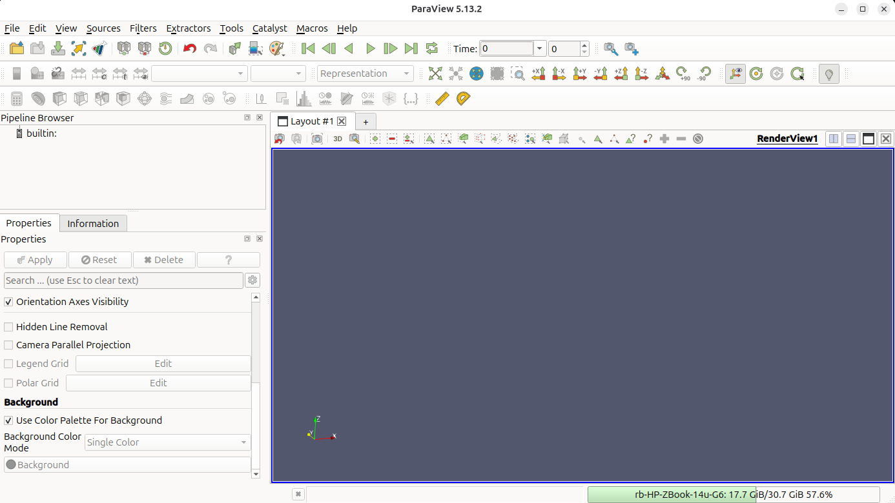{ #fig-compress-1 width="100%" }
</div>
</div>

<div class="walkthrough" markdown>
<div markdown>
**2. Open the output files.** Use *File → Open* and navigate to `MaterialPoints/src/output`. Hold `Ctrl` and click `Octree..vtu`, `mpDataV..vtu` and `rbData..vtk` so all three datasets are highlighted, then click *OK*. The three files give you the background mesh, the GIMPs and the rigid body respectively.
</div>
<div markdown>
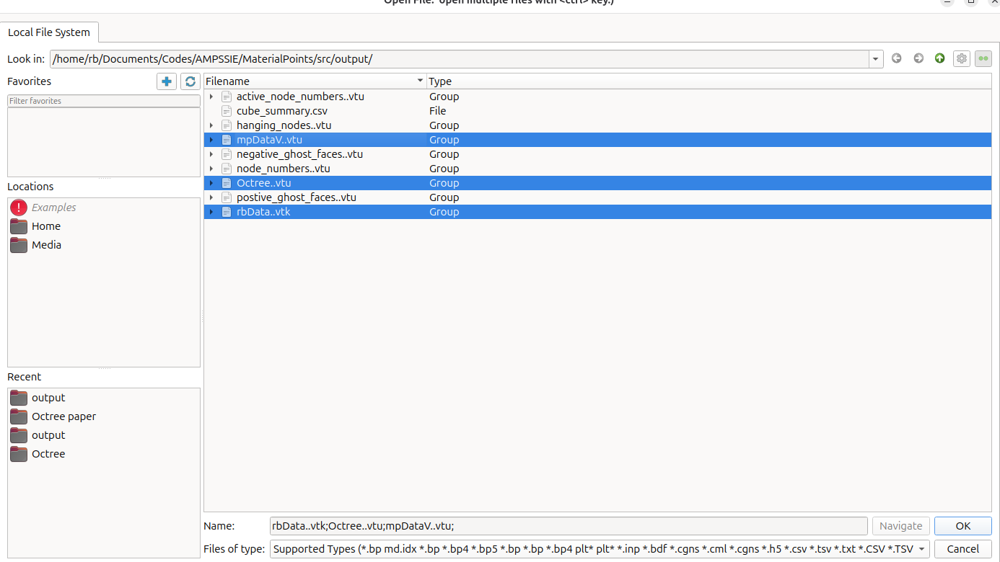{ #fig-compress-3 width="100%" }
</div>
</div>

<div class="walkthrough" markdown>
<div markdown>
**3. Apply the readers.** Click *Apply* in the Properties panel for each reader. The deformable cube appears as a solid grey block with the rigid cube sitting directly on top of it. In the current view it is difficult to see which body is which; try rotating by click-and-drag inside the *Layout #1* render view to inspect the geometry.
</div>
<div markdown>
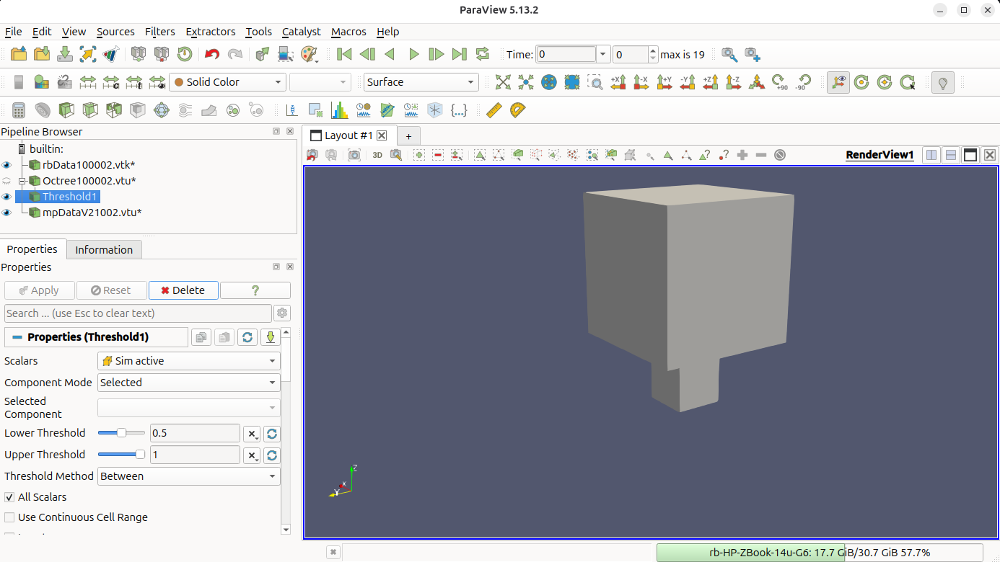{ #fig-compress-4 width="100%" }
</div>
</div>

<div class="walkthrough" markdown>
<div markdown>
**4. View only the active elements.** We want to keep only the mesh cells that contain GIMPs and hide the inactive elements. This is achieved with the `Threshold` filter: with `Octree..vtu` selected, go to *Filters → Common → Threshold*, set the scalar to `Sim active`, lower threshold `0.5`, upper `2`, then click *Apply*.
</div>
<div markdown>
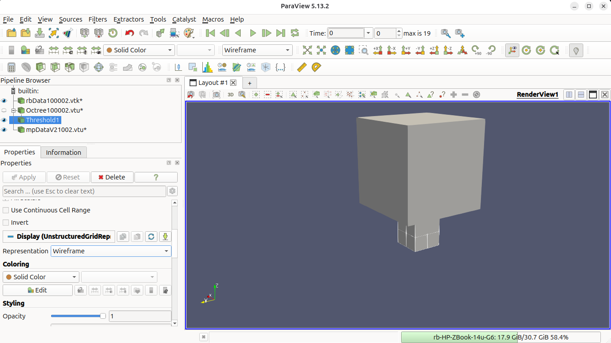{ #fig-compress-5 width="100%" }
</div>
</div>

<div class="walkthrough" markdown>
<div markdown>
**5. Make the mesh a Wireframe.** Change the representation of the `Threshold1` filter to *Wireframe* so the active mesh edges are drawn as lines instead of filled surfaces. This lets the GIMPs underneath become visible. 

Additionally, try pressing the `Reset` button, marked by the red circle, to obtain a better view.
</div>
<div markdown>
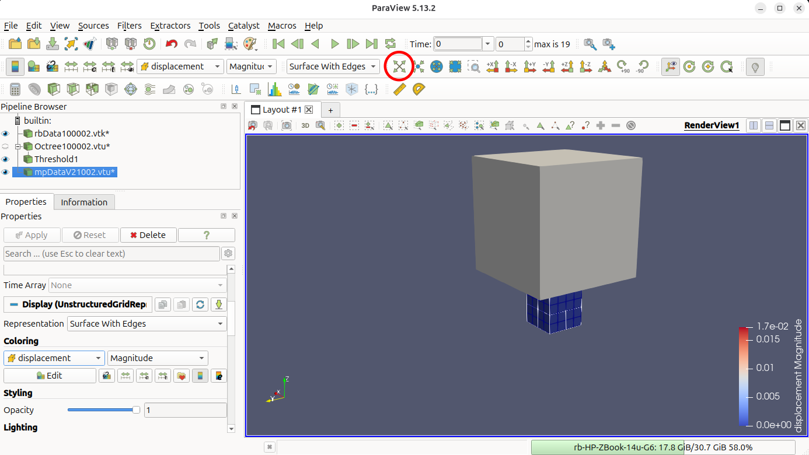{ #fig-compress-6 width="100%" }
</div>
</div>

<div class="walkthrough" markdown>
<div markdown>
**6. Colour the GIMPs by displacement.** Select `mpDataV..vtu` and change *Coloring* to `displacement` → `Magnitude`. 
</div>
<div markdown>
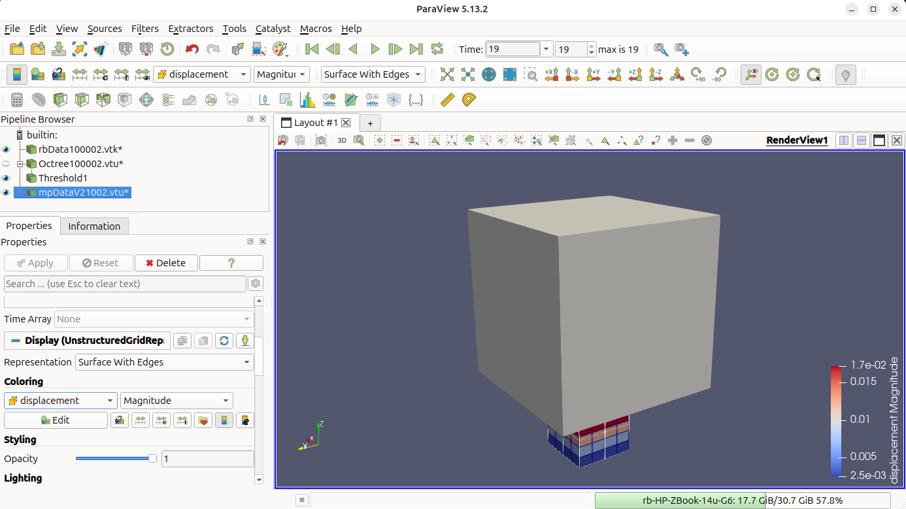{ #fig-compress-7 width="100%" }
</div>
</div>

<div class="walkthrough" markdown>
<div markdown>
**7. Advance to the final step.** Click the *Go to Last* button (`▶|`) in the time toolbar to jump to load increment 19, then click *Rescale to Data Range* in the colour-bar toolbar so the scale matches the deformed configuration. The rigid cube has now driven $0.2$ m into the top of the deformable cube.
</div>
<div markdown>
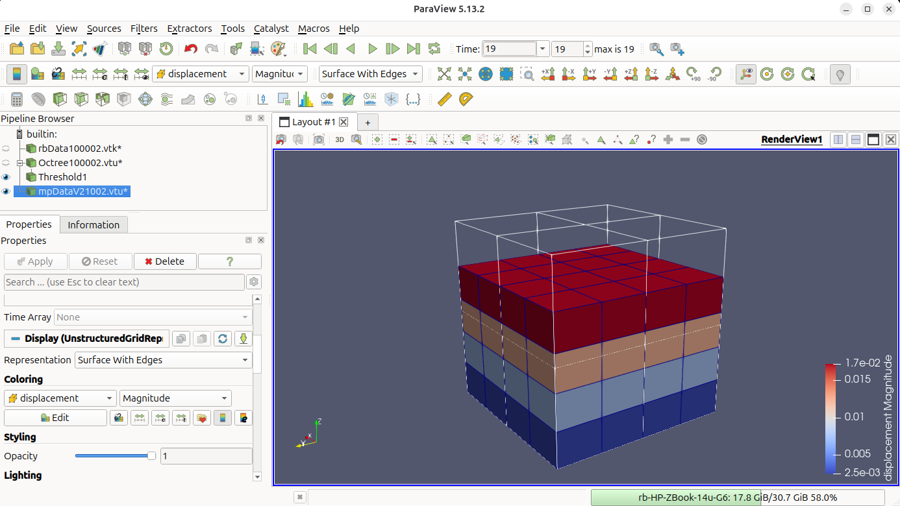{ #fig-compress-8 width="100%" }
</div>
</div>

<div class="walkthrough" markdown>
<div markdown>
**8. Hide the rigid body.** Click the eye icon next to `rbData..vtk` in the Pipeline Browser to toggle the rigid body off. The deformable cube is now visible on its own, with the displacement banding running from the (compressed) top face down to the (fixed) base.
</div>
<div markdown>
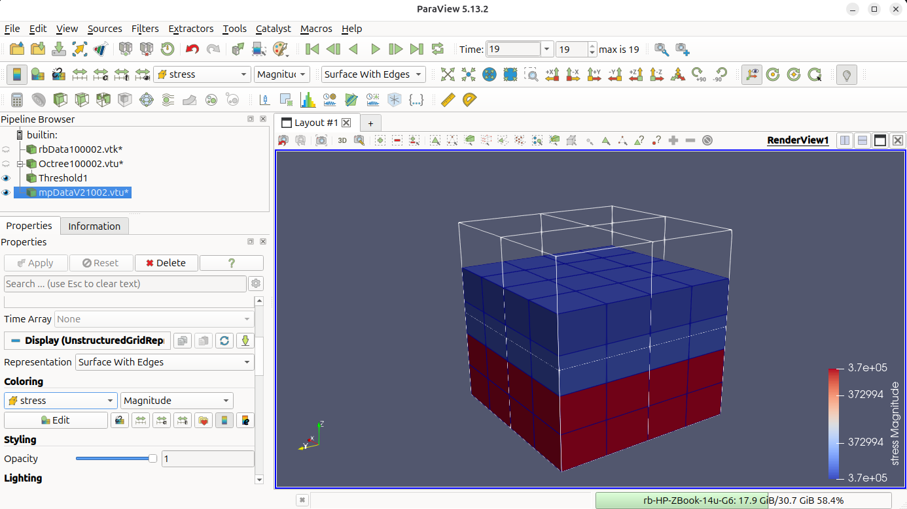{ #fig-compress-9 width="100%" }
</div>
</div>

<div class="walkthrough" markdown>
<div markdown>
**9. Inspect the final deformed configuration.** Rotate the view to confirm the bands are flat and the colour is uniform across each $0.4$ m mesh layer - this is the visual signature of the uniform vertical stress field predicted by the analytical Hencky solution in the [Problem summary](#problem-summary). Any visible "warping" of the bands would indicate too low a `normal penalty factor` (see [Analysing the stress variation with height](#analysing-the-stress-variation-with-height)).
</div>
<div markdown>
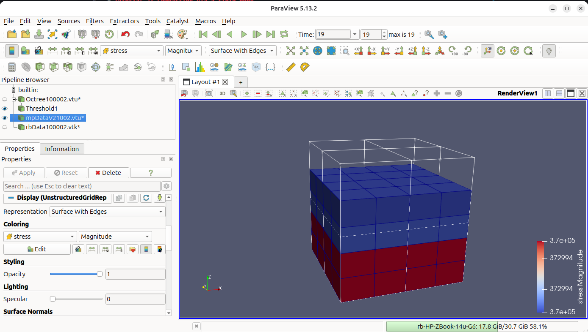{ #fig-compress-10 width="100%" }
</div>
</div>


## Analysing the stress in the domain

The option `"text data": "contact cube"` in [Output data](#output-data) writes a one-row summary `cube_summary.csv` to `MaterialPoints/src/output`. Its columns are the penalty factor, the final cube height, the GIMP-averaged vertical Cauchy stress and the final $z$-position of the rigid body's lower face:

```text
pen_factor,       final_height,      avg_stress_zz,         min_rb_pos
      1000, 0.6037299414518334, -372994.2487099074, 0.5999999989999916
```

Each time you run this problem with different parameters a new row will be appended to the bottom of the file.

For these results the simulated stress $\bar{\sigma}_{zz}^{\text{sim}} \approx -3.73 \times 10^{5}$ Pa matches the analytical Hencky-Cauchy value $-3.84 \times 10^{5}$ Pa from the [Problem summary](#problem-summary) to within $\approx 2.8\%$. The contact overlap `final_height - min_rb_pos` $\approx 3.7 \times 10^{-3}$ m ($\approx 0.6\%$ of the cube height) shows that the penalty spring is doing a good job at minimising the overlap between the two bodies.

Raise `normal penalty factor` in the [Rigid body](#rigid-body) JSON block to reduce both of these errors further and observe the additional rows added to the end of the text file.