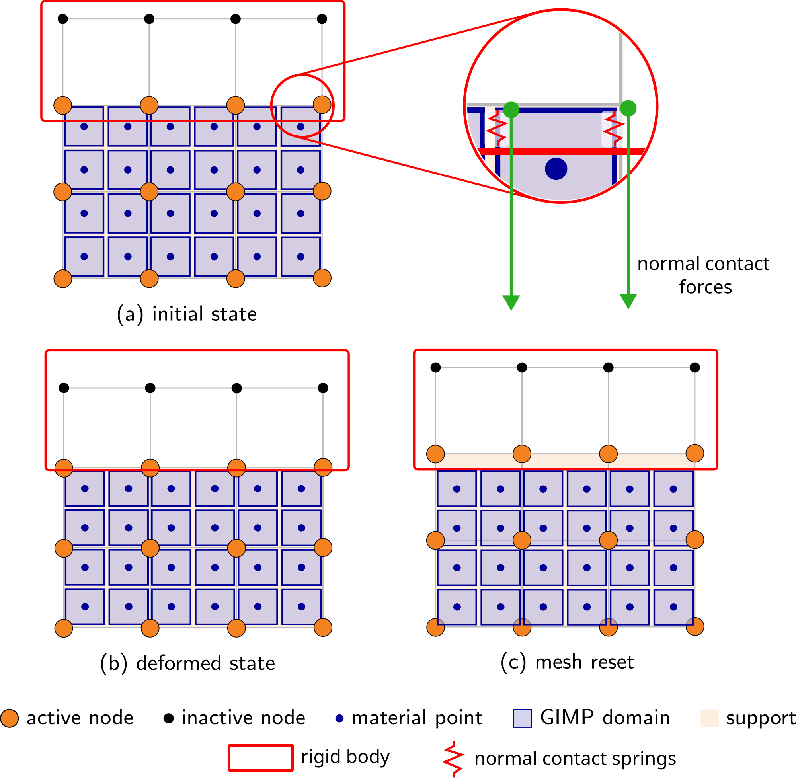
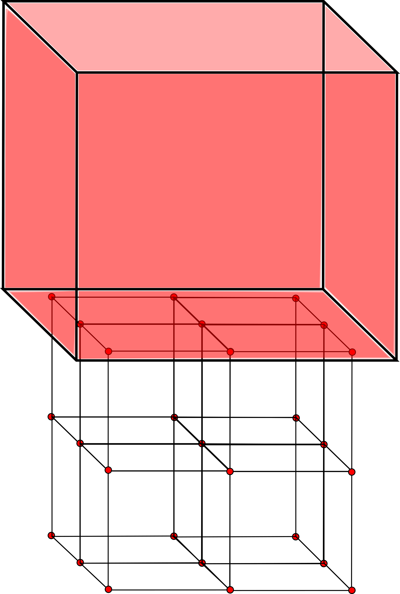
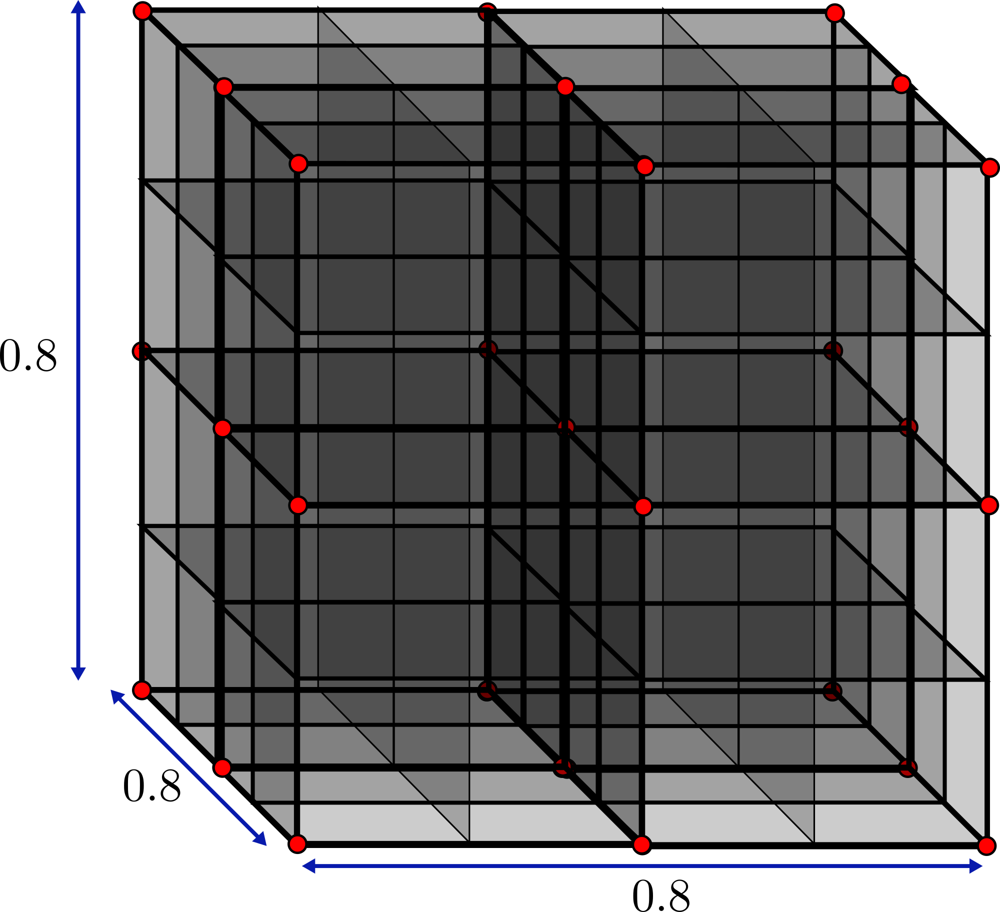

# Tutorial 2: Compaction via a rigid body

## Introduction
This quick start tutorial introduces the concept of a rigid body interacting with the material points.

This tutorial analyses a cube of soil compressed by a rigid platen through 25% of its height, and is used to validate that the contact formulation produces the expected uniform vertical stress field. This problem has been used to validate our contact formulation [@bird_dynamic_2025] and our adaptive-octree extension [@bird2026implicitoctreebasedadaptivematerial].

This tutorial has three main sections after the introduction:

- [Input setup](#input-setup)
- [Deploying and running the problem](#deploying-and-running-the-problem)
- [Viewing the results](#viewing-the-results)

### Background: rigid-body contact

<div class="json-side" markdown>

<div class="js-text" markdown>

This tutorial extends [Tutorial 1](Tutorial_1.md#background-the-gimpm) to include normal contact. A brief overview is provided here for context; see [equilibrium with rigid-body contact](../TechnicalReferences/EquilibriumEquationsContact.md) for the full technical details. [](#fig-contact-schematic) provides a schematic overview of how the contact between the rigid body and the material points works.

When contact is detected between a GIMP and the rigid body, (a) initial state, a normal contact force is applied at the corners of the GIMP's domain to resist the overlap. This force is proportional to the amount of overlap and can be thought of as a spring whose stiffness resists the overlap. S3-MPM calculates the spring stiffness automatically from the GIMP size and material properties,

$$
\epsilon_N = 50\, E_p\, A_p^0,
$$

where $E_p$ is the smallest Young's modulus of the GIMPs in the element and $A_p^0 = (V_p^0)^{2/3}$ is a representation of the contact area, with $V_p^0$ the initial GIMP volume. A tangential stiffness of $25\, E_p\, A_p^0$ is used for friction. The springs are stiff but not rigid, so a small overlap between the rigid body and the GIMPs remains - a few millimetres in this problem.

After the springs have been activated the GIMPs and the mesh deform due to the contact forces created by the springs, (b) deformed state, and once convergence is obtained the mesh is reset, (c) mesh reset.

</div>

<div class="js-code" markdown>

{ #fig-contact-schematic width="100%" }

</div>

</div>

## Input setup

### Problem summary

The aim is to introduce the set-up and modelling of soil-structure interaction problems. The problem is a deformable cube compressed by a rigid platen. Although simple, it is essential, as it validates the contact formulation by confirming that the overlap between the two bodies stays small and that the resulting vertical stress field is uniform throughout the cube and matches the analytical Hencky solution for the Cauchy stress in the vertical direction

$$
\sigma_{zz} = E \ln\!\left(\frac{L}{L_0}\right) \frac{L_0}{L} = \frac{10^6}{0.75} \ln(0.75) \approx -3.84 \times 10^5 \text{ Pa},
$$

where $L_0 = 0.8$ m is the initial cube height, $\Delta z = -0.2$ m is the prescribed compression and $L = L_0 + \Delta z = 0.6$ m is the final height after the $25\%$ axial compression.

As in [Tutorial 1](Tutorial_1.md#background-the-gimpm) the material is homogeneous Hencky elastic, here with $E = 10^6$ Pa, $\nu = 0$ and $\rho = 1000$ kg/m$^3$. The cube is discretised by a uniform $0.4$ m mesh ($2 \times 2 \times 2 = 8$ elements) with a $2 \times 2 \times 2$ grid of GIMPs per element. Roller boundaries are imposed on the four side faces and the base, and the top face is left free for the platen to push on.

The rigid platen is a $1.2 \times 1.2 \times 1.0$ m box that overhangs the top of the cube on every side. It starts resting on the cube and is pushed down $0.2$ m over 20 load steps.

Gravity is included. S3-MPM measures convergence relative to the weight of the soil, so every analysis needs gravity; here the weight of the soil adds at most $\rho g L_0 \approx 7.8$ kPa at the base, about $2\%$ of the stress from the platen.

<div class="grid" markdown>

{ #fig-cube-mesh style="width: 100%; height: 30em; object-fit: contain;" }

{ #fig-cube-bcs style="width: 100%; height: 20em; object-fit: contain;" }

</div>

The simulation is configured through a single JSON object - a human-readable, editable text file. It extends [Tutorial 1](Tutorial_1.md#input-setup) with a rigid body. The complete file for this problem, and the platen geometry, can be found [here](Tutorial_2_input_data.md), and every key is described on the [`input_data.json` file format](../UsingTheSoftware/InputFormat.md) page.

<div class="json-side-header">
<div>Description</div>
<div><code>input_data.json</code></div>
</div>

<div class="json-side" markdown>

<div class="js-text" markdown>

### Machine and domain

`"GPU": "off"` runs the analysis on the CPU.

`"domain update": "stretch"` lets the GIMP domains shrink as the cube is compressed. Without it, the domains keep their initial size, and the GIMPs next to the base cannot move closer to it.

The background mesh must hold the cube and the same height of empty space above it, so it is a cube of side $1.6$ m, the same as `"size"`.

</div>

<div class="js-code" markdown>

```json
"GPU": "off",

"domain update": "stretch",

"domain": {
    "size": 1.6,
    "gravity": [0.0, 0.0, -9.81]
}
```

</div>

</div>

<div class="json-side" markdown>

<div class="js-text" markdown>

### Material points

The soil is one $0.8$ m layer on a $0.8 \times 0.8$ m footprint, discretised by $0.4$ m elements with $2 \times 2 \times 2$ GIMPs in each, using the elastic properties from the [Problem summary](#problem-summary).

</div>

<div class="js-code" markdown>

```json
"material points": {
    "extra capacity": 1.2,
    "element size": 0.4,
    "number of material points per element 1": 2,
    "material size": { "min": [0.0, 0.0], "max": [0.8, 0.8] },
    "layers": [
        {
            "thickness": 0.8,
            "material": { "type": "elastic", "E": 1.0e6, "nu": 0.0, "density": 1000.0 }
        }
    ]
}
```

</div>

</div>

<div class="json-side" markdown>

<div class="js-text" markdown>

### Rigid body

A rigid body is a *system* of one or more *points*. Each point has six degrees of freedom - three displacements and three rotations - and carries a mass and rotational inertia. The platen is a single point at its centre, $(0.4, 0.5, 1.3)$ m.

Its `"boundary conditions"` list the six degrees of freedom in the order $[u_x, u_y, u_z, \theta_x, \theta_y, \theta_z]$. Five are `"fixed"`, and the vertical displacement is prescribed as $-0.01$ m per load step, so the platen moves $0.2$ m down over the 20 load steps. Because every degree of freedom is held, the mass and inertia have no effect.

The geometry comes from `platen.stl`, welded to point 1. It is drawn in global coordinates - the same frame as the point - with its base on the top of the soil. On the first run S3-MPM builds a tetrahedral mesh of the platen and stores it in `platen_mesh.txt` for later runs.

</div>

<div class="js-code" markdown>

```json
"rigid bodies": [
    {
        "points": [
            { "position": [0.4, 0.5, 1.3], "mass": 1.0, "rotational inertia": [0.2, 0.2, 0.24],
              "boundary conditions": ["fixed", "fixed", { "prescribed": -0.01 }, "fixed", "fixed", "fixed"] }
        ],
        "stl files": [
            { "name": "platen", "stl": "platen.stl", "mesh cache": "platen_mesh.txt", "point": 1 }
        ]
    }
]
```

</div>

</div>

<div class="json-side" markdown>

<div class="js-text" markdown>

### Contact

The contact between the platen and the soil is frictionless. The contact stiffness is set automatically, as described in the [Background](#background-rigid-body-contact).

</div>

<div class="js-code" markdown>

```json
"contact": {
    "friction coefficient": 0.0
}
```

</div>

</div>

<div class="json-side" markdown>

<div class="js-text" markdown>

### Analysis

A single static stage of 20 load steps with the rigid body switched on. `"load": "full"` applies gravity in full from the first step, while the platen is pushed down a little further at every step.

`"rigid body surface placement": "on"` moves the platen vertically at the start of the stage so that its base rests exactly on the top of the soil. Rollers are applied on the four sides and the base, and the top is free.

</div>

<div class="js-code" markdown>

```json
"analysis": [
    {
        "type": "static",
        "load steps": 20,
        "load": "full",
        "rigid bodies": "on",
        "rigid body surface placement": "on",
        "boundary conditions": { "min": ["roller", "roller", "roller"], "max": ["roller", "roller", "free"] }
    }
]
```

</div>

</div>

<div class="json-side" markdown>

<div class="js-text" markdown>

### Solver

The same settings as [Tutorial 1](Tutorial_1.md#solver): Newton-Raphson iterations to a tolerance of $10^{-6}$, and no ghost stabilisation, because the cube fills its elements completely.

</div>

<div class="js-code" markdown>

```json
"solver": {
    "tolerance": 1.0e-6,
    "max newton iterations": 20,
    "poor factor": 0.25,
    "ghost factor": 0.0,
    "ghost factor mass": 0.0
}
```

</div>

</div>

<div class="json-side" markdown>

<div class="js-text" markdown>

### Output

VTK and CSV output at every load step. The CSV files record each GIMP's position, domain size (`"lp"`) and stress, and the platen's position and reaction force - the force needed to push it - which are used in [Analysing the stress in the domain](#analysing-the-stress-in-the-domain).

</div>

<div class="js-code" markdown>

```json
"output": {
    "vtk": "on",
    "vtk directory": "vtk_cube",
    "vtk percent": 0,
    "vtk material point fields": ["displacement", "stress", "strain"],
    "vtk rigid body fields": ["position", "reaction force"],

    "csv": "on",
    "csv directory": "csv_cube",
    "csv percent": 0,
    "csv material point fields": ["initial position", "position", "lp", "stress"],
    "csv rigid body fields": ["position", "reaction force"]
}
```

</div>

</div>

## Deploying and running the problem

S3-MPM is written in the [Julia](https://julialang.org/) programming language, and there are two ways to run the code, both explored on the [deployment page](../UsingTheSoftware/DeployingTheSoftware.md). As this is a small problem that runs quickly, this tutorial uses Julia directly; see the [installation guide](../GettingStarted/Installation.md) for installing Julia and S3-MPM.

<div class="json-side-header">
<div>Deployment instructions</div>
<div><code>terminal</code></div>
</div>

<div class="json-side" markdown>

<div class="js-text" markdown>

### Setting up and running the problem

Create a folder for the run containing two files, both provided [here](Tutorial_2_input_data.md):

- `input_data.json`;
- `platen.stl`, the geometry of the platen.

The STL path in the input file is relative to the input file, and the output folders `vtk_cube` and `csv_cube` are created in the folder Julia is started from.

As in [Tutorial 1](Tutorial_1.md#setting-up-and-running-the-problem), open a terminal in the run folder, start Julia with the S3-MPM project active and load S3-MPM.

</div>

<div class="js-code" markdown>

<div class="terminal terminal-full" markdown>

```console
$ cd path/to/run_folder
$ julia --project=path/to/S3-MPM -t auto

julia> using S3MPM
```

</div>

</div>

</div>

<div class="json-side" markdown>

<div class="js-text" markdown>

### Running the problem

With Julia running in the run folder and S3-MPM loaded, start the simulation:

```
S3MPM.non_linear_solve("input_data.json");
```

#### Reading the output

Before the first load step, S3-MPM reports the rigid body surface placement: the lowest point of the platen (`body base`) and the top of the soil (`material top`) are both at $0.8$ m, so the platen is moved by just `Δz = 2.23517e-8` m, a small tolerance above the soil.

The progress line then works as in [Tutorial 1](Tutorial_1.md#reading-the-output). The load fraction `t` rises by `Δt 0.05` per load step, each step converges in 3 or 4 Newton-Raphson iterations (`NR`), and no steps are cut or material points deleted. The background mesh has `N 46` nodes.

</div>

<div class="js-code" markdown>

<div class="terminal" markdown>

```console
julia> S3MPM.non_linear_solve("input_data.json");
[ Info: rigid body surface placement: body base 0.8 → material top 0.8   Δz = 2.23517e-8
stage 1/1 ████████████ 100.0% t 1.0/1.0 step 21 Δt 0.05 NR 4 cuts 0 del 0 N 46
```

In a log file, the progress lines are kept:

```text
stage 1/1 █░░░░░░░░░░░   5.0% t 0.05/1.0 step 2 Δt 0.05 NR 3 cuts 0 del 0 N 46
stage 1/1 █░░░░░░░░░░░  10.0% t 0.1/1.0 step 3 Δt 0.05 NR 3 cuts 0 del 0 N 46
stage 1/1 ██░░░░░░░░░░  15.0% t 0.15/1.0 step 4 Δt 0.05 NR 3 cuts 0 del 0 N 46
...
stage 1/1 ███████████░  90.0% t 0.9/1.0 step 19 Δt 0.05 NR 4 cuts 0 del 0 N 46
stage 1/1 ███████████░  95.0% t 0.95/1.0 step 20 Δt 0.05 NR 4 cuts 0 del 0 N 46
stage 1/1 ████████████ 100.0% t 1.0/1.0 step 21 Δt 0.05 NR 4 cuts 0 del 0 N 46
```

</div>

</div>

</div>

## Viewing the results

The simulation results appear as the simulation runs, so you do not need to wait until it has finished. `vtk_cube` holds three series of files, numbered from `00002` to `00021`: `mps_1_...vtu` for the GIMPs, `surface_...vtu` for the surface of the platen and `body_...vtu` for the platen's point.

### Visualising the output in ParaView

The walkthrough below follows the same pattern as the [ParaView walkthrough from Tutorial 1](Tutorial_1.md#visualising-the-output-in-paraview), but also loads the surface of the platen, and finishes by hiding it so that the compressed cube can be inspected on its own. The same [3D-navigation controls](Tutorial_1.md#visualising-the-output-in-paraview) (left-drag to rotate, scroll to zoom) apply throughout.

<div class="walkthrough" markdown>
<div markdown>
**1. Open ParaView.** Launch ParaView from your applications menu or terminal. You should see an empty render view with the orientation axes in the bottom-left corner.
</div>
<div markdown>
!!! example "Placeholder: ParaView screenshot"
    `img/tutorial_2/paraview_1.png` - ParaView on launch, with an empty render view.
</div>
</div>

<div class="walkthrough" markdown>
<div markdown>
**2. Open the output files.** Use *File → Open* and navigate to `vtk_cube`. Hold `Ctrl` and click the `mps_1_..vtu` and `surface_..vtu` series so both are highlighted, then click *OK*.
</div>
<div markdown>
!!! example "Placeholder: ParaView screenshot"
    `img/tutorial_2/paraview_2.png` - the Open File dialog with both series selected.
</div>
</div>

<div class="walkthrough" markdown>
<div markdown>
**3. Apply the readers.** Click *Apply* in the Properties panel. The cube of GIMPs appears with the platen sitting on top of it. The platen overhangs the cube, so rotate the view to see both bodies.
</div>
<div markdown>
!!! example "Placeholder: ParaView screenshot"
    `img/tutorial_2/paraview_3.png` - the cube of GIMPs with the platen resting on top.
</div>
</div>

<div class="walkthrough" markdown>
<div markdown>
**4. Make the platen see-through.** Select `surface_..vtu` and change its *Representation* to *Wireframe*, so that the GIMPs beneath it can be seen.
</div>
<div markdown>
!!! example "Placeholder: ParaView screenshot"
    `img/tutorial_2/paraview_4.png` - the platen drawn as a wireframe over the GIMPs.
</div>
</div>

<div class="walkthrough" markdown>
<div markdown>
**5. Colour the GIMPs by vertical displacement at the final step.** Select `mps_1_..vtu`, change *Coloring* to `displacement` → `Z`, click *Go to Last* (`▶|`) and then *Rescale to Data Range*. The platen has moved $0.2$ m down, and the displacement of the GIMPs increases evenly from the base to the top of the cube.
</div>
<div markdown>
!!! example "Placeholder: ParaView screenshot"
    `img/tutorial_2/paraview_5.png` - the compressed cube coloured by vertical displacement, with the platen at its final position.
</div>
</div>

<div class="walkthrough" markdown>
<div markdown>
**6. Inspect the final stress distribution.** Click the eye icon next to `surface_..vtu` in the *Pipeline Browser* to hide the platen. Change the GIMPs' *Coloring* to `stress` → `ZZ` and click *Rescale to Data Range*. The colour is almost the same throughout the cube - the visual signature of the uniform vertical stress predicted by the Hencky solution in the [Problem summary](#problem-summary).
</div>
<div markdown>
!!! example "Placeholder: ParaView screenshot"
    `img/tutorial_2/paraview_6.png` - the compressed cube, with the platen hidden, coloured by vertical stress.
</div>
</div>

<div class="walkthrough" markdown>
<div markdown>
**7. Look at the contact force.** Show `surface_..vtu` again, change its *Representation* back to *Surface* and colour it by `contact force` → `Z`. The load is carried by the triangles of the platen's base, which is in contact with the soil.
</div>
<div markdown>
!!! example "Placeholder: ParaView screenshot"
    `img/tutorial_2/paraview_7.png` - the platen coloured by the vertical contact force on each triangle.
</div>
</div>

## Analysing the stress in the domain

`csv_cube/rigid_body.csv` has one row per load step for the platen's point, `body1`. The `time` column is the load fraction, `body1_position_z` is the height of the platen's centre and `body1_reaction force_z` is the vertical force needed to push the platen down, in N:

```text
time,body1_position_x,body1_position_y,body1_position_z,body1_reaction force_x,body1_reaction force_y,body1_reaction force_z
0.05,0.4,0.5,1.290000022351742,0.0,0.0,5542.940609787619
0.1,0.4,0.5,1.280000022351742,0.0,0.0,13865.821975158773
...
1.0000000000000002,0.4,0.5,1.1000000223517419,0.0,0.0,234663.3242756344
```

The GIMP files, `csv_cube/mps_1_00002.csv` to `mps_1_00021.csv`, have the same layout as in [Tutorial 1](Tutorial_1.md#analysing-the-stress-variation-with-height), with the addition of the domain half-widths `lp_x`, `lp_y` and `lp_z`.

The Python script below, run from the run folder, compares the final state with the analytical solution. It needs [NumPy](https://numpy.org/).

```python
import csv
import math
import numpy as np

def read_csv(path, skip=0):
    with open(path) as f:
        rows = list(csv.reader(f))[skip:]
    return rows[0], np.array(rows[1:], dtype=float)

# the soil at the final load step (the first line of the file is the time)
header, soil = read_csv("csv_cube/mps_1_00021.csv", skip=1)
z = soil[:, header.index("position_z")]
lp_z = soil[:, header.index("lp_z")]
stress_zz = soil[:, header.index("stress_zz")]

# the platen: one row per load step
header, platen = read_csv("csv_cube/rigid_body.csv")
force_z = platen[-1, header.index("body1_reaction force_z")]
base_z = platen[-1, header.index("body1_position_z")] - 0.5     # the platen is 1 m tall

E, L0, area = 1.0e6, 0.8, 0.8 * 0.8
L = np.max(z + lp_z)                                           # final height of the soil
print(f"final soil height      {L:.4f} m (overlap {1000 * (L - base_z):.1f} mm)")
print(f"mean vertical stress   {stress_zz.mean() / 1000:.1f} kPa")
print(f"Hencky at that height  {E * math.log(L / L0) * L0 / L / 1000:.1f} kPa")
print(f"platen force / area    {-force_z / area / 1000:.1f} kPa")
```

For this run it prints:

```text
final soil height      0.6046 m (overlap 4.6 mm)
mean vertical stress   -370.6 kPa
Hencky at that height  -370.6 kPa
platen force / area    -366.7 kPa
```

The platen overlaps the soil by $4.6$ mm - about $0.6\%$ of the cube's height - so the soil is compressed to $0.6046$ m rather than $0.6$ m. At that height the Hencky solution gives $-370.6$ kPa, matching the mean stress in the GIMPs; the full $0.2$ m of compression would give the $-383.6$ kPa of the [Problem summary](#problem-summary), $3.4\%$ more.

The stress is nearly uniform: every GIMP lies between $-367.5$ and $-373.5$ kPa, and the small variation comes from the weight of the soil. The platen force divided by the area of the cube gives the stress at the top of the soil, $-366.7$ kPa; adding the average weight of the soil above each GIMP, about $3.9$ kPa, recovers the mean stress of the GIMPs.

To see the effect of the mesh, set `"element size"` in [Material points](#material-points) to `0.2` and compare the overlap and the stresses.
