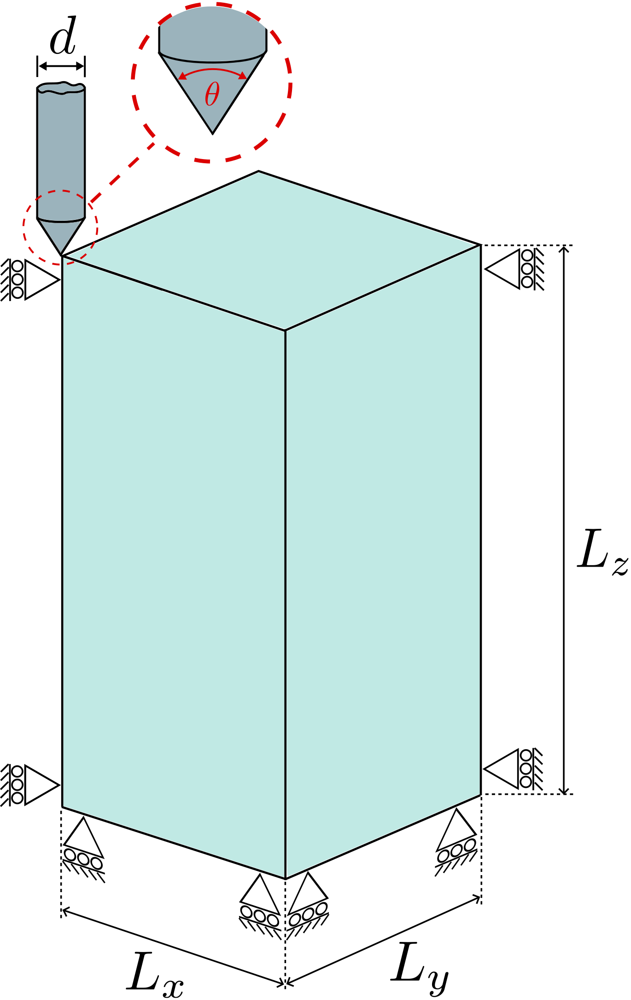
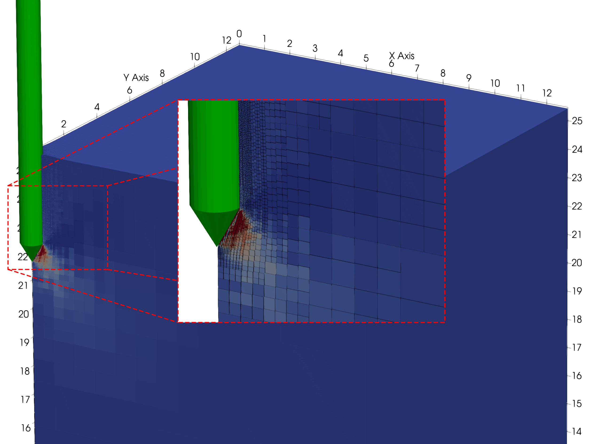
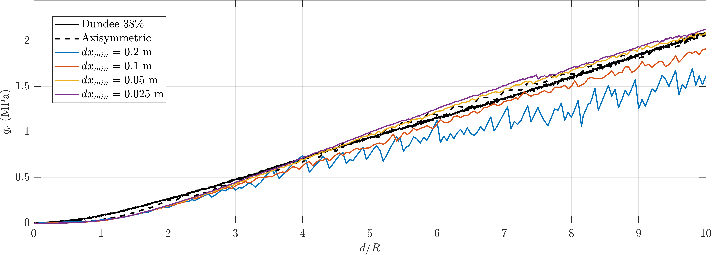

# Tutorial 3: Vertical penetration (Cone Penetration Test)

## Introduction
This tutorial walks through a Cone Penetration Test (CPT) simulation, a workhorse problem in offshore geotechnical engineering that calibrates soil parameters against in-situ measurements.

The problem is the quasi-static penetration of a rigid cone into a dry sand bed, with the cone-tip resistance compared against experimental centrifuge data from Davidson et al. [@davidson2022physical] and Cerfontaine et al. [@Cerfontaine2020]. It exercises adaptive octree refinement around a moving rigid body, frictional contact, and a hyperelastic-perfectly plastic constitutive model.

This tutorial has four sections:

- [Problem description](#problem-description)
- [Input setup](#input-setup)
- [Deploying and running the problem](#deploying-and-running-the-problem)
- [Viewing the results](#viewing-the-results)

## Problem description

You will define the geometry, mesh, boundary conditions, material, rigid body and solver in the input file. All the inputs to the simulation are defined using the [`input_data.json` file format](../UsingTheSoftware/InputFormat.md).

Only a quarter of the domain is modelled, exploiting the two-fold symmetry of the CPT in the $xz$ and $yz$ planes. The cone is pushed $4$ m into the sand over 300 quasi-static load steps. The deformation is large enough that GIMPs traverse multiple octree levels around the cone tip.

{ #fig-cpt-domain width="70%" }

**Mesh:** Domain dimensions $L_x = L_y = 12.8$ m and $L_z = 24.6$ m, with only a quarter modelled by symmetry. Adaptive octree refinement is driven by the rigid body position. The smallest element size near the cone surface is $dx_{\min}$, and the surrounding "buffer" region uses elements of size $2\, dx_{\min}$. For a quick first run set $dx_{\min} = 0.1$ m; for a high-accuracy comparison against the experimental data drop to $dx_{\min} = 0.05$ m.

**Initial GIMP distribution:** $2\times2\times2$ material points within each element, filling the entire soil domain.

**Boundary conditions:** Roller boundaries on the two symmetry planes ($-x$ and $-y$), on the two remaining lateral faces ($+x$ and $+y$) and on the base ($-z$). The top face ($+z$) is left as a free surface (homogeneous Neumann). Every node has its $x$ and $y$ degrees of freedom unconstrained on the symmetry planes by the roller condition, so the cone tip can drive vertical settlement freely.

**Material:** Hencky hyperelastic-perfectly plastic, with a Willam-Warnke deviatoric yield surface and a non-associated Drucker-Prager flow potential. Properties are calibrated to a relative density of $R_D = 32\%$ via the Brinkgreve empirical correlations [@brinkgreve2010validation], a procedure established in Bird et al. [@birdanchors2026]: reference Young's modulus $E^{ref}_{50} = 19\,200$ kPa, density $\rho = 16.3$ kN/m$^3$, Poisson's ratio $\nu = 0.25$, friction angle $\phi = 32^\circ$, dilation angle $\psi = 2^\circ$, apparent cohesion $c = 0.3$ kPa, earth pressure coefficient at rest $K_0 = 0.47$ and stiffness exponent $m_E = 0.60$.

The Young's modulus varies with confining pressure but is fixed at each material point's initial position:

$$
E_{50}(z_p^0) = E^{ref}_{50} \left( \frac{K_0\, \sigma_v(z_p^0)}{p^{ref}} \right)^{m_E}, \qquad \sigma_v = \rho\, d_p^0,
$$

where $d_p^0$ is the GIMP's initial depth below the surface. The $E_{50}$ value does not evolve during the simulation.

**Rigid body:** A circular cone of radius $r = 0.4$ m and apex angle $\theta = 60^\circ$, with its tip initially positioned just above the soil surface. The coefficient of friction between the cone and soil is $\mu = 0.3$. The normal and tangential contact penalty parameters are

$$
\epsilon_N = 50\, E_p\, A_p^0, \qquad \epsilon_T = 25\, E_p\, A_p^0,
$$

as in [Tutorial 2](Tutorial_2.md) and in Bird et al. [@bird_dynamic_2025].

**Loading:** A two-stage pseudo-static solution:

- **Stage 1 - gravity:** Apply gravitational body force in a single load step, populating the initial stress field and the depth-dependent $E_{50}$ at every GIMP.
- **Stage 2 - cone descent:** Prescribe a downward displacement of the cone of $\Delta z = -4$ m over 300 load steps.

**Solver:** Newton-Raphson, quasi-static (pseudo-static), with the two-stage loading above.

## Input setup
The input file is a single JSON object - a human-readable, editable text file. The complete file for this problem can be found [here](Tutorial_3_input_data.md).

This problem has eight top-level sections, broken out below alongside the [Problem description](#problem-description).

Defaults (a face being free, a DOF being unconstrained, etc.) are not included in the file; only non-default settings are specified. See the [`input_data.json` file format](../UsingTheSoftware/InputFormat.md) for the full list of defaults.

### Mesh data

The quarter-symmetric domain matches the $12.8 \times 12.8 \times 24.6$ m setup, with refinement driven by the rigid body.

```json
"Mesh": {
    "domain size x": 12.8,
    "domain size y": 12.8,
    "domain size z": 24.6,
    "dx refined": 0.1,
    "Refinement type": "rigid body adaptive",
    "buffer multiplier": 2
}
```

`dx refined` is the smallest element size, used on elements intersecting the cone surface. `buffer multiplier` sets the element size in the surrounding region as a multiple of `dx refined`.

`Refinement type` is `rigid body adaptive` so the mesh re-refines as the cone descends.

### Initial GIMP distribution

The default $2\times2\times2$ distribution per element, filling the soil domain.

```json
"Initial GIMP distribution": {
    "Initial GIMP distribution x": 12.8,
    "Initial GIMP distribution y": 12.8,
    "Initial GIMP distribution z": 24.6
}
```

### Boundary conditions

Rollers on the symmetry planes ($-x$, $-y$), the remaining lateral faces ($+x$, $+y$) and the base ($-z$). The top face is left as a free surface (default).

```json
"Boundary conditions": {
    "neg x-plane": "roller",
    "neg y-plane": "roller",
    "neg z-plane": "roller",
    "pos x-plane": "roller",
    "pos y-plane": "roller"
}
```

### Material

A single layer of hyperelastic-perfectly plastic sand, calibrated to $R_D = 32\%$ Congleton sand via the Brinkgreve correlations.

```json
"Material": {
    "number of layers": 1,
    "layers": [
        {
            "type": "DruckerPrager",
            "emperical data": "Brinkgreve sand",
            "assigned material properties": {
                "E_50_ref": 19200000.0,
                "rho": 1630.0,
                "nu": 0.25,
                "phi": 32.0,
                "psi": 2.0,
                "c": 300.0,
                "K_0": 0.47,
                "m_E": 0.60
            }
        }
    ]
}
```

### Rigid body

A cone with radius $0.4$ m and apex angle $60^\circ$, initially positioned just above the soil surface, given a prescribed downward displacement of $4$ m over the 300 load steps of step 2.

```json
"Rigid body": {
    "geometry": "cone",
    "radius": 0.4,
    "apex angle": 60.0,
    "initial position z": 24.6,
    "prescribed displacement z": -4.0,
    "friction coefficient": 0.3,
    "normal penalty factor": 50,
    "tangential penalty factor": 25
}
```

### Loading

The two stages are processed in order: a single gravity step generates the initial stress field, then the cone is displaced over 300 load steps.

```json
"Loading": {
    "stages": [
        {
            "name": "stage 1 - gravity",
            "type": "gravity",
            "g": [0.0, 0.0, -9.81],
            "number of increments": 1
        },
        {
            "name": "stage 2 - cone descent",
            "type": "rigid body displacement",
            "rigid body": "cone",
            "displacement z": -4.0,
            "number of increments": 300
        }
    ]
}
```

### Solver

Newton-Raphson, quasi-static. The same solver is applied to both stages.

```json
"Solver": {
    "solve type": "static",
    "method": "Newton-Raphson"
}
```

### Output data

VTU and VTK output is enabled for visualisation in [ParaView](https://www.paraview.org/) (or [VisIt](https://visit-dav.github.io/visit-website/)). The `text data` field tags the run as `cone penetration test` for post-processing.

```json
"Output Data": {
    "vtu data": "yes",
    "vtk data": "yes",
    "text data": "cone penetration test"
}
```


## Deploying and running the problem
## Viewing the results

The deformed mesh and GIMP displacement field at $1.2$ m penetration is shown below: the displacement magnitude rises from $0$ m (blue) at the far field to roughly $0.5$ m (red) immediately under the cone tip.

{ #fig-cpt-final width="70%" }

The cone-tip resistance $q_c$ is normalised by the cone radius $r$ to compare against the centrifuge measurements of Davidson et al. [@davidson2022physical] and Cerfontaine et al. [@Cerfontaine2020]. Convergence with mesh refinement is monitored by halving $dx_{\min}$.

{ #fig-cpt-results width="70%" }
