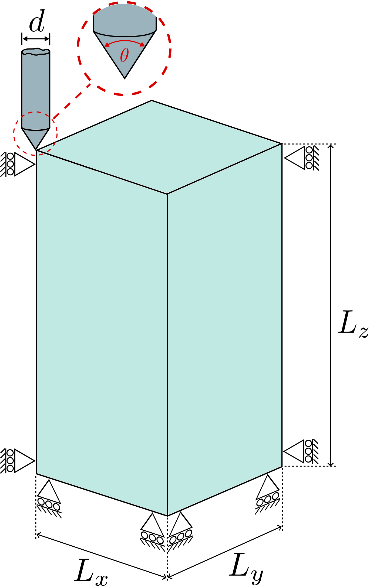
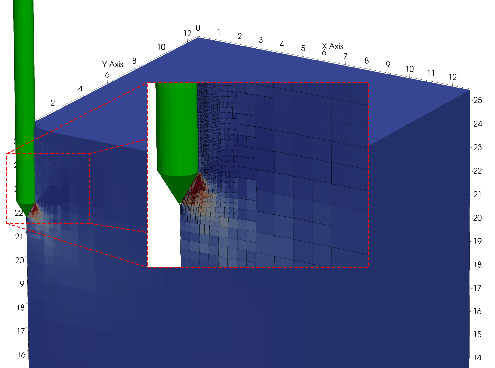
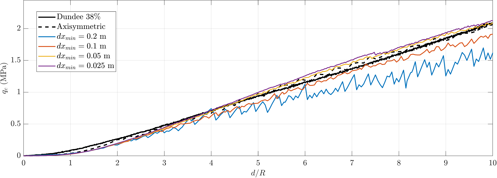

---
hide:
  - toc
---

# Tutorial 3: Vertical penetration (Cone Penetration Test)

## Introduction
This tutorial walks through a Cone Penetration Test (CPT) simulation, a workhorse problem in offshore geotechnical engineering that is used to calibrate soil parameters against in-situ measurements.

A rigid cone is pushed quasi-statically $4.5$ m into a bed of dry sand, and the cone-tip resistance can be compared against centrifuge data such as that of Davidson et al. [@davidson2022physical] and Cerfontaine et al. [@Cerfontaine2020]. The problem builds on [Tutorial 2](Tutorial_2.md) and adds four things: an elasto-plastic sand whose stiffness increases with depth, frictional contact, mesh refinement that follows the cone, and an analysis made of two stages.

This tutorial has four sections:

- [Problem description](#problem-description)
- [Input setup](#input-setup)
- [Deploying and running the problem](#deploying-and-running-the-problem)
- [Viewing the results](#viewing-the-results)

## Problem description

You will define the soil, the cone, the two loading stages, the solver and the output in the input file. All the inputs to the simulation are defined using the [`input_data.json` file format](../UsingTheSoftware/InputFormat.md).

Only a quarter of the problem is modelled, using the two vertical planes of symmetry through the cone axis. The cone axis runs down the corner of the soil block at $x = y = 0$, and the two faces that meet there carry roller conditions.

{ #fig-cpt-domain width="30%" }

*Figure reproduced from [@bird2026implicitoctreebasedadaptivematerial].*

**Soil block:** $10 \times 10$ m in plan and $20$ m deep, starting with $2 \times 2 \times 2$ material points in each element. The base element size is given as $2.0$ m, but every element size must be a power-of-two multiple of the smallest one - $0.025$ m at the cone - so the base size becomes $0.025 \times 2^6 = 1.6$ m and the footprint is rounded up to seven elements, $11.2 \times 11.2$ m (see [how element sizes set the mesh](../UsingTheSoftware/InputFormat.md#how-element-sizes-set-the-mesh)).

**Boundary conditions:** Rollers on the four vertical faces - on $x = 0$ and $y = 0$ these are the symmetry conditions - and a fixed base. The soil surface is free.

**Material:** Willam-Warnke elasto-plastic sand at a relative density of $D_r = 38\%$, with the parameters from the Brinkgreve correlations [@brinkgreve2010validation]:

<div class="centered-table" markdown>

| Property                     | Correlation                                | Value at $D_r = 38\%$ | Input key                     |
|------------------------------|--------------------------------------------|-----------------------|-------------------------------|
| Reference Young's modulus    | $E^{ref} = 60\,000\; D_r/100$ kPa          | $22.8$ MPa            | `"E": 2.28e7`                 |
| Friction angle               | $\phi = 28 + 12.5\; D_r/100$               | $32.75^\circ$         | `"friction angle": 32.75`     |
| Dilation angle               | $\psi = -2 + 12.5\; D_r/100$               | $2.75^\circ$          | `"dilation angle": 2.75`      |
| Dry unit weight              | $\gamma = 15 + 4\; D_r/100$ kN/m$^3$       | $16.52$ kN/m$^3$      | `"density": 1652.0`           |
| Stiffness exponent           | $m = 0.7 - D_r/320$                        | $0.58125$             | `"exponent": 0.58125`         |
| Earth pressure at rest       | $K_0 = 1 - \sin\phi$                       | $0.459$               | `"reference stress"` (below)  |
| Poisson's ratio              | -                                          | $0.25$                | `"nu": 0.25`                  |
| Cohesion                     | -                                          | $0.3$ kPa             | `"cohesion": 300.0`           |

</div>

The density is entered as the unit weight divided by $10$ m/s$^2$.

The Young's modulus increases with depth. Brinkgreve's stiffness law is written in terms of the horizontal stress $K_0 \sigma_v$ and a reference pressure $p^{ref} = 100$ kPa, whereas AMPSSIE's [stress-dependent stiffness](../UsingTheSoftware/InputFormat.md#stress-dependent-stiffness) uses the vertical stress $\sigma_v$. The two are the same when the reference stress is $p^{ref}/K_0$:

$$
E = E^{ref} \left( \frac{K_0\, \sigma_v}{p^{ref}} \right)^{m} = E^{ref} \left( \frac{\sigma_v}{\sigma^{ref}} \right)^{m}, \qquad \sigma^{ref} = \frac{p^{ref}}{K_0} = 217.85 \text{ kPa}.
$$

$\sigma_v$ is calculated from the weight of the soil above each material point's initial position, so each point's stiffness is set once and does not change during the analysis.

**Cone:** `CPT.stl`, a cylinder of radius $r = 0.4$ m with a $60^\circ$ conical tip, $10.69$ m long in total and drawn with its tip at the origin. Coulomb friction with $\mu = 0.33$ acts between the cone and the sand, and the contact penalty is set automatically, as described in [Tutorial 2](Tutorial_2.md#background-rigid-body-contact).

**Loading:** Two static stages:

- **Stage 1 - initial stresses:** the cone is switched off and gravity is ramped up over 5 load steps.
- **Stage 2 - penetration:** the cone is placed on the soil surface and pushed down $10$ mm per load step for 450 load steps ($4.5$ m), with the mesh refined to $0.025$ m wherever the cone surface is.

**Solver:** Newton-Raphson, quasi-static, for both stages.

## Input setup
The input file is a single JSON object - a human-readable, editable text file. The complete file for this problem can be found [here](Tutorial_3_input_data.md), and every key is described on the [`input_data.json` file format](../UsingTheSoftware/InputFormat.md) page.

<div class="json-side-header">
<div>Description</div>
<div><code>input_data.json</code></div>
</div>

<div class="json-side" markdown>

<div class="js-text" markdown>

### Machine and domain

`"GPU": "on"` runs the analysis on an NVIDIA GPU. This is recommended here, because refining the cone surface to $0.025$ m creates a large number of material points; set it to `"off"` to run on the CPU.

The domain `"size"` is only a lower bound. The background grid is enlarged automatically to hold the soil block and the empty space above it, which here makes it a cube of side $51.2$ m. Gravity acts in $-z$.

</div>

<div class="js-code" markdown>

```json
"GPU" : "on",

"domain": {
    "size": 10.0,
    "gravity": [0.0, 0.0, -9.81]
}
```

</div>

</div>

<div class="json-side" markdown>

<div class="js-text" markdown>

### Material points

A single $20$ m layer of Willam-Warnke sand over a $10 \times 10$ m footprint, with the properties from the [Problem description](#problem-description). The `"E overburden"` block makes the Young's modulus increase with depth.

`"extra capacity": 1.2` reserves 20% more storage than the initial material points need, because the refinement around the cone splits material points into smaller ones.

</div>

<div class="js-code" markdown>

```json
"material points": {
    "extra capacity": 1.2,
    "element size": 2.0,
    "number of material points per element 1": 2,
    "material size": { "min": [0.0, 0.0], "max": [10.0, 10.0] },
    "layers": [
        {
            "thickness": 20.0,
            "material": { "type": "willam warnke",
                          "E": 2.28e7, "nu": 0.25,
                          "friction angle": 32.75, "dilation angle": 2.75, "cohesion": 300.0,
                          "density": 1652.0,
                          "E overburden": { "reference stress": 2.1785e5, "exponent": 0.58125 } }
        }
    ]
}
```

</div>

</div>

<div class="json-side" markdown>

<div class="js-text" markdown>

### Rigid body

The cone is one system with a single point, placed at its tip - the origin of `CPT.stl`. All positions in the file are global, so the point and the STL geometry are given in the same frame.

`"offset"` shifts the whole cone $10$ mm in $-x$ and $-y$, so its axis sits just outside the corner of the soil block. All six degrees of freedom are `"fixed"`, so the cone does not move and its mass and inertia play no part; stage 2 replaces the vertical condition to push the cone down.

`CPT_mesh.txt` stores the tetrahedral mesh of the cone. If it is missing, it is generated from the STL on the first run.

</div>

<div class="js-code" markdown>

```json
"rigid bodies": [
    {
        "offset": [-0.01, -0.01, 0.0],
        "points": [
            { "position": [0.0, 0.0, 0.0], "mass": 39989.6, "rotational inertia": [1626001.9, 1626001.9, 3199.2],
              "boundary conditions": ["fixed", "fixed", "fixed", "fixed", "fixed", "fixed"] }
        ],
        "stl files": [
            { "name": "cpt", "stl": "CPT.stl",
              "mesh cache": "CPT_mesh.txt", "point": 1 }
        ]
    }
]
```

</div>

</div>

<div class="json-side" markdown>

<div class="js-text" markdown>

### Contact

Coulomb friction with $\mu = 0.33$ between the cone and the sand.

</div>

<div class="js-code" markdown>

```json
"contact": {
    "friction coefficient": 0.33
}
```

</div>

</div>

<div class="json-side" markdown>

<div class="js-text" markdown>

### Stage 1: initial stresses

The first entry in `"analysis"` is a static stage with the cone switched off (`"rigid bodies": "off"`). Gravity is ramped from zero to its full value over 5 load steps, setting up the initial stresses in the sand. `"adaptivity": {"type": "uniform"}` meshes the whole grid at the $1.6$ m base size.

The four vertical faces are rollers and the base is fixed. The top face is fixed too, but it lies at twice the soil depth, in the empty space above the soil, so the soil surface stays free.

</div>

<div class="js-code" markdown>

```json
{
    "type": "static",
    "load steps": 5,
    "load": "gravity ramp",
    "rigid bodies": "off",
    "adaptivity": { "type": "uniform" },
    "boundary conditions": { "min": ["roller", "roller", "fixed"], "max": ["roller", "roller", "fixed"] }
}
```

</div>

</div>

<div class="json-side" markdown>

<div class="js-text" markdown>

### Stage 2: cone penetration

The second stage switches the cone on. `"rigid body surface placement": "on"` moves it vertically at the start of the stage so that its tip rests on the soil surface, and `"load": "full"` keeps gravity at its full value throughout.

`"rigid body boundary conditions"` replaces the conditions of point 1 of system 1 - the cone - for this stage only, prescribing a vertical displacement of $-0.01$ m per load step. Over the 450 load steps the cone penetrates $4.5$ m.

`"rigid body surface"` adaptivity refines the elements the cone surface passes through to $0.025$ m at every step, so the fine mesh travels down with the cone. For a quicker, coarser first run use `"element size": 0.1`.

</div>

<div class="js-code" markdown>

```json
{
    "type": "static",
    "load steps": 450,
    "load": "full",
    "rigid bodies": "on",
    "rigid body surface placement": "on",
    "adaptivity": {
        "type": "rigid body surface",
        "element size": 0.025
    },
    "rigid body boundary conditions": [
        { "system": 1, "point": 1, "boundary conditions": ["fixed", "fixed", { "prescribed": -0.01 }, "fixed", "fixed", "fixed"] }
    ],
    "boundary conditions": { "min": ["roller", "roller", "fixed"], "max": ["roller", "roller", "fixed"] }
}
```

</div>

</div>

<div class="json-side" markdown>

<div class="js-text" markdown>

### Solver

Each load step is solved by Newton-Raphson iterations to a tolerance of $10^{-6}$; a step that has not converged after 20 iterations is retried with half the increment.

`"ghost factor"` and `"ghost factor mass"` set the strength of the [ghost stabilisation](../TechnicalReferences/ghostStabilisation.md) of poorly filled elements at the edges of the soil, and `"poor factor": 0.25` treats elements less than a quarter full as poorly filled.

</div>

<div class="js-code" markdown>

```json
"solver": {
    "tolerance": 1.0e-6,
    "max newton iterations": 20,
    "poor factor": 0.25,
    "ghost factor": 0.025,
    "ghost factor mass": 0.25
}
```

</div>

</div>

<div class="json-side" markdown>

<div class="js-text" markdown>

### Output

VTK files for [ParaView](https://www.paraview.org/) are written to `vtk_CPT_dr38` every $0.5\%$ of each stage's load steps - every 2 load steps during penetration - and CSV files to `csv_CPT_dr38` every $0.25\%$, which is every load step here.

The rigid-body CSV output includes the `reaction force` on the cone, from which the tip resistance is calculated in [Cone resistance](#cone-resistance).

</div>

<div class="js-code" markdown>

```json
"output": {
    "vtk": "on",
    "vtk directory": "vtk_CPT_dr38",
    "vtk percent": 0.5,
    "vtk material point fields": ["displacement", "velocity", "stress", "strain", "volume"],
    "vtk rigid body fields": ["position", "velocity", "reaction force"],

    "csv": "on",
    "csv directory": "csv_CPT_dr38",
    "csv percent": 0.25,
    "csv material point fields": ["initial position", "position", "stress"],
    "csv rigid body fields": ["position", "velocity", "reaction force", "reaction moment"]
}
```

</div>

</div>

## Deploying and running the problem

AMPSSIE is written in the [Julia](https://julialang.org/) programming language. See the [installation guide](../GettingStarted/Installation.md) for installing Julia and AMPSSIE, and [Tutorial 1](Tutorial_1.md#deploying-and-running-the-problem) for a first, small run.

<div class="json-side-header">
<div>Deployment instructions</div>
<div><code>terminal</code></div>
</div>

<div class="json-side" markdown>

<div class="js-text" markdown>

### Setting up the run folder

Create a folder for the run containing:

- `input_data.json`, copied from the [complete input file](Tutorial_3_input_data.md);
- `CPT.stl` and `CPT_mesh.txt`, from the top level of the AMPSSIE repository.

The STL and mesh-cache paths in the input file are relative to the input file, and the output folders `vtk_CPT_dr38` and `csv_CPT_dr38` are created in the folder Julia is started from.

### Running the problem

Start Julia in the run folder with the AMPSSIE project active (`--project`) and every CPU thread available (`-t auto`), then load AMPSSIE and run the input file.

This is a large analysis: with $0.025$ m elements around the cone it is intended for a GPU or an HPC node. On a workstation without a GPU, set `"GPU": "off"` and use `"element size": 0.1` in stage 2.

The progress line shows `stage 1/2` while the initial stresses are set up and `stage 2/2` during penetration. Its fields are explained in [Tutorial 1](Tutorial_1.md#reading-the-output).

</div>

<div class="js-code" markdown>

<div class="terminal terminal-full" markdown>

```console
$ cd path/to/run_folder
$ julia --project=path/to/AMPSSIE -t auto

julia> using S3MPM

julia> S3MPM.non_linear_solve("input_data.json");
```

</div>

</div>

</div>

## Viewing the results

### Visualising the output in ParaView

The output can be viewed while the analysis runs. The walkthrough below uses the same ParaView controls as [Tutorial 1](Tutorial_1.md#visualising-the-output-in-paraview).

<div class="walkthrough" markdown>
<div markdown>
**1. Open the soil and the cone.** *File → Open*, go to `vtk_CPT_dr38`, hold `Ctrl` and select the `mps_1_..vtu` (soil) and `surface_..vtu` (cone) series, click *OK* and then *Apply*.
</div>
<div markdown>
!!! example "Placeholder: ParaView screenshot"
    `img/tutorial_3/paraview_1.png` - the quarter soil block and the cone after *Apply*.
</div>
</div>

<div class="walkthrough" markdown>
<div markdown>
**2. Mirror the quarter model.** Select `mps_1_..vtu` and apply *Filters → Alphabetical → Reflect* with *Plane* `X` and *Center* `0`. Select the new `Reflect1` and apply a second *Reflect* with *Plane* `Y` and *Center* `0`, giving the full soil block around the cone.
</div>
<div markdown>
!!! example "Placeholder: ParaView screenshot"
    `img/tutorial_3/paraview_2.png` - the full soil block after the two reflections.
</div>
</div>

<div class="walkthrough" markdown>
<div markdown>
**3. Cut through the cone axis.** With `Reflect2` selected, apply *Filters → Common → Clip* with *Normal* `(0, 1, 0)` and *Origin* `(0, 0, 0)`, and untick *Show Plane*. The clip opens a vertical section through the soil beside the cone.
</div>
<div markdown>
!!! example "Placeholder: ParaView screenshot"
    `img/tutorial_3/paraview_3.png` - the clipped soil block with the cone visible in the section.
</div>
</div>

<div class="walkthrough" markdown>
<div markdown>
**4. Colour by displacement at the final step.** Set the clip's *Coloring* to `displacement` → `Magnitude`, click *Go to Last* (`▶|`) and then *Rescale to Data Range*. The largest displacements are in the sand immediately beneath and beside the cone tip.
</div>
<div markdown>
!!! example "Placeholder: ParaView screenshot"
    `img/tutorial_3/paraview_4.png` - displacement magnitude on the section at the end of penetration.
</div>
</div>

<div class="walkthrough" markdown>
<div markdown>
**5. Look at the stresses and the contact force.** Colour the clip by `stress` → `ZZ` for the vertical stress. Then select `surface_..vtu` and colour it by `contact force` → `Magnitude` to see which parts of the cone carry the load.
</div>
<div markdown>
!!! example "Placeholder: ParaView screenshot"
    `img/tutorial_3/paraview_5.png` - vertical stress in the soil and contact force on the cone surface.
</div>
</div>

### Cone resistance

`csv_CPT_dr38/rigid_body.csv` has one row per output step for the cone's point, `body1`. `body1_position_z` is the height of the cone tip and `body1_reaction force_z` is the vertical force needed to push the cone. Because only a quarter of the soil is modelled, the tip resistance is approximately

$$
q_c = \frac{4\, |F_z|}{\pi r^2}, \qquad r = 0.4 \text{ m},
$$

and the penetration depth is the height of the soil surface, $20$ m, minus `body1_position_z`. The rows from stage 1 come before the cone is placed on the soil, with zero force, and should be skipped. In a static stage the `time` column is the load fraction, which runs from 0 to 1 over the $4.5$ m of penetration.

!!! example "Placeholder: results plot"
    `img/tutorial_3/cone_resistance.png` - $q_c$ against penetration depth from `rigid_body.csv`, compared with the centrifuge data.

### Published results

The deformed mesh and GIMP displacement field at $1.2$ m penetration from [@bird2026implicitoctreebasedadaptivematerial] is shown below: the displacement magnitude rises from $0$ m (blue) in the far field to roughly $0.5$ m (red) immediately under the cone tip.

{ #fig-cpt-final width="50%" }

*Figure reproduced from [@bird2026implicitoctreebasedadaptivematerial].*

In the same study the cone-tip resistance $q_c$, normalised by the cone radius $r$, was compared against the centrifuge measurements of Davidson et al. [@davidson2022physical] and Cerfontaine et al. [@Cerfontaine2020], with convergence checked by halving the smallest element size.

{ #fig-cpt-results width="70%" }

*Figure reproduced from [@bird2026implicitoctreebasedadaptivematerial].*
