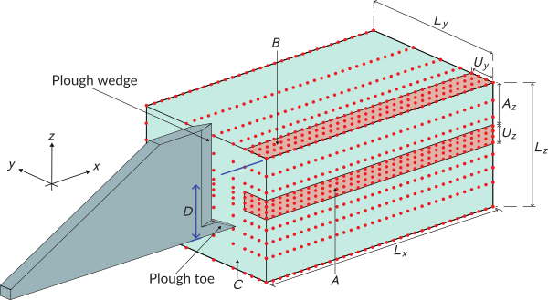
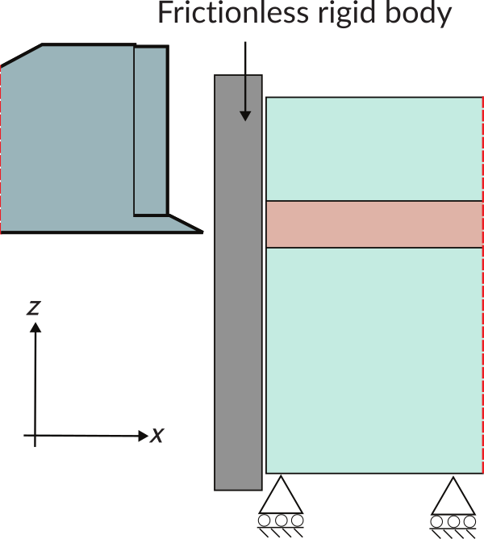
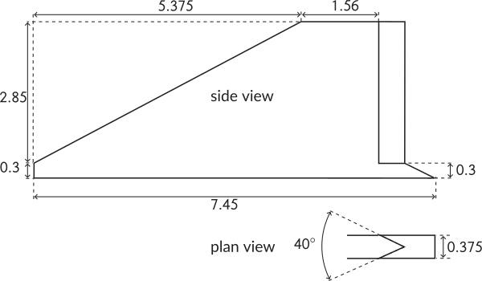
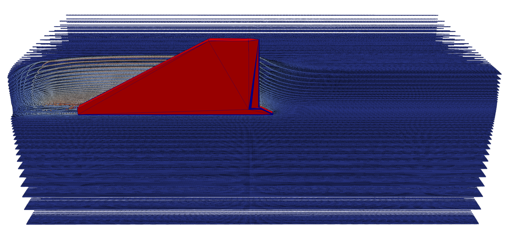
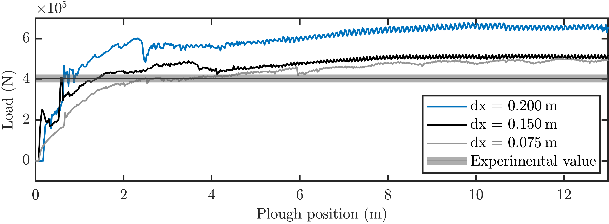

---
hide:
  - toc
---

# Tutorial 4: Plough (horizontal penetration)

## Introduction
This tutorial walks through a 3D simulation of a seabed cable plough being dragged horizontally through dry sand, the most geometrically complex problem in the AMPSSIE tutorial set.

The plough is held at a fixed embedment depth and pulled at constant speed; the steady-state horizontal pull (tow) force is compared against the 50g geotechnical centrifuge measurements of Robinson et al. [@robinson2021cone], with scaling to the 1g full-scale problem following Robinson et al. [@robinson2019centrifuge]. The problem exercises contact with a non-convex rigid body, large deformation around a moving wedge, and adaptive mesh refinement that follows the plough through the domain.

This tutorial has four sections:

- [Problem description](#problem-description)
- [Input setup](#input-setup)
- [Deploying and running the problem](#deploying-and-running-the-problem)
- [Viewing the results](#viewing-the-results)

## Problem description

You will define the geometry, mesh, boundary conditions, material, rigid body and solver in the input file. All the inputs to the simulation are defined using the [`input_data.json` file format](../UsingTheSoftware/InputFormat.md).

Only half of the domain is modelled, exploiting the symmetry of the plough in $x$. The plough is held at a fixed embedment depth of $D = 1.85$ m and is dragged through the soil over a total horizontal travel of $20$ m at a step size of $0.025$ m.

<div class="grid" markdown>

{ #fig-plough-setup width="100%" }

{ #fig-plough-setup-BCs width="100%" }

{ #fig-plough_schematic width="100%" }

</div>

**Mesh:** Half-symmetric domain dimensions $L_x = 20$ m, $L_y = 10$ m, $L_z = 7.5$ m. As in [Tutorial 3](Tutorial_3.md), adaptive octree refinement is driven by the rigid body position. The smallest element size near the plough surface is $dx_{\min}$, and the surrounding "buffer" region uses elements of size $2\, dx_{\min}$. For a quick first run set $dx_{\min} = 0.2$ m; for a high-accuracy comparison against the experimental data drop to $dx_{\min} = 0.075$ m. Try the values $dx_{\min} \in \{0.075,\, 0.15,\, 0.2\}$ m to reproduce the validation envelope reported in [@robinson2021cone].

**Initial GIMP distribution:** $2\times2\times2$ material points within each element, filling the soil domain.

**Boundary conditions:** Roller boundaries on the symmetry plane and the remaining lateral faces, and on the base. The top face is left as a free surface (homogeneous Neumann). The face the plough exits through (marked C in [](#fig-plough-setup)) carries a Signorini condition - material can move away from this face but not across it. Pragmatically, this is enforced by a secondary frictionless rigid plate.

**Material:** Hencky hyperelastic-perfectly plastic dry sand with a non-associated Drucker-Prager flow potential, calibrated to the Robinson 2019 centrifuge sand via the Brinkgreve correlations [@brinkgreve2010validation]. Use the same parameters as [Tutorial 3](Tutorial_3.md) and adjust the relative density to match your target. Per [@robinson2021cone], the simulation runs at full scale with $1g$ gravity (the $50g$ centrifuge scaling collapses to identical $1g$ behaviour when length and time are scaled equally [@robinson2019centrifuge]).

**Rigid body:** The plough geometry includes a forward wedge, a main share and an angled mouldboard (see [](#fig-plough_schematic)). The side view of the Signorini boundary condition arrangement is shown in [](#fig-plough-setup-BCs). To prevent rigid-body penetration of GIMPs, all convex edges sharper than $90^\circ$ are filleted to a radius equal to half the minimum GIMP side length (~10 fillet segments per $90^\circ$). Frictional contact uses the same penalty parameters as [Tutorial 2](Tutorial_2.md): $\epsilon_N = 50\,E_p A_p$ and $\epsilon_T = 25\,E_p A_p$.

**Loading:** A two-stage pseudo-static solution:

- **Stage 1 - gravity and initial embedment:** Apply gravity and position the plough at its operating depth $D = 1.85$ m.
- **Stage 2 - horizontal drag:** Pull the plough horizontally in $+y$ at a fixed depth over $20$ m total travel, in steps of $0.025$ m. If a step fails to converge, halve the step size and restart that step.

**Solver:** Newton-Raphson, quasi-static. The plough is the most complex contact geometry in the tutorial set, so robust step-size control is important.

## Input setup
The input file is a single JSON object - a human-readable, editable text file. The complete file for this problem can be found [here](Tutorial_4_input_data.md).

This problem has eight top-level sections, broken out below alongside the [Problem description](#problem-description).

Defaults (a face being free, a DOF being unconstrained, etc.) are not included in the file; only non-default settings are specified. See the [`input_data.json` file format](../UsingTheSoftware/InputFormat.md) for the full list of defaults.

<div class="json-side-header">
<div>Description</div>
<div><code>input_data.json</code></div>
</div>

<div class="json-side" markdown>

<div class="js-text" markdown>

### Mesh data

The half-symmetric domain, with octree refinement driven by the rigid body.

`dx refined` is the smallest element size, used on elements intersecting the plough surface. `buffer multiplier` sets the element size in the surrounding region as a multiple of `dx refined`.

`Refinement type` is `rigid body adaptive` so the mesh re-refines as the plough advances through the soil, matching the scheme used in [Tutorial 3](Tutorial_3.md).

</div>

<div class="js-code" markdown>

```json
"Mesh": {
    "domain size x": 20.0,
    "domain size y": 10.0,
    "domain size z": 7.5,
    "dx refined": 0.075,
    "Refinement type": "rigid body adaptive",
    "buffer multiplier": 2
}
```

</div>

</div>

<div class="json-side" markdown>

<div class="js-text" markdown>

### Initial GIMP distribution

The default $2\times2\times2$ distribution per element, filling the soil domain.

</div>

<div class="js-code" markdown>

```json
"Initial GIMP distribution": {
    "Initial GIMP distribution x": 20.0,
    "Initial GIMP distribution y": 10.0,
    "Initial GIMP distribution z": 7.5
}
```

</div>

</div>

<div class="json-side" markdown>

<div class="js-text" markdown>

### Boundary conditions

Rollers everywhere except the top face (default free surface) and the exit face which uses Signorini contact.

</div>

<div class="js-code" markdown>

```json
"Boundary conditions": {
    "neg x-plane": "roller",
    "neg y-plane": "roller",
    "neg z-plane": "roller",
    "pos x-plane": "roller",
    "pos y-plane": "Signorini"
}
```

</div>

</div>

<div class="json-side" markdown>

<div class="js-text" markdown>

### Material

A single layer of hyperelastic-perfectly plastic sand, calibrated to the Robinson 2019 sand via the Brinkgreve correlations - use the same property block as [Tutorial 3](Tutorial_3.md), adjusting the relative density to match the experimental sand.

</div>

<div class="js-code" markdown>

```json
"Material": {
    "number of layers": 1,
    "layers": [
        {
            "type": "DruckerPrager",
            "emperical data": "Brinkgreve sand",
            "assigned material properties": {
                "E_50_ref": 19200000.0,
                "rho": 1630.0,
                "nu": 0.25,
                "phi": 32.0,
                "psi": 2.0,
                "c": 300.0,
                "K_0": 0.47,
                "m_E": 0.60
            }
        }
    ]
}
```

</div>

</div>

<div class="json-side" markdown>

<div class="js-text" markdown>

### Rigid body

The plough geometry is loaded from an external mesh file. Convex edges sharper than $90^\circ$ are filleted to a radius equal to half the minimum GIMP side length.

</div>

<div class="js-code" markdown>

```json
"Rigid body": {
    "geometry": "mesh file",
    "mesh path": "plough.stl",
    "embedment depth": 1.85,
    "fillet segments per quarter": 10,
    "friction coefficient": 0.3,
    "normal penalty factor": 50,
    "tangential penalty factor": 25
}
```

</div>

</div>

<div class="json-side" markdown>

<div class="js-text" markdown>

### Loading

The two stages: gravity plus initial embedment, then horizontal drag. The drag step size is reduced by half on a failed convergence.

</div>

<div class="js-code" markdown>

```json
"Loading": {
    "stages": [
        {
            "name": "stage 1 - gravity and embedment",
            "type": "gravity",
            "g": [0.0, 0.0, -9.81],
            "number of increments": 1
        },
        {
            "name": "stage 2 - horizontal drag",
            "type": "rigid body displacement",
            "rigid body": "plough",
            "displacement y": 20.0,
            "step size": 0.025,
            "step size reduction factor": 0.5
        }
    ]
}
```

</div>

</div>

<div class="json-side" markdown>

<div class="js-text" markdown>

### Solver

Newton-Raphson, quasi-static. The same solver is applied to both stages.

</div>

<div class="js-code" markdown>

```json
"Solver": {
    "solve type": "static",
    "method": "Newton-Raphson"
}
```

</div>

</div>

<div class="json-side" markdown>

<div class="js-text" markdown>

### Output data

VTU and VTK output is enabled for visualisation in [ParaView](https://www.paraview.org/) (or [VisIt](https://visit-dav.github.io/visit-website/)). The `text data` field tags the run as `plough` for post-processing.

</div>

<div class="js-code" markdown>

```json
"Output Data": {
    "vtu data": "yes",
    "vtk data": "yes",
    "text data": "plough"
}
```

</div>

</div>

## Deploying and running the problem
## Viewing the results

The deformed soil state at $10$ m plough travel, with the GIMPs coloured by $x$-displacement (red 3 m, blue 0 m), shows how material flows around the wedge and is pushed forward (see [](#fig-plough-final)):

{ #fig-plough-final width="70%" }

*Figure reproduced from [@bird_dynamic_2025].*

After post-processing each run, plot the horizontal pull force as a function of plough position and overlay the centrifuge data of [@robinson2021cone] for the three mesh refinements - see [](#fig-plough-results):

{ #fig-plough-results width="70%" }

*Figure reproduced from [@bird_dynamic_2025].*

The first $7.45$ m of travel is the embedment phase, during which the force oscillates as different parts of the plough engage with the soil. Beyond that the force reaches a steady-state regime - this is the regime to compare against the experimental measurement. Refinement consistently moves the numerical result towards the experimental data; $dx \in \{0.075,\, 0.15\}$ m give good agreement with no parameter tuning.
