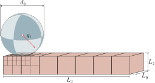
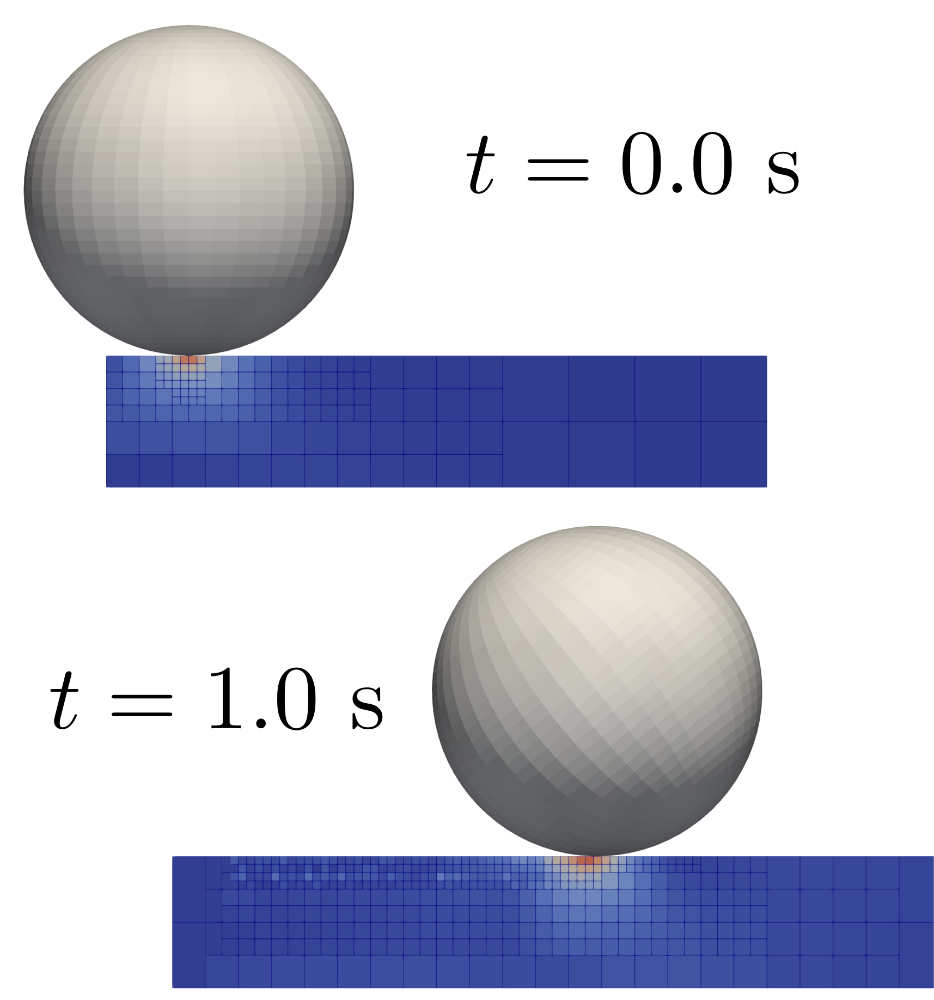
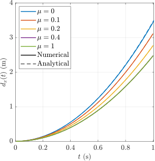

# Tutorial 5: Rolling sphere

## Introduction
This is the first dynamic tutorial in AMPSSIE. A rigid sphere rolls down an inclined slope under gravity, with the sphere's distance travelled compared against the analytical slip/stick solution for a sequence of friction coefficients.

The problem validates frictional contact, the dynamic time-integration scheme, and the hanging-node formulation simultaneously. As the sphere moves over the slope, the GIMPs around the contact patch are refined by the octree adaptivity; refined GIMPs are then carried with the contact region as the sphere travels.

This tutorial has four sections:

- [Problem description](#problem-description)
- [Input setup](#input-setup)
- [Deploying and running the problem](#deploying-and-running-the-problem)
- [Viewing the results](#viewing-the-results)

## Problem description

You will define the geometry, mesh, boundary conditions, material, rigid body and solver in the input file. All the inputs to the simulation are defined using the [`input_data.json` file format](../UsingTheSoftware/InputFormat.md).

To keep the contact vertices aligned with the slope boundary as the sphere travels, the slope is kept horizontal and gravity is tilted to $45^\circ$ instead. The sphere then rolls along $+x$ under the in-plane gravity component.

{ #fig-sphere-setup width="80%" }

**Mesh:** Slope dimensions $L_x = 50$ m and $L_y = L_z = 1$ m. Adaptive octree refinement is driven by the rigid body position. The maximum element size away from the sphere is $0.5$ m; at the contact point the smallest element size is $dx_{\min} = 0.1$ m.

**Initial GIMP distribution:** $2\times2\times2$ material points within each element, filling the slope volume.

**Boundary conditions:** Roller boundaries on all faces except the top, which is left as a free surface (homogeneous Neumann). Every node has its $x$ and $y$ degrees of freedom fixed - the slope must stay still while the sphere rolls.

**Material:** The slope is modelled as a very stiff Hencky elastic block (Young's modulus $E = 10^9$ Pa, Poisson's ratio $\nu = 0$) rather than a true rigid body. The stiffness is high enough that the slope deforms negligibly, but treating it as a deformable continuum is what exercises the hanging-node + contact formulation - the point of the test.

**Rigid body:** The sphere has diameter $d_p = 2.0$ m, mass $m = 10^4$ kg and rotational inertia $I = 4000$ kg$\cdot$m$^2$. Its surface is discretised as 3120 triangles arranged on a latitude-longitude grid with the poles aligned to the rolling plane (so the finest triangles contact the GIMPs). The friction coefficient $\mu$ is the parameter you sweep - the paper considers $\mu \in \{0,\, 0.1,\, 0.2,\, 0.4,\, 1.0\}$, covering both slipping ($\tan\theta > 3.5\mu$) and sticking regimes. The penalty parameters are

$$
\epsilon_N = 50\, E_p A_p, \qquad \epsilon_T = 25\, E_p A_p,
$$

as in [Tutorial 2](Tutorial_2.md).

**Loading:** A single dynamic stage. Gravity is applied as a tilted vector

$$
g_i = 9.81 \times \left[ \tfrac{1}{\sqrt{2}},\, 0,\, -\tfrac{1}{\sqrt{2}} \right] \text{ m/s}^2,
$$

equivalent to a $45^\circ$ slope under a vertical gravity field.

**Solver:** Newton-Raphson, implicit dynamic. The sphere's velocity, angular velocity and rotation evolve through time under the resultant of gravity and contact.

The analytical solution to compare against is the distance the sphere has travelled along $+x$ as a function of time:

$$
d_x(t) =
\begin{cases}
\dfrac{g t^2}{2} \left[ \sin\theta_s - \mu \cos\theta_s \right] & \text{slipping, } \tan\theta_s > 3.5\mu \\[6pt]
\dfrac{5\, g t^2 \sin\theta_s}{14} & \text{sticking, otherwise}
\end{cases}
$$

with $g = 9.81$ m/s$^2$ and $\theta_s = 45^\circ$.

## Input setup
The input file is a single JSON object - a human-readable, editable text file. The complete file for this problem can be found [here](Tutorial_5_input_data.md).

This problem has seven top-level sections, broken out below alongside the [Problem description](#problem-description).

Defaults (a face being free, a DOF being unconstrained, etc.) are not included in the file; only non-default settings are specified. See the [`input_data.json` file format](../UsingTheSoftware/InputFormat.md) for the full list of defaults.

### Mesh data

```json
"Mesh": {
    "domain size x": 50.0,
    "domain size y": 1.0,
    "domain size z": 1.0,
    "dx refined": 0.1,
    "dx coarse": 0.5,
    "Refinement type": "rigid body adaptive",
    "buffer multiplier": 2
}
```

`dx refined` is the smallest element size, applied to elements intersecting the sphere. `dx coarse` is the maximum element size far from the sphere. `Refinement type` is `rigid body adaptive` so the refined patch follows the sphere along the slope.

### Initial GIMP distribution

```json
"Initial GIMP distribution": {
    "Initial GIMP distribution x": 50.0,
    "Initial GIMP distribution y": 1.0,
    "Initial GIMP distribution z": 1.0
}
```

### Boundary conditions

Rollers on all lateral and bottom faces. All nodes have their $x$ and $y$ DOFs fixed so the slope does not translate.

```json
"Boundary conditions": {
    "neg x-plane": "roller",
    "neg y-plane": "roller",
    "neg z-plane": "roller",
    "pos x-plane": "roller",
    "pos y-plane": "roller",
    "x dof": "fixed",
    "y dof": "fixed"
}
```

### Material

A single very-stiff Hencky elastic layer representing the slope.

```json
"Material": {
    "number of layers": 1,
    "layers": [
        {
            "type": "Elastic",
            "emperical data": "homogeneous elastic",
            "assigned material properties": {"E": 1000000000.0, "nu": 0.0}
        }
    ]
}
```

### Rigid body

The sphere geometry is loaded from an external mesh file; the kinematic parameters (mass, inertia, initial position) and the friction coefficient $\mu$ are listed inline. Vary `friction coefficient` between runs to reproduce the slip/stick sweep.

```json
"Rigid body": {
    "geometry": "mesh file",
    "mesh path": "sphere.stl",
    "diameter": 2.0,
    "mass": 10000.0,
    "rotational inertia": 4000.0,
    "initial position": [1.0, 0.5, 1.5],
    "friction coefficient": 0.2,
    "normal penalty factor": 50,
    "tangential penalty factor": 25
}
```

### Loading

A single dynamic stage with tilted gravity. The tilt encodes the $45^\circ$ slope.

```json
"Loading": {
    "stages": [
        {
            "name": "rolling under tilted gravity",
            "type": "gravity",
            "g": [6.9367, 0.0, -6.9367],
            "time step": 0.01,
            "end time": 3.0
        }
    ]
}
```

The two non-zero components are $9.81 / \sqrt{2} \approx 6.9367$ m/s$^2$ each.

### Solver

Newton-Raphson, implicit dynamic.

```json
"Solver": {
    "solve type": "dynamic",
    "method": "Newton-Raphson",
    "time integration": "implicit"
}
```

### Output data

```json
"Output Data": {
    "vtu data": "yes",
    "vtk data": "yes",
    "text data": "rolling sphere"
}
```


## Deploying and running the problem
## Viewing the results

Below, the deformed slope and GIMP positions show how the refinement follows the sphere down the slope (left), and the simulated $d_x(t)$ traces are overlaid on the analytical solution for each friction coefficient, exercising both slipping and sticking regimes (right).

<div class="grid" markdown>

{ #fig-sphere-3d width="100%" }

{ #fig-sphere-results width="100%" }

</div>

The agreement is excellent across the full friction range and across the slip/stick boundary at $\tan(45^\circ)/3.5 \approx 0.286$, validating the dynamic frictional contact formulation in the presence of hanging nodes.
