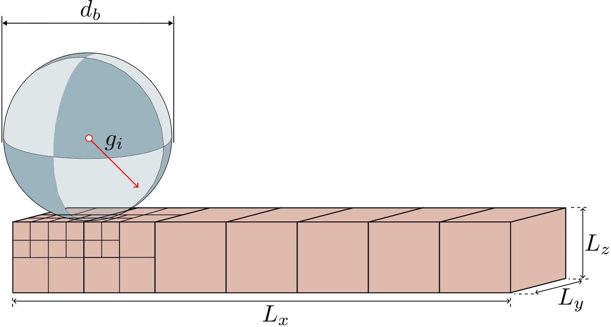
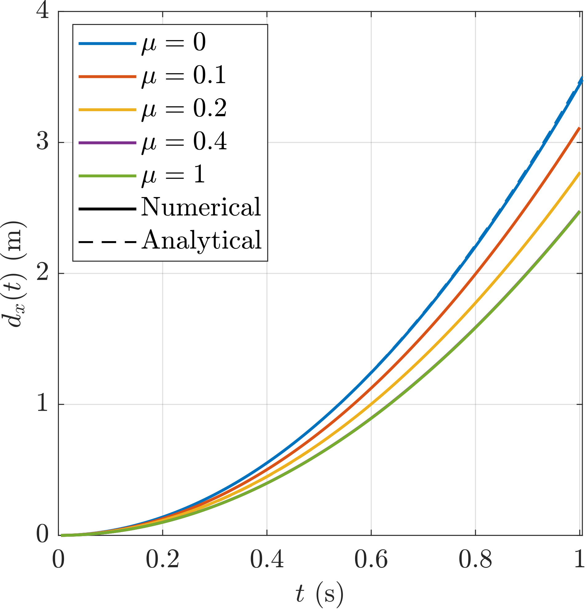

---
hide:
  - toc
---

# Tutorial 5: Rolling sphere

## Introduction
This is the first dynamic tutorial in AMPSSIE. A rigid sphere rolls down a slope under gravity, and the distance it travels is compared against the analytical slip/stick solution for a range of friction coefficients.

The problem validates frictional contact and dynamic time integration together. As the sphere moves, the elements beneath it are refined to a fine mesh that travels with it, and a boundary track keeps only the part of the slope around the sphere active.

This tutorial has four sections:

- [Problem description](#problem-description)
- [Input setup](#input-setup)
- [Deploying and running the problem](#deploying-and-running-the-problem)
- [Viewing the results](#viewing-the-results)

## Problem description

You will define the slope, the sphere, the dynamic stage, the solver and the output in the input file. All the inputs to the simulation are defined using the [`input_data.json` file format](../UsingTheSoftware/InputFormat.md).

To keep the slope aligned with the background grid, the slope is kept horizontal and gravity is tilted by $45^\circ$ instead (see [](#fig-sphere-setup)). The sphere then rolls along $+x$ under the in-plane component of gravity.

{ #fig-sphere-setup width="70%" }

*Figure reproduced from [@bird2026implicitoctreebasedadaptivematerial].*

**Slope:** A slab $12.8$ m long, $1.6$ m wide and $0.8$ m thick, made of $0.8$ m base elements with $2 \times 2 \times 2$ material points in each. The elements the sphere touches are refined to $0.025$ m.

**Boundary conditions:** The two ends of the slab ($x = 0$ and $x = 12.8$ m) and its base are fixed, and its two sides are rollers. The top surface is free.

**Material:** A very stiff Hencky elastic slab: Young's modulus $E = 10^9$ Pa, Poisson's ratio $\nu = 0$ and density $\rho = 1000$ kg/m$^3$. It deforms negligibly, but modelling it with material points is what exercises the contact between a rigid body and a refined mesh - the point of the test.

**Sphere:** `sphere.stl`, a sphere of radius $r = 1$ m made of 3120 triangles on a latitude-longitude grid, drawn centred on the origin. Its point is at the centre, with mass $m = 5000$ kg and rotational inertia $I = \tfrac{2}{5} m r^2 = 2000$ kg$\cdot$m$^2$, a solid sphere. The sphere can move in $x$ and $z$ and rotate about $y$; its other three degrees of freedom are fixed.

**Friction:** The friction coefficient $\mu$ is the parameter you sweep. Try $\mu \in \{0,\, 0.1,\, 0.2,\, 0.4,\, 1.0\}$ to cover both the slipping ($\tan\theta_s > 3.5\mu$) and sticking regimes.

**Loading:** A single dynamic stage lasting $1$ s, with a time step of $0.005$ s. Gravity is applied as a tilted vector

$$
g_i = 9.81 \times \left[ \tfrac{1}{\sqrt{2}},\, 0,\, -\tfrac{1}{\sqrt{2}} \right] \text{ m/s}^2,
$$

equivalent to a $45^\circ$ slope under vertical gravity.

**Solver:** Newton-Raphson, implicit dynamic. The sphere's velocity, angular velocity and rotation evolve through time under gravity and contact.

The analytical solution to compare against is the distance the sphere has travelled along $+x$ as a function of time:

$$
d_x(t) =
\begin{cases}
\dfrac{g t^2}{2} \left[ \sin\theta_s - \mu \cos\theta_s \right] & \text{slipping, } \tan\theta_s > 3.5\mu \\[6pt]
\dfrac{5\, g t^2 \sin\theta_s}{14} & \text{sticking, otherwise}
\end{cases}
$$

with $g = 9.81$ m/s$^2$ and $\theta_s = 45^\circ$.

## Input setup
The input file is a single JSON object - a human-readable, editable text file. The complete file for this problem can be found [here](Tutorial_5_input_data.md), and every key is described on the [`input_data.json` file format](../UsingTheSoftware/InputFormat.md) page.

<div class="json-side-header">
<div>Description</div>
<div><code>input_data.json</code></div>
</div>

<div class="json-side" markdown>

<div class="js-text" markdown>

### Machine and domain

`"GPU": "off"` runs the analysis on the CPU. The domain `"size"` of $12.8$ m matches the length of the slab, so the background grid is a $12.8$ m cube.

`"gravity"` is the tilted vector from the [Problem description](#problem-description): its two non-zero components are $9.81/\sqrt{2} \approx 6.93672$ m/s$^2$.

</div>

<div class="js-code" markdown>

```json
"GPU": "off",

"domain": {
    "size": 12.8,
    "gravity": [6.93672, 0.0, -6.93672]
}
```

</div>

</div>

<div class="json-side" markdown>

<div class="js-text" markdown>

### Material points

A single $0.8$ m layer over a $12.8 \times 1.6$ m footprint, with the stiff elastic properties from the [Problem description](#problem-description). The refinement size used later, $0.025$ m, is $0.8/2^5$, so the base element size needs no rounding.

</div>

<div class="js-code" markdown>

```json
"material points": {
    "extra capacity": 1.2,
    "element size": 0.8,
    "number of material points per element 1": 2,
    "material size": { "min": [0.0, 0.0], "max": [12.8, 1.6] },
    "layers": [
        {
            "thickness": 0.8,
            "material": { "type": "elastic", "E": 1.0e9, "nu": 0.0, "density": 1000.0 }
        }
    ]
}
```

</div>

</div>

<div class="json-side" markdown>

<div class="js-text" markdown>

### Rigid body

The sphere is one system with one point at its centre. The point's six boundary conditions, in the order $[u_x, u_y, u_z, \theta_x, \theta_y, \theta_z]$, leave it free to move in $x$ and $z$ and to rotate about $y$.

`sphere.stl` is drawn centred on the origin, the same place as the point. `"offset"` then places the whole sphere with its centre above $x = 1.5$ m, halfway across the slab's width and $1.8$ m up - resting on the slab surface at $0.8$ m.

</div>

<div class="js-code" markdown>

```json
"rigid bodies": [
    {
        "offset": [1.5, 0.8, 1.8],
        "points": [
            { "position": [0.0, 0.0, 0.0], "mass": 5000.0, "rotational inertia": [2000.0, 2000.0, 2000.0],
              "boundary conditions": ["free", "fixed", "free", "fixed", "free", "fixed"] }
        ],
        "stl files": [
            { "name": "sphere", "stl": "sphere.stl", "mesh cache": "sphere_mesh.txt", "point": 1 }
        ]
    }
]
```

</div>

</div>

<div class="json-side" markdown>

<div class="js-text" markdown>

### Contact

The friction coefficient between the sphere and the slab. Change it between runs to reproduce the friction sweep, and change the output directory names to match so the runs do not overwrite each other.

</div>

<div class="js-code" markdown>

```json
"contact": {
    "friction coefficient": 0.0
}
```

</div>

</div>

<div class="json-side" markdown>

<div class="js-text" markdown>

### Analysis

A single dynamic stage: $1$ s of motion in steps of $0.005$ s. The Newmark parameters $\beta = 0.5$ and $\gamma = 1.0$ add numerical damping, which keeps the stiff contact stable. `"rigid body surface placement": "on"` makes sure the sphere starts exactly on the slab surface.

`"rigid body surface"` adaptivity refines the elements the sphere's surface passes through to $0.025$ m at every step. The slab's ends and base are fixed and its sides are rollers.

`"boundary track"` makes the $x$ boundaries follow the sphere: a fixed plane at the back of the sphere deletes the slab it leaves behind (`"remove": "yes"`), and a fixed plane $1$ m ahead of it keeps the slab further ahead inactive until the sphere approaches. Tracking is `"off"` in $y$ and $z$.

</div>

<div class="js-code" markdown>

```json
"analysis": [
    {
        "type": "dynamic",
        "dt": 0.005,
        "final time": 1.0,
        "beta": 0.5,
        "gamma": 1.0,
        "rigid bodies": "on",
        "rigid body surface placement": "on",
        "adaptivity": {
            "type": "rigid body surface",
            "element size": 0.025
        },
        "boundary conditions": { "min": ["fixed", "roller", "fixed"], "max": ["fixed", "roller", "free"] },
        "boundary track": {
            "min": { "type": ["fixed", "off", "off"], "distance": [0.0, 0.0, 0.0],
                     "advance": ["positive", "positive", "positive"], "remove": ["yes", "no", "no"] },
            "max": { "type": ["fixed", "off", "off"], "distance": [1.0, 0.0, 0.0],
                     "advance": ["positive", "positive", "positive"], "remove": ["no", "no", "no"] }
        }
    }
]
```

</div>

</div>

<div class="json-side" markdown>

<div class="js-text" markdown>

### Solver

Newton-Raphson iterations to a tolerance of $10^{-6}$ in each time step, with at most 20 iterations before the step is retried with half the time step. The [ghost stabilisation](../TechnicalReferences/ghostStabilisation.md) uses `"ghost factor": 10.0` for the stiffness and `"ghost factor mass": 0.25` for the mass.

</div>

<div class="js-code" markdown>

```json
"solver": {
    "tolerance": 1.0e-6,
    "max newton iterations": 20,
    "poor factor": 0.25,
    "ghost factor": 10.0,
    "ghost factor mass": 0.25
}
```

</div>

</div>

<div class="json-side" markdown>

<div class="js-text" markdown>

### Output

`"vtk percent": 0` writes a VTK frame at every time step, with every field, to `vtk_sphere_mu0.0`. The CSV output writes no material-point files (an empty list) but records the sphere's position, velocity, acceleration and angular velocity in `csv_sphere_mu0.0/rigid_body.csv`.

</div>

<div class="js-code" markdown>

```json
"output": {
    "vtk": "on",
    "vtk directory": "vtk_sphere_mu0.0",
    "vtk percent": 0,

    "csv": "on",
    "csv directory": "csv_sphere_mu0.0",
    "csv percent": 0,
    "csv material point fields": [],
    "csv rigid body fields": ["position", "velocity", "acceleration", "angular velocity"]
}
```

</div>

</div>

## Deploying and running the problem

AMPSSIE is written in the [Julia](https://julialang.org/) programming language. See the [installation guide](../GettingStarted/Installation.md) for installing Julia and AMPSSIE, and [Tutorial 1](Tutorial_1.md#deploying-and-running-the-problem) for a first, small run.

<div class="json-side-header">
<div>Deployment instructions</div>
<div><code>terminal</code></div>
</div>

<div class="json-side" markdown>

<div class="js-text" markdown>

### Setting up the run folder

Create a folder for the run containing:

- `input_data.json`, copied from the [complete input file](Tutorial_5_input_data.md);
- `sphere.stl` and `sphere_mesh.txt`, from the top level of the AMPSSIE repository.

The STL and mesh-cache paths in the input file are relative to the input file, and the output folders are created in the folder Julia is started from.

### Running the problem

Start Julia in the run folder with the AMPSSIE project active (`--project`) and every CPU thread available (`-t auto`), then load AMPSSIE and run the input file. The analysis runs on a workstation CPU but takes a while; set `"GPU": "on"` if a GPU is available.

The progress line shows the simulated time out of the $1$ s final time. Its fields are explained in [Tutorial 1](Tutorial_1.md#reading-the-output).

</div>

<div class="js-code" markdown>

<div class="terminal terminal-full" markdown>

```console
$ cd path/to/run_folder
$ julia --project=path/to/AMPSSIE -t auto

julia> using S3MPM

julia> S3MPM.non_linear_solve("input_data.json");
```

</div>

</div>

</div>

## Viewing the results

### Visualising the output in ParaView

The walkthrough below uses the same ParaView controls as [Tutorial 1](Tutorial_1.md#visualising-the-output-in-paraview). Only active material points are written, so the slab appears as a short section that travels with the sphere: the boundary track has deleted the slab behind it, and the slab ahead has not yet been reached.

<div class="walkthrough" markdown>
<div markdown>
**1. Open the slab and the sphere.** *File → Open*, go to `vtk_sphere_mu0.0`, hold `Ctrl` and select the `mps_1_..vtu` (slab) and `surface_..vtu` (sphere) series, click *OK* and then *Apply*.
</div>
<div markdown>
!!! example "Placeholder: ParaView screenshot"
    `img/tutorial_5/paraview_1.png` - the active slab section and the sphere at the first output step.
</div>
</div>

<div class="walkthrough" markdown>
<div markdown>
**2. Show the refinement.** Select `mps_1_..vtu` and change its *Representation* to *Surface With Edges*. Each box is one material point, so the refinement shows as a patch of much smaller boxes under the sphere.
</div>
<div markdown>
!!! example "Placeholder: ParaView screenshot"
    `img/tutorial_5/paraview_2.png` - close-up of the refined material points beneath the sphere.
</div>
</div>

<div class="walkthrough" markdown>
<div markdown>
**3. Colour the sphere by velocity.** Select `surface_..vtu` and set *Coloring* to `velocity` → `Magnitude`.
</div>
<div markdown>
!!! example "Placeholder: ParaView screenshot"
    `img/tutorial_5/paraview_3.png` - the sphere coloured by velocity magnitude.
</div>
</div>

<div class="walkthrough" markdown>
<div markdown>
**4. Play the animation.** Click *Play* (`▶`) in the time toolbar to watch the sphere roll down the slope, with the refined patch and the active slab section moving with it. Click *Rescale to Data Range* on the last step so the colour scale covers the final velocity.
</div>
<div markdown>
!!! example "Placeholder: ParaView screenshot"
    `img/tutorial_5/paraview_4.png` - the sphere and the active slab section at the final step.
</div>
</div>

### Distance travelled

`csv_sphere_mu0.0/rigid_body.csv` has one row per time step. The distance travelled is $d_x = $ `body1_position_x` $- 1.5$ m, to be plotted against the `time` column and compared with $d_x(t)$ from the [Problem description](#problem-description). When the sphere sticks, it rolls without slipping, so `body1_angular velocity_y` equals `body1_velocity_x` (the radius is $1$ m); when it slips, the angular velocity lags behind.

!!! example "Placeholder: results plot"
    `img/tutorial_5/distance_travelled.png` - $d_x$ against time for each friction coefficient, with the analytical solution.

### Published results

The figures below are reproduced from [@bird2026implicitoctreebasedadaptivematerial]. The deformed slope and GIMP positions show how the refinement follows the sphere down the slope (left, [](#fig-sphere-3d)), and the simulated $d_x(t)$ traces are overlaid on the analytical solution for each friction coefficient, in both the slipping and sticking regimes (right, [](#fig-sphere-results)).

<div class="grid" markdown>

{ #fig-sphere-3d width="100%" }

{ #fig-sphere-results width="100%" }

</div>

*Figures reproduced from [@bird2026implicitoctreebasedadaptivematerial].*

The agreement is excellent across the full friction range and across the slip/stick boundary at $\tan(45^\circ)/3.5 \approx 0.286$, validating the dynamic frictional contact formulation in the presence of hanging nodes.
