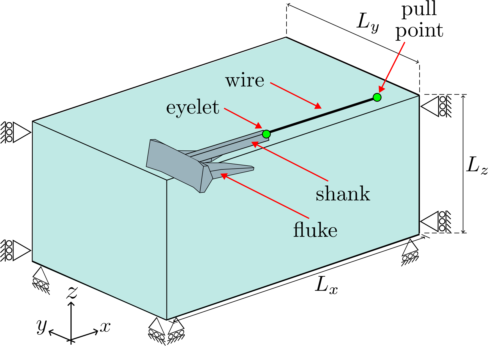
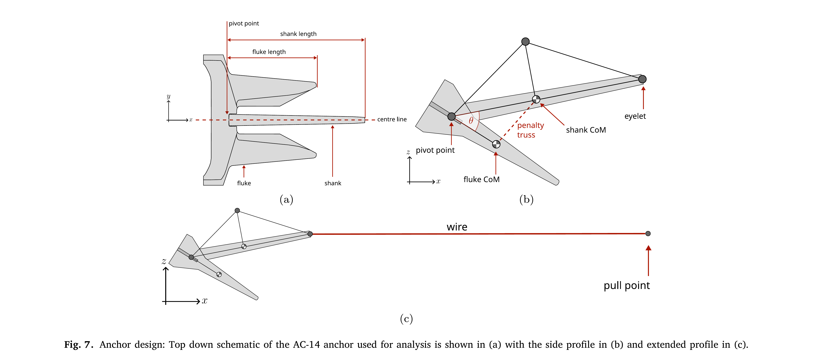
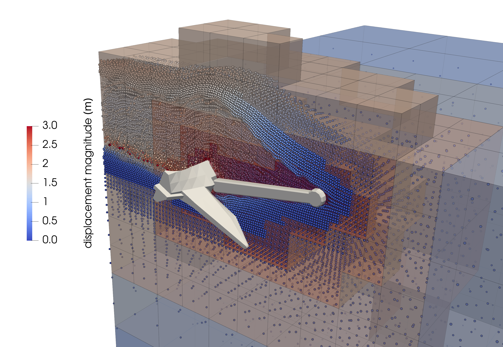
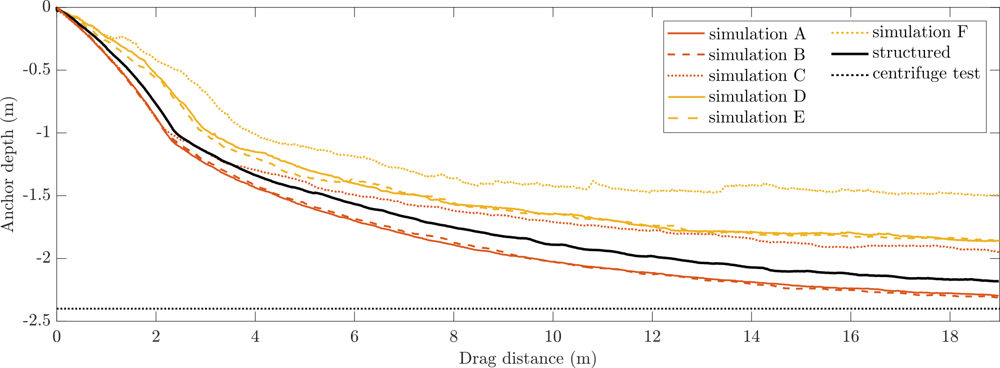

---
hide:
  - toc
---

# Tutorial 6: Drag anchor

## Introduction
This is the most ambitious tutorial - a 3D dynamic simulation of an offshore drag anchor being pulled through a sand bed.

The anchor is dragged $19$ m through dry sand and its trajectory (penetration depth versus horizontal travel) is compared against the centrifuge measurements of Sharif et al. [@sharif] and the structured-mesh reference solution of Bird et al. [@birdanchors2026]. The problem combines almost everything in AMPSSIE: hyperelastic-perfectly plastic soil from [Tutorial 3](Tutorial_3.md), a multi-body articulated rigid body with internal kinematics, dynamic time integration, and adaptive octree refinement that follows the anchor across a long domain.

This tutorial has four sections:

- [Problem description](#problem-description)
- [Input setup](#input-setup)
- [Deploying and running the problem](#deploying-and-running-the-problem)
- [Viewing the results](#viewing-the-results)

## Problem description

You will define the geometry, mesh, boundary conditions, material, rigid body (anchor + truss frame) and solver in the input file. All the inputs to the simulation are defined using the [`input_data.json` file format](../UsingTheSoftware/InputFormat.md).

Only half of the anchor is modelled, exploiting the $xz$-symmetry plane. The full $19$ m horizontal drag is achieved with a partitioned domain that travels with the anchor rather than meshing all $19$ m at once. The domain dimensions are shown in [](#fig-anchor-setup), and the truss-frame abstraction of the anchor is shown in [](#fig-anchor-design).

{ #fig-anchor-setup width="50%" }

*Figure reproduced from [@bird2026implicitoctreebasedadaptivematerial].*

**Mesh:** Domain side lengths $L_y = L_z = 10$ m with $L_x = 100$ m. Adaptive octree refinement is driven by the anchor position. The smallest element size near the anchor is $dx_{\min}$, with a buffer region of size $dx_{\min}^{region}$. Try sweeping $dx_{\min} \in \{0.1,\, 0.2\}$ m and $dx_{\min}^{region} \in \{dx_{\min},\, 2dx_{\min},\, 3dx_{\min}\}$ to see how the trajectory converges; $dx_{\min} = 0.1$ m with $dx_{\min}^{region} = 0.2$ m is a good first choice that balances accuracy and run time. To avoid meshing the entire $100$ m domain, a **partitioned domain** is used: only $1.5\, L_a$ of soil ahead of the anchor and $0.5\, L_a$ behind are kept active, where $L_a$ is the total anchor length.

**Initial GIMP distribution:** $2\times2\times2$ material points within each element of the active partition.

**Boundary conditions:** Rollers on the symmetry plane, the four side faces and the base. The top face is left as a free surface (homogeneous Neumann).

**Material:** Identical to [Tutorial 3](Tutorial_3.md) - Hencky hyperelastic-perfectly plastic, calibrated to $R_D = 32\%$ Congleton sand via the Brinkgreve correlations [@brinkgreve2010validation]. The $E_{50}$ field varies with initial depth as in Tutorial 3 and does not evolve during the simulation. See Tutorial 3 for the parameter values.

**Rigid body:** The anchor used in this tutorial is the AC-14 design - see [](#fig-anchor-design) - comprising two parts hinged together: a **shank** and a **fluke**. They are modelled with a truss frame (each truss member: stiffness $10^9$ N/m, nominal nodal mass $10$ kg), with the hinge represented by a penalty truss between the shank and fluke centres of mass.

{ #fig-anchor-design width="100%" }

*Figure reproduced from [@birdanchors2026].*

The total mass and rotational inertia of each component are given below. Because of the half-symmetry, both are **halved** in the analysis:

<div class="centered-table" markdown>

| Part  | Mass (kg) | Rotational inertia (kg$\cdot$m$^2$) | CoM offset from pivot (m) | Length (m) |
|-------|:---------:|:-----------------------------------:|:-------------------------:|:----------:|
| Fluke | 6583.2    | 1100                                | 0.131                     | 1.7        |
| Shank | 2116.7    | 1350                                | 1.272                     | 3.3        |

</div>

Frictional contact with the soil uses the same penalty parameters as the rest of the tutorial set: $\mu = 0.3$, $\epsilon_N = 50\, E_p A_p$, $\epsilon_T = 25\, E_p A_p$.

**Loading:** A three-stage dynamic + pseudo-static solution:

- **Stage 1 - gravity:** Apply gravitational body force in a single pseudo-static load step, populating the initial stress field and $E_{50}$.
- **Stage 2 - settle:** Place the anchor on the sand surface with the pull point at a height of $10$ m. Run dynamically until the vertical oscillations decay below $10^{-3}$ m/s.
- **Stage 3 - drag:** Move the pull point with velocity $(v_x, v_y, v_z) = (0.1,\, 0,\, 0)$ m/s, modelled dynamically with $\Delta t = 0.01$ s until the anchor has been dragged $19$ m.

**Solver:** Newton-Raphson, implicit dynamic for stages 2 and 3, pseudo-static for stage 1.

## Input setup
The input file is a single JSON object - a human-readable, editable text file. The complete file for this problem can be found [here](Tutorial_6_input_data.md).

This problem has eight top-level sections, broken out below alongside the [Problem description](#problem-description).

Defaults (a face being free, a DOF being unconstrained, etc.) are not included in the file; only non-default settings are specified. See the [`input_data.json` file format](../UsingTheSoftware/InputFormat.md) for the full list of defaults.

<div class="json-side-header">
<div>Description</div>
<div><code>input_data.json</code></div>
</div>

<div class="json-side" markdown>

<div class="js-text" markdown>

### Mesh data

The long, narrow domain with octree refinement following the anchor. The partitioned-domain extents are set relative to the anchor length $L_a$.

`partitioned domain` activates the moving-window method so only a small portion of the $100$ m domain is meshed and solved at each time step.

</div>

<div class="js-code" markdown>

```json
"Mesh": {
    "domain size x": 100.0,
    "domain size y": 10.0,
    "domain size z": 10.0,
    "dx refined": 0.1,
    "Refinement type": "rigid body adaptive",
    "buffer multiplier": 2,
    "partitioned domain": {
        "ahead multiplier": 1.5,
        "behind multiplier": 0.5
    }
}
```

</div>

</div>

<div class="json-side" markdown>

<div class="js-text" markdown>

### Initial GIMP distribution

</div>

<div class="js-code" markdown>

```json
"Initial GIMP distribution": {
    "Initial GIMP distribution x": 100.0,
    "Initial GIMP distribution y": 10.0,
    "Initial GIMP distribution z": 10.0
}
```

</div>

</div>

<div class="json-side" markdown>

<div class="js-text" markdown>

### Boundary conditions

</div>

<div class="js-code" markdown>

```json
"Boundary conditions": {
    "neg x-plane": "roller",
    "neg y-plane": "roller",
    "neg z-plane": "roller",
    "pos x-plane": "roller",
    "pos y-plane": "roller"
}
```

</div>

</div>

<div class="json-side" markdown>

<div class="js-text" markdown>

### Material

Same Brinkgreve-calibrated sand as Tutorial 3.

</div>

<div class="js-code" markdown>

```json
"Material": {
    "number of layers": 1,
    "layers": [
        {
            "type": "DruckerPrager",
            "emperical data": "Brinkgreve sand",
            "assigned material properties": {
                "E_50_ref": 19200000.0,
                "rho": 1630.0,
                "nu": 0.25,
                "phi": 32.0,
                "psi": 2.0,
                "c": 300.0,
                "K_0": 0.47,
                "m_E": 0.60
            }
        }
    ]
}
```

</div>

</div>

<div class="json-side" markdown>

<div class="js-text" markdown>

### Rigid body

The anchor is two hinged parts whose kinematics are tracked by a truss frame. Masses and inertias are halved here for the $xz$-symmetric setup.

</div>

<div class="js-code" markdown>

```json
"Rigid body": {
    "geometry": "articulated",
    "parts": [
        {
            "name": "fluke",
            "mesh path": "fluke.stl",
            "mass": 3291.6,
            "rotational inertia": 550.0,
            "centre of mass offset": 0.131,
            "length": 1.7
        },
        {
            "name": "shank",
            "mesh path": "shank.stl",
            "mass": 1058.35,
            "rotational inertia": 675.0,
            "centre of mass offset": 1.272,
            "length": 3.3
        }
    ],
    "truss frame": {
        "member stiffness": 1.0e9,
        "node mass": 10.0
    },
    "friction coefficient": 0.3,
    "normal penalty factor": 50,
    "tangential penalty factor": 25
}
```

</div>

</div>

<div class="json-side" markdown>

<div class="js-text" markdown>

### Loading

The three-stage solution. Stage 1 is a single pseudo-static gravity step; stages 2 and 3 are dynamic.

</div>

<div class="js-code" markdown>

```json
"Loading": {
    "stages": [
        {
            "name": "stage 1 - gravity",
            "type": "gravity",
            "g": [0.0, 0.0, -9.81],
            "number of increments": 1,
            "mode": "pseudo-static"
        },
        {
            "name": "stage 2 - settle",
            "type": "settle",
            "pull point height": 10.0,
            "mode": "dynamic",
            "time step": 0.01,
            "termination criterion": "vertical velocity below 1e-3 m/s"
        },
        {
            "name": "stage 3 - drag",
            "type": "pull point velocity",
            "velocity": [0.1, 0.0, 0.0],
            "mode": "dynamic",
            "time step": 0.01,
            "termination criterion": "horizontal travel 19 m"
        }
    ]
}
```

</div>

</div>

<div class="json-side" markdown>

<div class="js-text" markdown>

### Solver

Newton-Raphson; the time-integration scheme switches per stage based on `mode`.

</div>

<div class="js-code" markdown>

```json
"Solver": {
    "method": "Newton-Raphson"
}
```

</div>

</div>

<div class="json-side" markdown>

<div class="js-text" markdown>

### Output data

</div>

<div class="js-code" markdown>

```json
"Output Data": {
    "vtu data": "yes",
    "vtk data": "yes",
    "text data": "drag anchor"
}
```

</div>

</div>

## Deploying and running the problem
## Viewing the results

The octree background mesh and GIMP distribution around the anchor at $19$ m of drag, with elements coloured by refinement age (oldest blue, youngest red), is shown in [](#fig-anchor-example):

{ #fig-anchor-example width="70%" }

*Figure reproduced from [@bird2026implicitoctreebasedadaptivematerial].*

After post-processing your runs, plot the anchor trajectory (penetration depth versus horizontal travel) and compare it to the structured-mesh reference [@birdanchors2026] and the experimental data [@sharif] - see [](#fig-anchor-results):

{ #fig-anchor-results width="70%" }

*Figure reproduced from [@bird2026implicitoctreebasedadaptivematerial].*

Simulations A and B (both at $dx_{\min} = 0.1$ m) match or exceed the structured-mesh accuracy. Simulation B is $5.5$ times faster than the structured-mesh reference and emits approximately $21$ times less CO$_2$e. The trajectory becomes insensitive to the buffer-region size once $dx_{\min}^{region} \geq 2\, dx_{\min}$, demonstrating that the octree refinement is well-converged in the near field.
