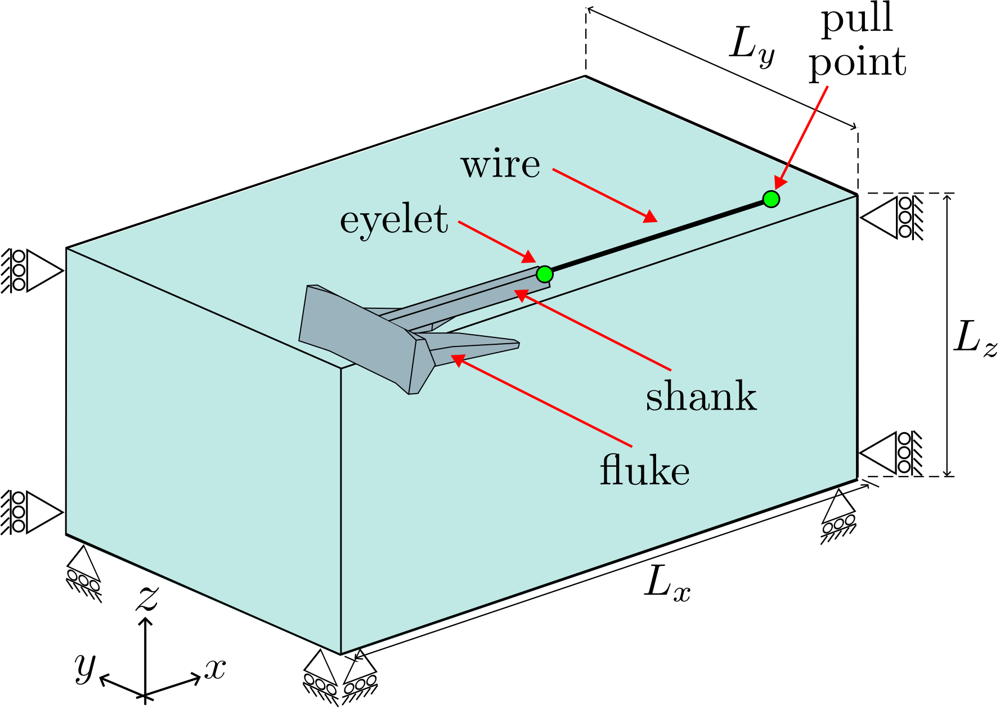
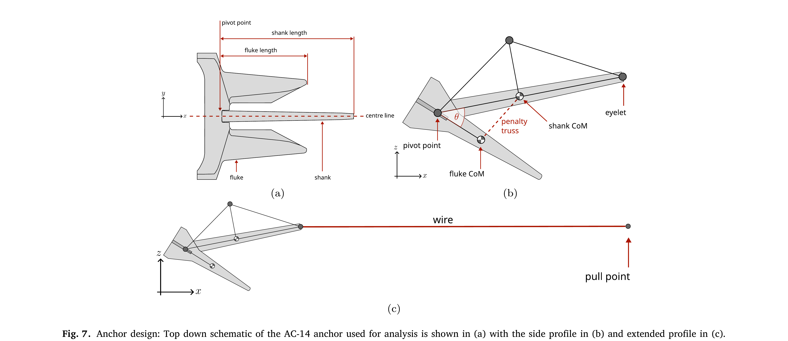
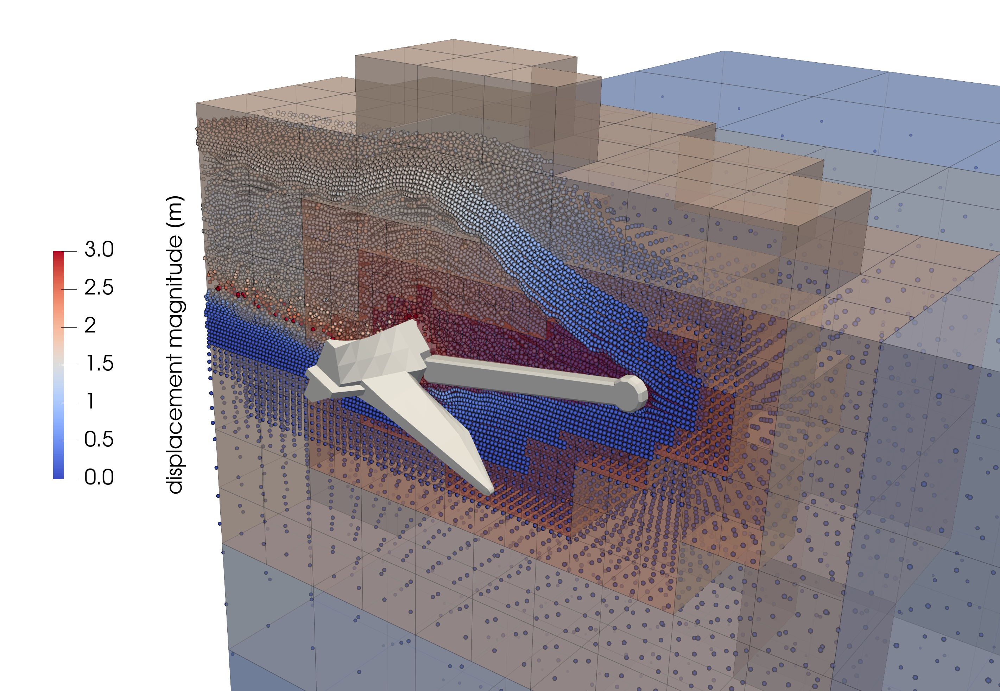
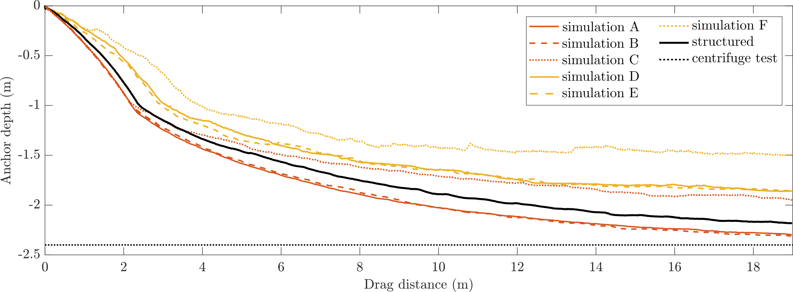

---
hide:
  - toc
---

# Tutorial 6: Drag anchor

## Introduction
This is the most ambitious tutorial - a 3D dynamic simulation of an AC-14 drag anchor being pulled through a bed of very loose, submerged sand.

The problem combines almost everything in S3-MPM: the Willam-Warnke sand with depth-dependent stiffness from [Tutorial 3](Tutorial_3.md), the dynamic time integration and moving boundaries from [Tutorial 5](Tutorial_5.md), and an articulated anchor built from three points joined by a hinge, an angle stop and a pull line.

This tutorial has four sections:

- [Problem description](#problem-description)
- [Input setup](#input-setup)
- [Deploying and running the problem](#deploying-and-running-the-problem)
- [Viewing the results](#viewing-the-results)

## Problem description

You will define the soil, the anchor, the three loading stages, the solver and the output in the input file. All the inputs to the simulation are defined using the [`input_data.json` file format](../UsingTheSoftware/InputFormat.md).

Only half of the anchor and soil is modelled, using the vertical $xz$ plane of symmetry through the anchor at $y = 0$. Instead of solving the whole length of soil the anchor will pass through, a boundary track keeps only a window of soil around the anchor active.

{ #fig-anchor-setup width="50%" }

*Figure reproduced from [@bird2026implicitoctreebasedadaptivematerial].*

**Soil block:** One layer $100$ m long, $10$ m wide and $18.123$ m deep, with $2 \times 2 \times 2$ material points in each element. The base element size is given as $4.0$ m, which is rounded to $0.1 \times 2^5 = 3.2$ m because the mesh around the anchor is refined to $0.1$ m. The footprint is then rounded up to whole elements ($102.4 \times 12.8$ m) and the soil surface up to a whole row of material points, at $19.2$ m (see [how element sizes set the mesh](../UsingTheSoftware/InputFormat.md#how-element-sizes-set-the-mesh)).

**Boundary conditions:** The side at $y = 0$ is the symmetry plane and carries rollers, as does the opposite side. The base is fixed. While the soil settles, the two ends are rollers; once the anchor is in place they become fixed planes that move with the anchor.

**Material:** Willam-Warnke elasto-plastic sand at a relative density of $D_r = 4\%$, below the water table, with the parameters from the Brinkgreve correlations [@brinkgreve2010validation]:

<div class="centered-table" markdown>

| Property                     | Correlation                                         | Value at $D_r = 4\%$      | Input key                     |
|------------------------------|-----------------------------------------------------|---------------------------|-------------------------------|
| Reference Young's modulus    | $E^{ref} = 60\,000\; D_r/100$ kPa                   | $2.4$ MPa                 | `"E": 2.4e6`                  |
| Friction angle               | $\phi = 28 + 12.5\; D_r/100$                        | $28.5^\circ$              | `"friction angle": 28.5`      |
| Dilation angle               | $\psi = -2 + 12.5\; D_r/100$, not below 0           | $0^\circ$                 | `"dilation angle": 0.0`       |
| Buoyant unit weight          | $\gamma' = 19 + 1.6\; D_r/100 - \gamma_w$ kN/m$^3$  | $9.254$ kN/m$^3$          | `"density": 925.4`            |
| Stiffness exponent           | $m = 0.7 - D_r/320$                                 | $0.6875$                  | `"exponent": 0.6875`          |
| Earth pressure at rest       | $K_0 = 1 - \sin\phi$                                | $0.5228$                  | `"reference stress"` (below)  |
| Poisson's ratio              | -                                                   | $0.25$                    | `"nu": 0.25`                  |
| Cohesion                     | -                                                   | $0.3$ kPa                 | `"cohesion": 300.0`           |

</div>

$\gamma_w = 9.81$ kN/m$^3$ is the unit weight of water. Because the sand is submerged, its buoyant density is used, so that gravity produces effective stresses; it is entered as the unit weight divided by $10$ m/s$^2$. As in [Tutorial 3](Tutorial_3.md#problem-description), the reference stress for the depth-dependent stiffness is $p^{ref}/K_0 = 100/0.5228 = 191.3$ kPa.

**Anchor:** The AC-14 anchor (see [](#fig-anchor-design)) has two parts, a **fluke** and a **shank**, joined by a hinge. Each part is a rigid body welded to a point at its centre of mass. A third point with no geometry is the end of the pull line; moving it drags the anchor. Because only half the anchor is modelled, the masses are halved (the full anchor is $8700$ kg).

{ #fig-anchor-design width="100%" }

*Figure reproduced from [@birdanchors2026].*

<div class="centered-table" markdown>

| Point | Represents             | Position as drawn (m) | Mass (kg) | Rotational inertia (kg$\cdot$m$^2$) | Geometry               |
|:-----:|------------------------|:---------------------:|:---------:|:-----------------------------------:|------------------------|
| 1     | Fluke centre of mass   | $(0.62, 0, 0)$        | $3291.6$  | $275$                               | `fluke_round_nose.stl` |
| 2     | Shank centre of mass   | $(1.7592, 0, 0)$      | $1058.4$  | $337.5$                             | `shank_scv2.stl`       |
| 3     | Pull point             | $(12.5294, 0, 0)$     | $1$       | $10^{-6}$                           | none                   |

</div>

Three constraints join the points:

<div class="centered-table" markdown>

| Constraint          | Type               | Points | Details                                                                                                           |
|---------------------|--------------------|:------:|-------------------------------------------------------------------------------------------------------------------|
| Hinge               | `"rotation lock"`  | 1, 2   | Pin at $(0.489, 0, 0)$ with its axis along $y$; pin stiffness $10^9$ N/m, axis stiffness $10^8$ N$\cdot$m.       |
| Opening-angle stop  | `"distance stop"`  | 1, 2   | Goes taut when the hinge has opened $35^\circ$; stiffness $8.58 \times 10^9$ N/m.                                 |
| Pull line           | `"distance lock"`  | 2, 3   | A $9.5$ m rod from the shank's eyelet at $(3.0294, 0, 0)$ to the pull point; stiffness $EA/L$ with $EA = 10^{10}$ N. |

</div>

Frictional contact between the anchor and the sand uses $\mu = 0.45$.

**Loading:** Three stages:

- **Stage 1 - initial stresses:** static; the anchor is switched off and gravity is ramped up over 5 load steps.
- **Stage 2 - settling:** dynamic, $1$ s in steps of $0.005$ s; the anchor is placed on the soil surface and settles under its own weight with the pull point held still.
- **Stage 3 - drag:** dynamic, in steps of $0.08$ s; the pull point moves in $+x$ at $0.1$ m/s. The tutorial file runs for $3$ s, a drag of $0.3$ m; for a longer drag increase `"final time"` - for example $190$ s drags the pull point $19$ m.

**Solver:** Newton-Raphson, pseudo-static for stage 1 and implicit dynamic for stages 2 and 3.

## Input setup
The input file is a single JSON object - a human-readable, editable text file. The complete file for this problem can be found [here](Tutorial_6_input_data.md), and every key is described on the [`input_data.json` file format](../UsingTheSoftware/InputFormat.md) page.

<div class="json-side-header">
<div>Description</div>
<div><code>input_data.json</code></div>
</div>

<div class="json-side" markdown>

<div class="js-text" markdown>

### Machine and domain

`"GPU": "on"` runs the analysis on an NVIDIA GPU; a problem of this size is intended for a GPU or an HPC node.

The domain `"size"` is only a lower bound. The background grid is enlarged automatically to hold the soil block, which here makes it a cube of side $102.4$ m.

</div>

<div class="js-code" markdown>

```json
"GPU": "on",

"domain": {
    "size": 2.0,
    "gravity": [0.0, 0.0, -9.81]
}
```

</div>

</div>

<div class="json-side" markdown>

<div class="js-text" markdown>

### Material points

One layer of Willam-Warnke sand with the properties from the [Problem description](#problem-description), over a $100 \times 10$ m footprint whose $y = 0$ side is the plane of symmetry.

</div>

<div class="js-code" markdown>

```json
"material points": {
    "extra capacity": 1.2,
    "element size": 4.0,
    "number of material points per element 1": 2,
    "material size": { "min": [0.0, 0.0], "max": [100, 10] },
    "layers": [
        {
            "thickness": 18.123,
            "material": { "type": "willam warnke",
                          "E": 2.4e6, "nu": 0.25,
                          "friction angle": 28.5, "dilation angle": 0.0, "cohesion": 300.0,
                          "density": 925.4,
                          "E overburden": { "reference stress": 1.913e5, "exponent": 0.6875 } }
        }
    ]
}
```

</div>

</div>

<div class="json-side" markdown>

<div class="js-text" markdown>

### Rigid body: points

The anchor is one system of three points. Points 1 and 2 are the centres of mass of the fluke and the shank. Their boundary conditions leave them free to move in the $xz$ plane and to rotate about $y$; the other three degrees of freedom are fixed by the symmetry.

Point 3, the end of the pull line, carries no geometry and only a nominal mass, so all six of its degrees of freedom are held; stage 3 replaces its $x$ condition to pull.

The anchor is drawn lying along the $x$ axis, and `"offset"` moves the whole system $1$ m in $+x$.

</div>

<div class="js-code" markdown>

```json
"rigid bodies": [
    {
        "offset": [1.0, 0.0, 0.0],
        "points": [
            { "position": [0.62, 0.0, 0.0], "mass": 3291.60, "rotational inertia": [275.0, 275.0, 275.0],
              "boundary conditions": ["free", "fixed", "free", "fixed", "free", "fixed"] },
            { "position": [1.7592, 0.0, 0.0], "mass": 1058.40, "rotational inertia": [337.5, 337.5, 337.5],
              "boundary conditions": ["free", "fixed", "free", "fixed", "free", "fixed"] },
            { "position": [12.5294, 0.0, 0.0], "mass": 1.0, "rotational inertia": [1.0e-6, 1.0e-6, 1.0e-6],
              "boundary conditions": ["fixed", "fixed", "fixed", "fixed", "fixed", "fixed"] }
        ],
```

</div>

</div>

<div class="json-side" markdown>

<div class="js-text" markdown>

### Rigid body: constraints

- The `"rotation lock"` is the hinge between the fluke and the shank, pinned at $(0.489, 0, 0)$ with both axes along $y$.
- The `"distance stop"` limits how far the hinge opens. Its two anchors start at the same place, $(0.62, 0, 0)$, one carried by the fluke and one by the shank. As the hinge opens they move apart, and when the opening about the rotation centre reaches $35^\circ$ the stop goes taut.
- The `"distance lock"` is the pull line: a $9.5$ m rod from the shank's eyelet at $(3.0294, 0, 0)$ to the pull point at $(12.5294, 0, 0)$.

</div>

<div class="js-code" markdown>

```json
        "constraints": [
            { "type": "rotation lock", "points": [1, 2],
              "rotation centre": [0.489, 0.0, 0.0],
              "direction 1": [0.0, 1.0, 0.0],
              "direction 2": [0.0, 1.0, 0.0],
              "stiffness": 1.0e9, "rotational stiffness": 1.0e8 },

            { "type": "distance stop", "points": [1, 2],
              "rotation centre": [0.489, 0.0, 0.0],
              "position 1": [0.62, 0.0, 0.0],
              "position 2": [0.62, 0.0, 0.0],
              "angle limit": 35, "stiffness": 8.5814e9 },

            { "type": "distance lock", "points": [2, 3],
              "position 1": [3.0294, 0.0, 0.0],
              "position 2": [12.5294, 0.0, 0.0],
              "distance": 9.5, "stiffness": 1.0526e9 }
        ],
```

</div>

</div>

<div class="json-side" markdown>

<div class="js-text" markdown>

### Rigid body: geometry

The fluke surface is welded to point 1 and the shank surface to point 2. Both STL files are drawn in global coordinates, in the same frame as the point positions, and their tetrahedral meshes are stored in the mesh-cache files.

</div>

<div class="js-code" markdown>

```json
        "stl files": [
            { "name": "fluke", "stl": "fluke_round_nose.stl",
              "mesh cache": "fluke_round_nose_mesh.txt", "point": 1 },
            { "name": "shank", "stl": "shank_scv2.stl",
              "mesh cache": "shank_scv2_mesh.txt", "point": 2 }
        ]
    }
]
```

</div>

</div>

<div class="json-side" markdown>

<div class="js-text" markdown>

### Contact

Coulomb friction with $\mu = 0.45$ between the anchor and the sand.

</div>

<div class="js-code" markdown>

```json
"contact": {
    "friction coefficient": 0.45
}
```

</div>

</div>

<div class="json-side" markdown>

<div class="js-text" markdown>

### Stage 1: initial stresses

A static stage with the anchor switched off. Gravity is ramped from zero over 5 load steps on a uniform $3.2$ m mesh, with rollers on the four vertical faces and a fixed base. The top face lies in the empty space above the soil.

</div>

<div class="js-code" markdown>

```json
{
    "type": "static",
    "load steps": 5,
    "load": "gravity ramp",
    "rigid bodies": "off",
    "adaptivity": { "type": "uniform" },
    "boundary conditions": { "min": ["roller", "roller", "fixed"], "max": ["roller", "roller", "fixed"] }
}
```

</div>

</div>

<div class="json-side" markdown>

<div class="js-text" markdown>

### Stage 2: settling

A dynamic stage of $1$ s in steps of $0.005$ s, in which the anchor settles into the sand under its own weight while the pull point stays where it is. `"rigid body surface placement": "on"` first moves the anchor vertically so that it rests on the soil surface. $\beta = 0.5$ and $\gamma = 1.0$ add numerical damping.

The mesh is refined to $0.1$ m wherever the fluke and shank surfaces are. `"boundary track"` replaces the two $x$ ends with fixed planes that follow the anchor: one $0.5$ m behind it, which deletes the soil the anchor leaves behind, and one $2.5$ m ahead of it. The soil beyond the leading plane stays inactive until the plane reaches it.

</div>

<div class="js-code" markdown>

```json
{
    "type": "dynamic",
    "dt": 5.0e-3,
    "final time": 1.0,
    "beta": 0.5,
    "gamma": 1.0,
    "rigid bodies": "on",
    "rigid body surface placement": "on",
    "adaptivity": {
        "type": "rigid body surface",
        "element size": 0.1
    },
    "boundary conditions": { "min": ["fixed", "roller", "fixed"], "max": ["roller", "roller", "fixed"] },
    "boundary track": {
        "min": { "type": ["fixed", "off", "off"], "distance": [0.5, 0.0, 0.0],
                 "advance": ["positive", "positive", "positive"], "remove": ["yes", "no", "no"] },
        "max": { "type": ["fixed", "off", "off"], "distance": [2.5, 0.0, 0.0],
                 "advance": ["positive", "positive", "positive"], "remove": ["no", "no", "no"] }
    }
}
```

</div>

</div>

<div class="json-side" markdown>

<div class="js-text" markdown>

### Stage 3: drag

The drag itself. `"rigid body boundary conditions"` replaces the conditions of the pull point (system 1, point 3) for this stage, prescribing a movement of $0.008$ m in $+x$ every $0.08$ s time step - $0.1$ m/s. The anchor is already in place, so `"rigid body surface placement"` is `"off"`, and the leading plane of the boundary track moves $5$ m ahead of the anchor.

`"final time": 3.0` drags the pull point $0.3$ m. Increase it for a longer drag.

</div>

<div class="js-code" markdown>

```json
{
    "type": "dynamic",
    "dt": 8.0e-2,
    "final time": 3.0,
    "beta": 0.5,
    "gamma": 1.0,
    "rigid bodies": "on",
    "rigid body surface placement": "off",
    "adaptivity": {
        "type": "rigid body surface",
        "element size": 0.1
    },
    "rigid body boundary conditions": [
        { "system": 1, "point": 3, "boundary conditions": [{ "prescribed": 0.008 }, "fixed", "fixed", "fixed", "fixed", "fixed"] }
    ],
    "boundary conditions": { "min": ["fixed", "roller", "fixed"], "max": ["roller", "roller", "fixed"] },
    "boundary track": {
        "min": { "type": ["fixed", "off", "off"], "distance": [0.5, 0.0, 0.0],
                 "advance": ["positive", "positive", "positive"], "remove": ["yes", "no", "no"] },
        "max": { "type": ["fixed", "off", "off"], "distance": [5.0, 0.0, 0.0],
                 "advance": ["positive", "positive", "positive"], "remove": ["no", "no", "no"] }
    }
}
```

</div>

</div>

<div class="json-side" markdown>

<div class="js-text" markdown>

### Solver

Newton-Raphson iterations to a tolerance of $10^{-6}$ in each step, with at most 20 iterations before the step is retried with half the increment, and the same [ghost stabilisation](../TechnicalReferences/ghostStabilisation.md) settings as [Tutorial 3](Tutorial_3.md).

</div>

<div class="js-code" markdown>

```json
"solver": {
    "tolerance": 1.0e-6,
    "max newton iterations": 20,
    "poor factor": 0.25,
    "ghost factor": 0.025,
    "ghost factor mass": 0.25
}
```

</div>

</div>

<div class="json-side" markdown>

<div class="js-text" markdown>

### Output

VTK files are written to `vtk_AC14` and CSV files to `csv_AC14`, each every $0.25\%$ of a stage's steps. `rigid_body.csv` records the position, velocity, reaction force and reaction moment of all three points, which is what the anchor's trajectory and holding force are calculated from.

</div>

<div class="js-code" markdown>

```json
"output": {
    "vtk": "on",
    "vtk directory": "vtk_AC14",
    "vtk percent": 0.25,
    "vtk material point fields": ["displacement", "velocity", "stress", "strain", "volume"],
    "vtk rigid body fields": ["position", "velocity", "reaction force"],

    "csv": "on",
    "csv directory": "csv_AC14",
    "csv percent": 0.25,
    "csv material point fields": ["initial position", "position", "stress"],
    "csv rigid body fields": ["position", "velocity", "reaction force", "reaction moment"]
}
```

</div>

</div>

## Deploying and running the problem

S3-MPM is written in the [Julia](https://julialang.org/) programming language. See the [installation guide](../GettingStarted/Installation.md) for installing Julia and S3-MPM, and [Tutorial 1](Tutorial_1.md#deploying-and-running-the-problem) for a first, small run.

<div class="json-side-header">
<div>Deployment instructions</div>
<div><code>terminal</code></div>
</div>

<div class="json-side" markdown>

<div class="js-text" markdown>

### Setting up the run folder

Create a folder for the run containing:

- `input_data.json`, copied from the [complete input file](Tutorial_6_input_data.md);
- `fluke_round_nose.stl`, `fluke_round_nose_mesh.txt`, `shank_scv2.stl` and `shank_scv2_mesh.txt`, from the top level of the S3-MPM repository.

The STL and mesh-cache paths in the input file are relative to the input file, and the output folders `vtk_AC14` and `csv_AC14` are created in the folder Julia is started from.

### Running the problem

Start Julia in the run folder with the S3-MPM project active (`--project`), then load S3-MPM and run the input file. `"GPU": "on"` requires an NVIDIA GPU with CUDA; set it to `"off"` to run on the CPU, which will be slow for this problem.

The progress line counts through `stage 1/3`, `stage 2/3` and `stage 3/3`. Its fields are explained in [Tutorial 1](Tutorial_1.md#reading-the-output).

</div>

<div class="js-code" markdown>

<div class="terminal terminal-full" markdown>

```console
$ cd path/to/run_folder
$ julia --project=path/to/S3-MPM -t auto

julia> using S3MPM

julia> S3MPM.non_linear_solve("input_data.json");
```

</div>

</div>

</div>

## Viewing the results

### Visualising the output in ParaView

The walkthrough below uses the same ParaView controls as [Tutorial 1](Tutorial_1.md#visualising-the-output-in-paraview). Only active material points are written, so once the anchor is on the soil the output shows the window of soil around it rather than the whole block.

<div class="walkthrough" markdown>
<div markdown>
**1. Open the soil and the anchor.** *File → Open*, go to `vtk_AC14`, hold `Ctrl` and select the `mps_1_..vtu` (soil) and `surface_..vtu` (fluke and shank) series, click *OK* and then *Apply*.
</div>
<div markdown>
!!! example "Placeholder: ParaView screenshot"
    `img/tutorial_6/paraview_1.png` - the soil and the anchor after *Apply*.
</div>
</div>

<div class="walkthrough" markdown>
<div markdown>
**2. Mirror the half model.** Select `mps_1_..vtu` and apply *Filters → Alphabetical → Reflect* with *Plane* `Y` and *Center* `0`. Do the same for `surface_..vtu` to show the whole anchor.
</div>
<div markdown>
!!! example "Placeholder: ParaView screenshot"
    `img/tutorial_6/paraview_2.png` - the full soil window and the full anchor after reflecting.
</div>
</div>

<div class="walkthrough" markdown>
<div markdown>
**3. Cut the soil away from the anchor.** Select the reflected soil and apply *Filters → Common → Clip* with *Normal* `(0, 1, 0)` and *Origin* `(0, 0, 0)`, and untick *Show Plane*. Adjust the clip until the embedded anchor can be seen through the section.
</div>
<div markdown>
!!! example "Placeholder: ParaView screenshot"
    `img/tutorial_6/paraview_3.png` - the anchor embedded in the clipped soil.
</div>
</div>

<div class="walkthrough" markdown>
<div markdown>
**4. Colour by displacement at the final step.** Colour the clipped soil by `displacement` → `Magnitude` and the anchor surface by `contact force` → `Magnitude`, click *Go to Last* (`▶|`) and then *Rescale to Data Range*.
</div>
<div markdown>
!!! example "Placeholder: ParaView screenshot"
    `img/tutorial_6/paraview_4.png` - soil displacement and contact force on the anchor at the end of the drag.
</div>
</div>

<div class="walkthrough" markdown>
<div markdown>
**5. Play the drag.** Click *Play* (`▶`) to watch the anchor settle and then drag, with the refined mesh and the window of active soil moving with it.
</div>
<div markdown>
!!! example "Placeholder: ParaView screenshot"
    `img/tutorial_6/paraview_5.png` - a frame part-way through the drag.
</div>
</div>

### Anchor trajectory and holding force

`csv_AC14/rigid_body.csv` has one row per output step, with columns for each point - `body1` the fluke, `body2` the shank and `body3` the pull point:

- **Pull-line force:** `body3_reaction force_x` is the force needed to move the pull point, i.e. the tension the anchor develops.
- **Drag distance:** `body3_position_x` minus its value at the start of stage 3.
- **Embedment:** the soil surface height, $19.2$ m, minus `body1_position_z`, the height of the fluke's centre of mass.

The `time` column restarts at the start of each stage.

!!! example "Placeholder: results plot"
    `img/tutorial_6/anchor_trajectory.png` - embedment depth and pull-line force against drag distance.

### Published results

The figures below are reproduced from [@bird2026implicitoctreebasedadaptivematerial], for anchors dragged $19$ m and compared against the structured-mesh reference solution of Bird et al. [@birdanchors2026] and the centrifuge measurements of Sharif et al. [@sharif]. The octree background mesh and GIMP distribution around the anchor at $19$ m of drag, with elements coloured by refinement age (oldest blue, youngest red), is shown in [](#fig-anchor-example):

{ #fig-anchor-example width="70%" }

*Figure reproduced from [@bird2026implicitoctreebasedadaptivematerial].*

The anchor trajectories (penetration depth against horizontal travel) are compared in [](#fig-anchor-results):

{ #fig-anchor-results width="70%" }

*Figure reproduced from [@bird2026implicitoctreebasedadaptivematerial].*

In that study, simulations A and B (both with a smallest element size of $0.1$ m) match or exceed the accuracy of the structured-mesh reference. Simulation B is $5.5$ times faster than the structured-mesh reference and emits approximately $21$ times less CO$_2$e. The trajectory becomes insensitive to the size of the refined region once its element size is at least twice the smallest element size, showing that the octree refinement is well converged in the near field.
